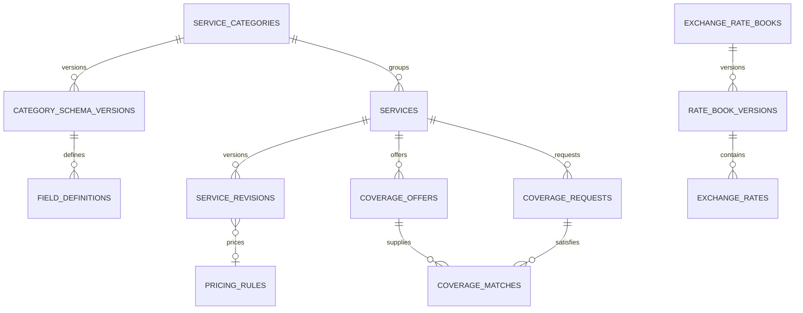

# المرحلة الثانية — الخدمات المرنة والتغطيات وأسعار الصرف

> **تاريخ التنفيذ:** سبتمبر 2026  
> **الفرع:** `phase-2/services-coverage-rates`  
> **الـ commit:** `9679ccd` (تم إضافة تبويب الخدمات الجانبي في `b59f828`)  
> **المرجع المعماري:** `plans/تعدد الوكلاء وقسم الخدمات/03_PHASE_2_SERVICES_COVERAGE_AND_RATES.md`

تهدف هذه المرحلة إلى تمكين صاحب العمل من إدارة يدوية مرنة لـ:
- **كتالوج خدمات** مع حقول مخصصة لكل تصنيف.
- **تسعير حتمي** يدعم 7 أنواع من القواعد.
- **أسعار صرف** بنشر ذرّي ومنع عرض السعر المنتهي كحالي.
- **عروض وطلبات تغطية** مع حجز ذرّي يمنع الحجز الزائد.

في هذه المرحلة **لا يتعامل AI مع هذه البيانات بعد** — الهدف تجهيز المجال بشكل صحيح قبل ربط الوكلاء بالأدوات في المرحلة 3.

---

## 1. ما تم تسليمه

| الناتج | الوصف |
|---|---|
| **4 ترحيلات قاعدة بيانات** | `047_service_catalog_core.sql`, `048_services_pricing.sql`, `049_exchange_rates.sql`, `050_coverage_offers_requests.sql` |
| **9 جداول جديدة** | خدمات، تسعير، صرف، تغطية |
| **4 دوال RPC بصلاحيات service_role** | للنشر الذرّي والحجز الذرّي |
| **محرك تسعير خالص** | يدعم 7 أنواع من القواعد بدقة `decimal` |
| **مُجمّع مخططات حقول** | تحقق strict مع التحكم بالظهور |
| **كاشف الأسعار المنتهية** | دالة نقية |
| **خدمات نطاق** | روابط للـ RPCs + منطق التطبيق |
| **8 مسارات API** | admin+ لجميع عمليات الكتابة |
| **صفحة إدارة `/services`** | تبويبا التصنيفات والخدمات |
| **40 اختبار وحدة** | تغطية شاملة لمنطق التسعير والتحقق |

---

## 2. ترحيلات قاعدة البيانات

### 2.1 Migration 047 — `service_catalog_core`

#### `service_categories` — هوية التصنيف

- **`slug`**: معرّف URL فريد داخل الحساب.
- **`status`**: `active` | `inactive` | `archived`.
- **`current_schema_version_id`**: مؤشر للإصدار المنشور الحالي من المخطط.

#### `service_category_schema_versions` — لقطة مخطط غير قابلة للتغيير

- **`version_number`** فريد داخل التصنيف.
- **`status`**: `draft` | `published` | `superseded`.
- الإصدار المنشور **ثابت** — أي تغيير ينشئ إصداراً جديداً.

#### `service_field_definitions` — بيانات تعريفية للحقول

مُقيَّدة بـ `data_type` مغلق:
```
short_text, long_text, number, integer, boolean,
money, currency, percentage, per_unit_rate,
enum, multi_enum, region, payment_method,
date, datetime
```

و`visibility` مغلق:
- **`public`** — مكشوف للعميل ووكيل AI.
- **`internal`** — للموظفين المخولين فقط، **لا يدخل سياق AI**.
- **`ai_only`** — لـ AI فقط، لا يُعرض للعميل.

**`is_filterable`** يحدد ما إذا كان الحقل يصلح لإنشاء فهرس.

### 2.2 Migration 048 — `services_pricing`

#### `service_pricing_rules`

أنواع القواعد المغلق (`kind`):
- **`fixed`**: مبلغ ثابت.
- **`percentage`**: نسبة من المبلغ.
- **`per_unit`**: قيمة لكل وحدة (مثل "6 لكل 1000").
- **`fixed_plus_percentage`**: ثابت + نسبة.
- **`tiered`**: شرائح محددة مسبقاً.
- **`fx_buy_sell`**: مرجع إلى سعر صرف + اتجاه.
- **`manual_quote`**: يتطلب موظفاً بشرياً.

كل قاعدة:
- **`fee_currency`, `input_currency`**: ISO-4217-like.
- **`minimum_fee`, `maximum_fee`**: bounds على المبلغ المحسوب.
- **`rounding_mode`**: `proportional` | `ceil_started_unit` | `floor_complete_unit` | `nearest_unit`.
- **`formula_config jsonb`**: جسم القاعدة (مُتحقَّق منه في طبقة التطبيق).
- **`status`**: `draft` | `published` | `superseded`.

#### `services` — هوية الخدمة

- **`code`**: رمز داخلي فريد (مثل `COV-SANA-CASH`).
- **`slug`**: معرّف URL فريد.
- **`status`**: `draft` | `active` | `paused` | `archived`.
- **`current_revision_id`**: مؤشر للإصدار المنشور الحالي.
- **`version bigint`**: تفاؤل.

#### `service_revisions` — لقطة تكوين الخدمة

- **`revision_number`** فريد داخل الخدمة.
- **`category_schema_version_id`**: **snapshot** — ربط الإصدار بنسخة المخطط التي وُلد تحتها. يحمي من إعادة تفسير حقول قديمة.
- **`name`, `public_description`, `ai_guidance`, `internal_notes`**:
  - `public_description` — للعميل.
  - `ai_guidance` — للنموذج فقط (يُغذَّى للسياق، لا يُعرض للعميل حرفياً).
  - `internal_notes` — بشري فقط.
- **`field_values jsonb`**: قيم الحقول، مُتحقَّقة ضد `service_field_definitions` بنسخة المخطط.
- **`pricing_rule_id`**: اختياري.
- **`valid_from`, `valid_until`**: نافذة صلاحية للعرض.

#### `service_activity_events` — سجل تدقيق ملحق فقط

نفس النمط الذي اعتمدناه في المرحلة 1 — كتابة حصرية عبر RPC `append_service_activity_event`.

### 2.3 Migration 049 — `exchange_rates`

#### `exchange_rate_books` — سياق سعر الصرف

- **`region`, `channel`, `settlement_method`**: مفتاح السياق (مثل "صنعاء / واتساب / نقدي").
- **`timezone`**: IANA.
- **`stale_after_seconds`**: بعد كم ثانية يُعتبر السعر **stale**.
- **`current_published_version_id`**: مؤشر للإصدار المنشور الحالي.
- **`status`**: `active` | `archived`.

قيد فريد جزئي: نشط واحد فقط لكل `(account, region, channel, settlement)`.

#### `exchange_rate_book_versions`

- **`status`**: `draft` | `published` | `superseded`.
- **`effective_at`, `expires_at`**: نافذة صلاحية.
- **`source`**: `manual` | `admin_agent` | `external` (الأخيران محجوزان للمرحلة 3).

#### `exchange_rates`

- **`base_currency`, `quote_currency`**: زوج العملات.
- **`buy_rate`, `sell_rate`**: `numeric(20, 8)` (دقة عالية لتجنب 1-ulp drift).
- **`min_amount`, `max_amount`**: شرائح اختيارية.
- **`rate_unit`**: إذا كان السوق المحلي يستخدم تمثيلاً خاصاً (مثل لكل 100).

قيد فريد: `(version_id, base_currency, quote_currency, coalesce(min_amount, -1), coalesce(max_amount, -1))`.

#### RPC `publish_exchange_rate_version`

دالة **ذرّية**:
1. التحقق من أن الكتاب نشط والإصدار `draft`.
2. رفض أزواج العملات المكررة.
3. **إلغاء** الإصدار السابق (`superseded`).
4. **نشر** الإصدار المستهدف.
5. **تبديل** المؤشر `current_published_version_id`.
6. كتابة حدث تدقيق.

كل ذلك في معاملة واحدة — **لا يرى العميل نصف عملات بالسعر الجديد ونصفها بالقديم أبداً**.

### 2.4 Migration 050 — `coverage_offers_requests`

#### `coverage_offers` — عرض من مزوّد تغطية

- **`provider_contact_id`**: الطرف الذي يوفّر التغطية. **يمكن أن يكون نفس الشخص الذي يطلب في عملية أخرى** (النموذج لكل سجل، لا لكل جهة اتصال).
- **`reference_code`**: رمز داخلي غير كاشف.
- **`total_amount`, `reserved_amount`, `fulfilled_amount`, `currency`**: كميات مع `numeric(20, 4)`.
- **`attributes jsonb`**: حقول خاصة بالخدمة، مُتحققة ضد المخطط.
- **`provider_cost`, `provider_cost_currency`**: **داخلي فقط**، لا يُعرض للعميل.
- **`status`**: `draft` | `active` | `partially_reserved` | `fully_reserved` | `fulfilled` | `expired` | `cancelled`.

قيد CHECK: `reserved + fulfilled ≤ total`.

#### `coverage_requests` — طلب تغطية

نفس البنية، مع:
- **`requester_contact_id`**: الطرف الطالب.
- **`requested_amount`, `reserved_amount`, `fulfilled_amount`**.
- **`priority`**: `low` | `normal` | `high`.

#### `coverage_matches` — ربط عرض مع طلب

- **`offer_id`, `request_id`**: المرجعيان.
- **`matched_amount, currency`**: الكمية المحجوزة.
- **`rate_snapshot`, `fee_snapshot`**: لقطات السعر والعمولة **وقت الحجز** — لا تتأثر بتغييرات لاحقة.
- **`provider_cost_snapshot, customer_fee_snapshot`**: لقطات التكلفة والعمولة.
- **`status`**: `proposed` | `reserved` | `confirmed` | `fulfilled` | `released` | `cancelled` | `expired`.
- **`idempotency_key`** فريد — حماية من تكرار الاستدعاءات.

#### RPC `reserve_coverage_match` — الحجز الذرّي

**الخطوات بالترتيب (داخل معاملة واحدة):**

1. تحقق من المبلغ الإيجابي.
2. **`SELECT FOR UPDATE`** لكلا الصفّين (offer + request) بترتيب ثابت `(id ASC)` لمنع deadlock.
3. تحقق من:
   - تطابق `service_id` و `currency`.
   - أن `status` قابل للحجز.
   - أن الكمية المطلوبة ≤ المتاح في العرض والطلب.
4. **إدراج** صف match مع `idempotency_key` (قيد فريد = شبكة أمان ضد التكرار).
5. **تحديث** `reserved_amount` على كلا الجدولين + زيادة `version`.
6. **إعادة حساب** الحالات (مثلاً `active` → `partially_reserved` أو `fully_reserved`).
7. **تدقيق** الحدث.

**ضمان المرحلة 2**: عاملان يستهدفان آخر وحدة متاحة → واحد فقط ينجح.

#### RPC `release_coverage_match` — تحرير الحجز

- يقفل صف الـ match.
- **Idempotent**: لو كان `released/cancelled/expired/fulfilled` مسبقاً، يعود بدون خطأ.
- يُرجع الكمية المحجوزة ويضبط الحالة.

---

## 3. طبقة المجال (TypeScript)

### 3.1 `pricing/decimal.ts`

استخدام `decimal.js` بدقة افتراضية 40، تقريب HALF_UP. الأرقام تعبر الشبكة كسلاسل نصية (Strings) — لا JavaScript floats.

- **`parseDecimal(input, opts)`**: تحليل آمن، يرجع `null` للمدخلات غير القانونية. يدعم `allowNegative` و `rejectZero`.
- **`formatDecimal(value, precision)`**: تنسيق ثابت بفاصلة عشرية.
- **`decimalsEqual(a, b, tolerance)`**: مقارنة مع تسامح ضد 1-ulp drift.

### 3.2 `pricing/engine.ts` — محرك التسعير

دالة `calculateQuote(rule, input): QuoteResult` نقية تماماً (لا DB، لا IO). تختبر كل نوع قاعدة:

**مثال "6 لكل 1000" — أنماط التقريب الأربعة** (plan §7.3):

| النمط | مبلغ 10,500 |
|---|---:|
| `proportional` | 63 |
| `ceil_started_unit` | 66 |
| `floor_complete_unit` | 60 |
| `nearest_unit` | 66 (HALF_UP) |

**النتيجة** `QuoteResult` تتضمن:
- `status: 'quoted' | 'manual_quote_required'`.
- `feeAmount, feeCurrency` (سلاسل decimal).
- `roundingMode`.
- `renderedFacts` — نص جاهز للعرض.
- `audit` — JSON كامل للمدخلات والمخرجات (يذهب لسجل التدقيق).

### 3.3 `catalog/field-schema.ts` — مُجمّع المخططات

`compileFieldSchema(definitions)` يُرجع مخططاً مُفهرَساً.
`validateValues(schema, values, intent)` يُرجع `ValidationResult`.

**DENY BY DEFAULT:**
- مفتاح غير معروف → `UNKNOWN_KEY`.
- حقل مطلوب غائب → `REQUIRED`.
- نوع خاطئ → `INVALID_TYPE`.
- قيمة خارج النطاق → `OUT_OF_RANGE`.
- قيمة enum خارج القائمة → `NOT_IN_ENUM`.

**التحكم بالظهور حسب النية (`intent`):**
- `'public'` — حقول `public` فقط.
- `'internal'` — `public + internal`.
- `'ai'` — `public + ai_only`.
- `'full'` — كل الحقول (admin).

### 3.4 `rates/staleness.ts`

`evaluateStaleness(version, now): StalenessResult`:
- **`is_stale: true`** إذا تجاوز `now` نافذة `effective_at + stale_after_seconds`، أو انتهت `expires_at`.
- **`secondsUntilStale`**: كم ثانية متبقية.

### 3.5 `domain-services.ts`

غلاف رقيق بين API والـ RPCs + محرك التسعير:
- **`publishPricingRule`**: تحديث `draft → published`.
- **`reserveCoverageMatch`**: استدعاء `reserve_coverage_match` RPC مع تحويل الأرقام decimal.
- **`releaseCoverageMatch`**: استدعاء `release_coverage_match` RPC.
- **`publishExchangeRateVersion`**: استدعاء `publish_exchange_rate_version` RPC.
- **`previewServiceQuote`**: قراءة الإصدار المنشور + القاعدة + حساب بـ `calculateQuote`.
- **`getCurrentExchangeRate`**: حل الـ book حسب السياق، فحص staleness، إرجاع السعر أو `unavailable_stale`.

**`ServiceError`** يحمل `code` و `status` HTTP — كل RPC error يُحوَّل إلى typed error.

---

## 4. مسارات API

| المسار | الأفعال | الوصف |
|---|---|---|
| `GET /api/service-categories` | list | قائمة التصنيفات. |
| `POST /api/service-categories` | create | إنشاء تصنيف (slug + name). |
| `GET /api/services` | list | قائمة الخدمات. |
| `POST /api/services` | create | إنشاء خدمة (categoryId + code + slug + name). |
| `POST /api/services/[id]/quote-preview` | preview | معاينة السعر (لا persistence). |
| `GET /api/exchange-rate-books` | list | قائمة دفاتر الأسعار. |
| `POST /api/exchange-rate-books` | create | إنشاء دفتر (سياق). |
| `POST /api/exchange-rate-books/[id]/publish` | publish | النشر الذرّي عبر RPC. |
| `GET /api/coverage/offers` | list | قائمة العروض. |
| `POST /api/coverage/offers` | create | إنشاء عرض. |
| `GET /api/coverage/requests` | list | قائمة الطلبات. |
| `POST /api/coverage/requests` | create | إنشاء طلب. |
| `POST /api/coverage/matches` | create | **الحجز الذرّي**. |
| `DELETE /api/coverage/matches` | release | **تحرير الحجز**. |

كل المسارات admin+ + rate limit + typed errors.

---

## 5. واجهة المستخدم

### 5.1 صفحة `/services` — تبويبا التصنيفات والخدمات

- **`CategoriesPanel`**: نموذج slug + name + قائمة البطاقات.
- **`ServicesListPanel`**: منتقي التصنيف + code + slug + name + قائمة البطاقات.
- **`ServicesPage`**: تبويبات `Categories` و `Services`.

### 5.2 الشريط الجانبي

أُضيف تبويب "Services" مع شارة `beta` (commit `b59f828`)، بين `Flows` و `AI Agents`.

### 5.3 الترجمة

كل النصوص مضافة في `messages/{en,ar,ko}.json`.

---

## 6. الاختبارات

| الملف | الاختبارات | الغطاء |
|---|---|---|
| `decimal.test.ts` | 13 | parseDecimal، formatDecimal، decimalsEqual. |
| `engine.test.ts` | 15 | كل نوع قاعدة، كل نمط تقريب، clamping، manual_quote. |
| `field-schema.test.ts` | 8 | التحقق الكامل، UNKNOWN_KEY، REQUIRED، visibility scoping. |
| `staleness.test.ts` | 5 | not-yet-effective, expired, past-window, no-published-at. |

**النتيجة**: 40 اختبار جديد، جميعها ناجحة. **إجمالي**: 1223 اختبار (1183 مرحلة 1 + 40 جديدة).

---

## 7. بوابات الجودة

```bash
cd D:\projects\node-next\e-proo-wacrm
npm run typecheck     # ✓ نظيف
npm run lint          # 7 أخطاء قديمة في node_modules (لا علاقة بعملي)
npm test              # 1223 اختبار ✓
npm run build         # ✓ نظيف
```

---

## 8. معيار الخروج (مُحقق)

- [x] يمكن إنشاء تصنيف جديد وحقوله من دون ترحيل قاعدة بيانات (عبر schema_versions).
- [x] الخدمة لها وصف عام وإرشاد AI داخلي منفصلان وإصدار منشور ثابت.
- [x] التسعير يعطي ناتجاً حتمياً مفسراً ويطبق التقريب المختار (كل 4 أنماط مغطاة).
- [x] أسعار الصرف تنشر ذرياً وتمنع وصف السعر المنتهي بأنه حالي (`unavailable_stale`).
- [x] العرض والطلب والمطابقة تدعم الدور المتغير والكمية الجزئية.
- [x] اختبار التزامن يثبت عدم الحجز الزائد (RPC `reserve_coverage_match` بـ `SELECT FOR UPDATE`).
- [x] واجهات العرض العامة لا تكشف المورد أو تكلفته (في الـ DTO).
- [x] يستطيع البشر إدارة الدورة كاملة من اللوحة بلا AI.
- [x] لا يوجد جدول رصيد أو قيد أو تسوية محاسبية ضمن الترحيلات.

---

## 9. ما لم يُنفذ (متعمد للمرحلة 3)

- ربط الوكلاء بأدوات قراءة الخدمات الحية (`services.search`, `pricing.calculate_quote`, `exchange_rates.get_current`, `coverage.check_availability`).
- إنشاء عروض/طلبات/مطابقات من رسائل الإدارة (تحتاج اقتراحات + اعتماد).
- منفذ التغيير الحتمي (execute-internal) لتعديل الكتالوج أو الأسعار أو التغطية.
- معيد تبادل (Reconciliation) للحجز المُعلَّق / المنتهي.
- تحرير wizard لإصدارات schema (المرحلة 4).

---

## 10. مخطط العلاقات


