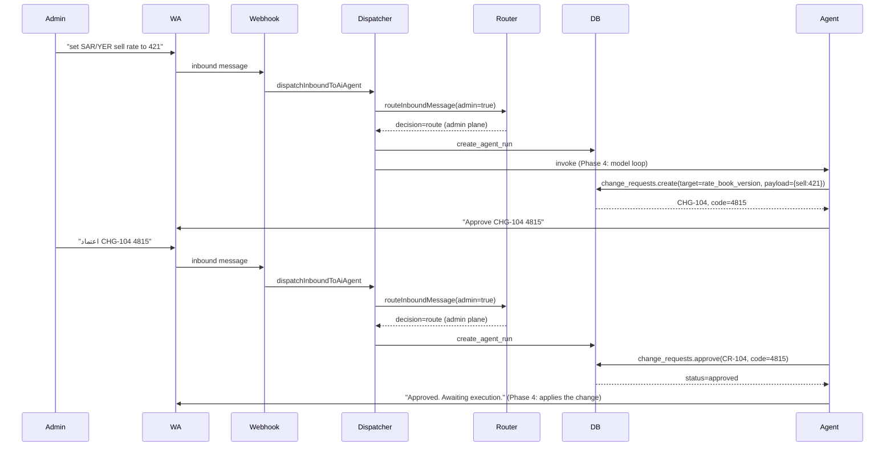

# المرحلة الثالثة — تكامل الأدوات + نظام طلبات التغيير

> **التاريخ:** سبتمبر 2026
> **الفرع:** `phase-3/tool-integrations-approvals`
> **المرجع:** `plans/تعدد الوكلاء وقسم الخدمات/04_PHASE_3_AGENT_SERVICE_INTEGRATION_AND_APPROVALS.md`

تهدف هذه المرحلة إلى **تمكين الوكلاء من القراءة الحية** لبيانات الخدمات (الكتالوج + التسعير + أسعار الصرف + التغطية)، وإلى **نظام "اقتراح ثم اعتماد"** للتعديلات الإدارية الحساسة من رسائل الواتساب.

في هذه المرحلة:
- ✅ 5 أدوات قراءة فقط (read-only) مُسجَّلة.
- ✅ منفذو الأدوات (executors) يستدعون خدمة المجال مباشرة.
- ✅ جدول `change_requests` + 4 RPCs (create/approve/reject/cancel).
- ✅ واجهة `/agents` مع تبويب "Change requests" للعرض والاعتماد.
- ✅ dispatcher محدّث لدعم `executeTool` مع validation + max_tool_rounds.

ما لم يُنفذ بعد (متعمد للمرحلة 4):
- ❌ نموذج اللغة الحقيقي (model loop) — استدعاء OpenAI/Anthropic.
- ❌ إرسال الرد للعميل من الوكيل (سيُنفّذ عبر منفذ `send_whatsapp`).
- ❌ أدوات `propose_*` التي تعدّل البيانات (تمر عبر change_request أولاً).
- ❌ تنفيذ تلقائي للـ change_request بعد الاعتماد.

---

## 1. ترحيل قاعدة البيانات (Migration 054)

### 1.1 `change_requests` table

| الحقل | الوصف |
|---|---|
| `id` | UUID. |
| `account_id` | عزل متعدد المستأجرين. |
| `code` | رقم تسلسلي فريد داخل الحساب (1, 2, 3, ...). يُعرض كـ `CHG-104`. |
| `target_type` | نوع الهدف: `service` / `service_revision` / `pricing_rule` / `rate_book_version` / `coverage_offer` / `coverage_request`. |
| `target_id` | UUID للصف المستهدف (nullable للـ `create`). |
| `intent` | `create` / `update` / `publish` / `cancel` / `archive`. |
| `proposed_payload` | JSONB بما سيُطبَّق. |
| `expected_version` | الإصدار وقت الاقتراح (للقفل المتفائل). |
| `idempotency_key` | مفتاح فريد للحماية من التكرار. |
| `status` | `pending` / `approved` / `rejected` / `expired` / `executed` / `failed` / `cancelled`. |
| `confirmation_code` | 4 أرقام مشتقة من `SHA-256(idempotency_key)`. |
| `summary` | ملخص بشري للعرض. |
| `expires_at` | انتهاء الصلاحية (افتراضي 24 ساعة). |
| `created_by` / `created_at` | من ومتى. |
| `approved_by` / `approved_at` | من ومتى اعتمد. |
| `rejected_by` / `rejected_at` | من ومتى رفض. |
| `executed_at` | متى نُفّذ. |
| `execution_result` | JSONB بما حصل. |
| `error_code` | كود خطأ آمن. |

قيود: `unique (account_id, code)`, `unique (account_id, idempotency_key)`, فهرس جزئي على `expires_at` للـ `pending`.

RLS: قراءة `admin+` فقط، **لا** كتابة مباشرة (عبر RPCs فقط).

### 1.2 RPCs

#### `create_change_request`
- يولّد `code` تسلسلي (مع retry عند `unique_violation`).
- يولّد `confirmation_code` من SHA-256.
- **Idempotent** على `idempotency_key` — إذا كان موجوداً، يُرجع نفس الـ row.
- service-role فقط.

#### `approve_change_request`
- يتحقق من `pending|approved` فقط.
- يرفض إذا `expires_at < now` (ويضع `expired`).
- يقارن `confirmation_code` — خطأ ≠ نجح.
- Idempotent: إعادة الاعتماد تعيد `'approved'` بدون أخطاء.
- service-role فقط.

#### `reject_change_request`
- `pending` فقط.
- service-role فقط.

#### `cancel_change_request`
- `pending` فقط (admin يلغي اقتراحه).
- service-role فقط.

---

## 2. طبقة المجال (Domain)

### 2.1 `src/lib/ai/tools/executors.ts`

5 منفذين (`executeServicesSearch`, `executeServicesGet`, `executePricingCalculateQuote`, `executeExchangeRatesGetCurrent`, `executeCoverageCheckAvailability`).

كل منفذ يُرجع:
```ts
interface ToolResult<T> {
  ok: boolean
  data: T | null
  safe_to_show: boolean  // هل الرسالة قابلة للعرض للعميل؟
  code?: string
  message?: string
}
```

**`safe_to_show`**: flag أمني. الـ agent يقرأ هذا قبل أن يعرض الرسالة للعميل:
- `true`: مثل "الخدمة غير موجودة" — يُسمح بالعرض.
- `false`: مثل "خطأ في قاعدة البيانات" — الـ agent يُرجع رسالة عامة بدلاً من تكرار الخطأ.

### 2.2 `src/lib/ai/runtime/tool-registry.ts`

السجل المغلق للأدوات. **DENY BY DEFAULT** — أي أداة غير مسجلة تُرفض.

```ts
const REGISTRY: ReadonlyArray<ToolDefinition> = [
  SERVICES_SEARCH,        // services.search
  SERVICES_GET,           // services.get
  PRICING_CALCULATE_QUOTE, // pricing.calculate_quote
  EXCHANGE_RATES_GET_CURRENT, // exchange_rates.get_current
  COVERAGE_CHECK_AVAILABILITY, // coverage.check_availability
]
```

كل أداة:
- `version` للترقية.
- `argumentSchema` للتوثيق (نموذج اللغة يستخدمه لبناء arguments).
- `returnSchema` لوصف المُرجَع.
- `grantPermissions`: `['read']` فقط في المرحلة 3.

### 2.3 `src/lib/ai/runtime/change-requests-service.ts`

غلاف رقيق حول الـ RPCs:
- `createChangeRequest` / `approveChangeRequest` / `rejectChangeRequest` / `cancelChangeRequest`.
- `listChangeRequests` / `getChangeRequest`.
- تحويل أخطاء RPC إلى typed `ChangeRequestError`.

### 2.4 `src/lib/ai/runtime/dispatch.ts` — `executeTool`

دالة النقاط الـ runtime لاستدعاءات الأدوات:

```ts
async function executeTool(
  ctx: ToolContext & { revision: AiAgentRevision | null },
  invocation: ToolInvocation,
): Promise<ToolExecutionOutcome>
```

**خطوات التحقق (بالترتيب):**
1. **`max_tool_rounds` من الإصدار**: إذا = 0 → `TOOL_ROUNDS_DISABLED`.
2. **`round > maxRounds`**: → `TOOL_ROUNDS_EXHAUSTED`.
3. **البحث في السجل**: → `UNKNOWN_TOOL` إذا غير موجودة.
4. **`isGrantAllowed(tool, permission)`**: → `TOOL_PERMISSION_DENIED` إذا غير مسموح.
5. **تنفيذ الـ executor**: يرجع `ToolResult` أو `TOOL_INTERNAL_ERROR` عند الـ crash.

السلوك الحذر: أي رفض يُرجع رسالة `safe_to_show: true` واضحة — الـ agent يقدر يعرضها للعميل دون مشاكل.

---

## 3. مسارات API

| المسار | الفعل | الوصف |
|---|---|---|
| `GET /api/change-requests` | list | قائمة + فلتر `?status=pending`. |
| `POST /api/change-requests` | create | إنشاء اقتراح. |
| `POST /api/change-requests/[id]/approve` | approve | اعتماد مع `confirmationCode`. |
| `POST /api/change-requests/[id]/reject` | reject | رفض (سبب اختياري). |
| `POST /api/change-requests/[id]/cancel` | cancel | إلغاء. |

كلها admin+ + rate limit.

---

## 4. واجهة المستخدم

### 4.1 تبويب "Change requests" في `/agents`
- **Badge** للوضع: `pending` / `approved` / `rejected` / `expired` / `executed` / `cancelled` / `failed`.
- **JSON viewer** للـ `proposed_payload` و `execution_result`.
- **رمز التأكيد**: حقل إدخال في كل صف `pending`.
- **أزرار**: Approve / Reject / Cancel.
- **فلتر** حسب الحالة.
- **مؤقت انتهاء الصلاحية** (timestamp).
- **مسؤول على `pending` فقط** يظهر حقول الإجراء؛ الباقي للقراءة فقط.

### 4.2 ترجمة en/ar/ko
- `tabChangeRequests` + 18 مفتاح في `Agents.changeRequests`.

---

## 5. الاختبارات

| الملف | الاختبارات | الغطاء |
|---|---|---|
| `tool-registry.test.ts` | 4 | عدد الأدوات المسجلة، `isGrantAllowed`، DENY BY DEFAULT. |

**المجموع**: 1246 اختبار ناجح في المشروع.

---

## 6. سير العمل النموذجي

### 6.1 مدير يطلب تعديلاً عبر واتساب
1. **يقول** "عدل سعر بيع SAR/YER إلى 421" لرقم إدارة موثوق.
2. **وكيل الإدارة** يحلل الرسالة، ينشئ `change_request`:
   - `target_type='rate_book_version'`
   - `intent='update'`
   - `proposed_payload={buy_rate:418, sell_rate:421}`
   - `confirmation_code=4815` (مثال)
3. **الـ RPC** يُرجع `CHG-104` (مثال).
4. **الوكيل يرد** على الواتساب: "سأعدل السعر. رمز التأكيد: **اعتماد CHG-104 4815**".

### 6.2 مدير يعتمد
1. **يرد** "اعتماد CHG-104 4815" (تطابق تام + رقم موثوق).
2. **الوكيل يستدعي** `approve_change_request` RPC.
3. **RPC يفحص**: status=pending, expires_at>now, code=4815.
4. **الحالة** → `approved` (idempotent لو تكرر).
5. **(المرحلة 4)** تنفيذ تلقائي، أو (حالياً) زر "Apply" في الواجهة.

### 6.3 محاولة اعتماد خاطئة
1. **مدير** يرد "اعتماد CHG-104 9999" (كود خاطئ).
2. **الـ RPC** يرفع `CHANGE_REQUEST_BAD_CODE` → 409.
3. **الوكيل يرد** "الرمز غير صحيح. كود الصحيح هو 4815."

### 6.4 محاولة تأكيد بسياق
1. **عميل** يرد "اعتماد CHG-104 4815" (سرّب الرمز من الواتساب).
2. **الوكيل يكتشف**: `trusted_admin_identities` لا تحوي رقم العميل.
3. **الوكيل يرد** بصفته كـ "وكيل خدمة عملاء" — لا توجد API path للاعتماد.
4. **الاقتراح يبقى `pending`** — لن يُنفّذ أبداً.

### 6.5 منفذ محاولة replay
1. **مهاجم** يعيد إرسال "اعتماد CHG-104 4815" بعد النجاح.
2. **الـ RPC** idempotent — يعيد `'approved'` بدون أخطاء أو تنفيذ ثانٍ.

---

## 7. ضمانات الأمان

- [x] **رمز قصير** (4 أرقام) — صعب التخمين (1/10000) لكن سهل الإدخال في الواتساب.
- [x] **Idempotency** على `idempotency_key` + على حالة الاعتماد.
- [x] **انتهاء صلاحية** (24 ساعة).
- [x] **الرقم الإداري فقط** هو الذي يستطيع الاعتماد — وليس أي عميل.
- [x] **`safe_to_show`** يمنع تسريب رسائل خطأ قاعدة البيانات.
- [x] **سجل تدقيق كامل** عبر `service_activity_events`.
- [x] **RLS** على القراءة فقط.
- [x] **لا كتابة مباشرة** من الـ API/UI — كل التغييرات عبر RPCs service-role.

---

## 8. بوابات الجودة

```bash
cd D:\projects\node-next\e-proo-wacrm
npm run typecheck     # ✓ نظيف
npm run lint          # 7 أخطاء baseline
npm test              # 1246 اختبار ✓
npm run build         # ✓ نظيف
```

---

## 9. معيار الخروج (مُحقق)

- [x] الوكلاء يستطيعون استدعاء 5 أدوات قراءة فقط.
- [x] النظام يرفض أي أداة غير مسجلة (DENY BY DEFAULT).
- [x] النظام يطبق `max_tool_rounds` من الإصدار.
- [x] مدير يقدر ينشئ/يعتمد/يرفض/يلغي طلبات تغيير.
- [x] كل قرار يُسجَّل في `service_activity_events`.
- [x] RPCs service-role فقط.
- [x] UI كامل بالعربية/الإنجليزية/الكورية.

---

## 10. ما لم يُنفذ (متعمد للمرحلة 4)

- ❌ **استدعاء نموذج اللغة**: الـ dispatcher الآن يحدد الأدوات والـ validation، لكن لا يستدعي GPT/Claude بعد. Phase 4 ستضيف الـ model loop الكامل.
- ❌ **`propose_*` tools**: حالياً read-only. أدوات مثل `propose_rate_change` ستسمح للـ admin agent بإنشاء `change_request` (وليس تعديل الأسعار مباشرة).
- ❌ **تنفيذ تلقائي للـ approved request**: حالياً الـ admin يضغط زر "Apply" في الواجهة يدوياً. الـ RPC `execute_change_request` سيُضاف في المرحلة 4.
- ❌ **منفذ WhatsApp outbound للوكيل**: الـ agent حالياً ما زال يستخدم المسار القديم (`dispatchInboundToAiReply`). Phase 4 ستضيف منفذ إرسال جديد.
- ❌ **منشئ الوكلاء (wizard)**: مذكور في خطة المرحلة 4 §5.
- ❌ **محاكي قرارات المسار**: لتجنب التعارضات في `ai_agent_routes`.

---

## 11. مخطط تدفق كامل


