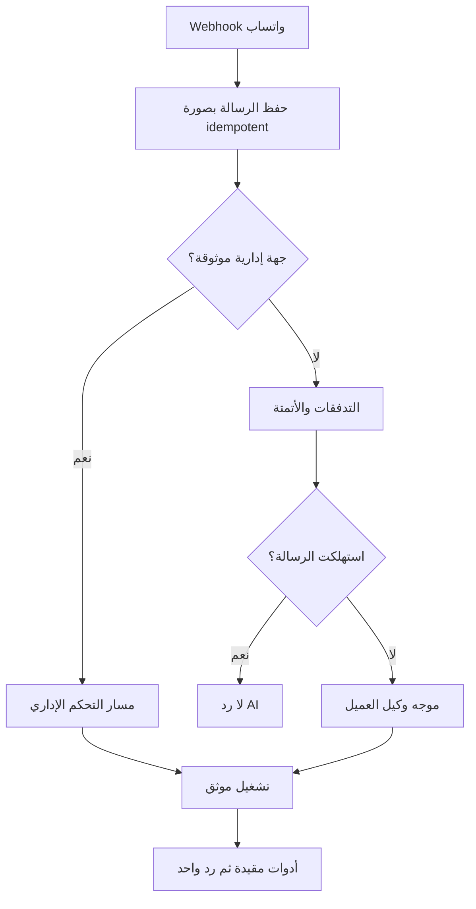

# المعمارية المستهدفة وخطة الانتقال من WACRM الحالي

## 1. الهدف

تحدد هذه الوثيقة البنية العامة التي تربط المراحل الأربع وتحافظ على سلوك WACRM الحالي أثناء التطوير. هي المرجع عند التعارض بين قرار محلي داخل مرحلة وبين سلامة المنظومة ككل.

## 2. ملخص الوضع الحالي

في الخط المرجعي للمشروع:

- إعداد الذكاء الاصطناعي محفوظ في `ai_configs` كسجل واحد لكل `account_id`، ويشمل المزود والنموذج والمفتاح المشفر والتعليمات والتفعيل والرد التلقائي وحدود الرد والتحويل لموظف.
- `src/lib/ai/config.ts` يحمل إعداد الحساب، و`src/lib/ai/generate.ts` يولد ردوداً نصية، وموصلات المزود موجودة تحت `src/lib/ai/providers/`.
- `src/lib/ai/auto-reply.ts` ينفذ الرد التلقائي ويسترجع مقاطع المعرفة من `src/lib/ai/knowledge.ts`.
- قاعدة المعرفة على مستوى الحساب، وليست مسندة حالياً إلى وكيل محدد.
- `src/app/api/whatsapp/webhook/route.ts` يحفظ الرسالة ثم يشغل التدفقات والأتمتة والرد الآلي ثم webhook العام.
- `assigned_agent_id` في المحادثة يشير إلى عضو فريق بشري؛ لا يجوز تحويل معناه إلى وكيل AI.
- سجل `ai_usage_log` لا يعرف بعد الوكيل أو اتصال المزود المستخدم.
- محددات المعدل الموجودة داخل الذاكرة لا تضمن الحد عبر عدة نسخ خادمية.
- التوليد الحالي نصي، ولا يوجد عقد عام لاستدعاء أدوات متعددة المزودين.

هذه قدرات قائمة يجب توسيعها تدريجياً، لا نسخها في مسار موازٍ دائم ولا حذفها في أول ترحيل.

## 3. حدود المكونات

تقسم المنظومة إلى وحدات ذات مسؤولية واحدة:

| الوحدة | مسؤوليتها | ما لا تفعله |
|---|---|---|
| اتصالات المزودين | تخزين الاعتماد المشفر، اختبار الاتصال، تعريف النماذج والحدود | لا تحتوي شخصية الوكيل أو توجيه الرسائل |
| سجل وكلاء AI | هوية الوكيل وتعليماته وإصداره وحالته | لا يخزن أسرار المزود ولا ينفذ SQL |
| موجه الوكلاء | يختار وكيلاً واحداً وفق قواعد مرتبة | لا يولد الرد ولا يطبق تعديل خدمة |
| مشغل الوكيل | يدير الدورة، والسياق، واستدعاء الأدوات، والحدود | لا يقرر صلاحية الأداة بنفسه |
| سجل الأدوات | يعرف الأدوات الثابتة ومخططات الإدخال/الإخراج ومستوى المخاطرة | لا يقبل كوداً من المستخدم |
| مجال الخدمات | التعريفات، الحقول، التسعير، الصرف، العروض والطلبات والمطابقات | لا يعتمد على صياغة النموذج لحساب الأرقام |
| محرك الاعتماد | ينشئ الاقتراح، يتحقق من المعتمد، وينفذ بصورة ذرية | لا يقبل تأكيداً مبهماً ولا يعيد تنفيذ الطلب |
| سجل التدقيق | يربط الرسالة بالتوجيه والأداة والاقتراح والتنفيذ | لا يخزن المفتاح أو النص الحساس بلا حاجة |
| قاعدة المعرفة | معلومات وصفية طويلة العمر يستدل بها النموذج | ليست مصدراً للسعر أو التوفر الحي |

## 4. مستويان منفصلان للتعامل

### 4.1 مستوى خدمة العملاء

يعالج رسائل العملاء العادية. يطبق قواعد التدفقات والأتمتة البشرية/الحتمية القائمة، ثم يوجه الرسالة إلى وكيل خدمة عملاء عند السماح. أدوات هذا المستوى للقراءة والحساب الحتمي فقط افتراضياً.

### 4.2 مستوى التحكم الإداري

يعالج رسالة واردة من رقم واتساب إداري موثوق ومفعّل. يجب اكتشاف هذا المسار مباشرة بعد حفظ الرسالة وقبل تشغيل تدفقات العملاء؛ وإلا قد يرسل النظام عرضاً أو رد عميل إلى صاحب العمل بدلاً من فهم أمره الإداري.

رسالة إدارية لا تعني أن النموذج يملك الكتابة. أقصى ما يفعله الوكيل هو إنشاء اقتراح منظم. التنفيذ مسؤولية محرك مستقل بعد الاعتماد.



## 5. مبدأ التشغيل المتين

لا تجعل معالجة الوكيل عملاً غير مرئي يعتمد فقط على عمر طلب webhook. بعد حفظ الرسالة:

1. ينشأ `agent_run` فريد مرتبط بالرسالة الواردة وبقرار التوجيه.
2. يحاول المسار الحالي بدء معالجته سريعاً باستخدام الآلية الملائمة لـ Next.js/بيئة الاستضافة.
3. يبقى السجل بحالة `queued` إذا لم يبدأ أو انقطع الطلب.
4. مهمة دورية/عامل موثوق يستعيد التشغيلات العالقة والمنتهية مهلة تنفيذها.
5. يدعي عامل واحد التشغيل بقفل/تحديث شرطي، ويكتب `attempt_count` و`lease_expires_at`.
6. إرسال رسالة واتساب يستخدم مفتاح idempotency مشتقاً من التشغيل والخطوة حتى لا يصل ردان.
7. يسجل كل انتقال حالة في `agent_run_events`.

هذه ليست بنية طابور محاسبي، بل ضمان تشغيل للرسائل. يمكن البدء بجداول PostgreSQL وعامل مجدول، ثم نقل التنفيذ إلى queue خارجي لاحقاً من دون تغيير عقد المجال.

## 6. ترتيب التوجيه الحاكم

ينفذ التوجيه بهذا الترتيب، مع تسجيل سبب القرار:

1. **رقم إداري موثوق:** يذهب إلى مسار الإدارة، ولا يمر بتدفقات العملاء.
2. **إيقاف AI أو استلام بشري:** إذا كانت المحادثة في handoff أو عطلت AI، لا يرد وكيل عميل.
3. **تعيين AI صريح للمحادثة:** يستخدم الوكيل المنشور المعين إن كان فعالاً ومسموحاً للقناة.
4. **تدفق/أتمتة حتمية استهلكت الرسالة:** لا يرد AI.
5. **قاعدة توجيه مطابقة:** تختار أعلى قاعدة فعالة حسب الأولوية والتحديد.
6. **الوكيل الافتراضي للقناة:** يستخدم عند عدم التطابق.
7. **لا يوجد مسار صالح:** تترك الرسالة للبشر، مع حدث يوضح السبب.

قاعدة «وكيل واحد لكل رسالة» تطبق بقيد فريد على `agent_runs.inbound_message_id` وبقرار واحد داخل معاملة، لا بالاتفاق البرمجي فقط.

## 7. بنية مقترحة داخل المستودع

يجوز تعديل الأسماء لتلائم النمط القائم، لكن حافظ على الحدود التالية:

```text
src/lib/ai/
  runtime/            # دورة الوكيل وحالات التشغيل والحدود
  routing/            # اختيار المسار والوكيل فقط
  providers/          # موصلات المزودين ودعم النص/الأدوات
  tools/              # السجل، التحقق، المنفذ، الأدوات المسماة
  approvals/          # الاقتراحات والاعتماد والتنفيذ والتعارض
  audit/              # أحداث موحدة وتنقيح البيانات الحساسة
src/lib/services/
  catalog/            # التصنيفات والخدمات والإصدارات والحقول
  pricing/            # decimal والتسعير وأسعار الصرف
  coverage/           # العروض والطلبات والحجوزات والمطابقة
src/app/api/
  ai-agents/          # إدارة وكلاء AI؛ اسم لا يلتبس مع أعضاء الفريق
  ai-providers/
  agent-routes/
  trusted-admins/
  services/
  exchange-rates/
  coverage/
  change-requests/
```

في الواجهة يمكن إبقاء `/agents` صفحة رئيسية، لكن يجب أن تكون الأنواع وواجهات API بأسماء تميز `ai-agent` عن عضو الفريق.

## 8. الانتقال من `ai_configs`

### 8.1 مبدأ الانتقال

ينفذ الانتقال بنمط expand → backfill → dual read → cutover → contract:

1. **Expand:** إنشاء الجداول الجديدة وإضافة أعمدة nullable في السجلات الحالية، من دون حذف أو إعادة تسمية مدمرة.
2. **Backfill:** لكل حساب يملك `ai_configs`، أنشئ اتصال مزود افتراضي ووكيل خدمة عملاء افتراضياً واربط الإعدادات.
3. **Dual read:** وقت التشغيل يفضل البنية الجديدة إذا كان الحساب مهاجراً، وإلا يرجع إلى `ai_configs`.
4. **Cutover:** فعّل الحساب تدريجياً بعلم ميزة وسجل مقارنة shadow بين قرار المسار القديم والجديد.
5. **Contract:** لا تحذف الجدول أو route القديم إلا في إصدار لاحق بعد قياس عدم استخدامه وتوفير ترحيل رجوع موثق.

### 8.2 نقل الاعتماد المشفر

قيمة `api_key` في `ai_configs` مشفرة بالفعل. إذا بقي مخطط التشفير وهدف فك التشفير نفسه، تنسخ القيمة المشفرة إلى اتصال المزود الجديد من دون فكها داخل SQL أو السجل. بعد النسخ، يختبر الخادم فكها واتصال المزود في عملية صريحة لا تطبع السر.

لا تعيد تشفير المفتاح داخل ترحيل SQL، ولا ترسله إلى العميل، ولا تسجله في الأخطاء. إذا تغير غلاف التشفير، نفذ مهمة خادمية مقيدة وقابلة للاستئناف مع علامة نجاح لكل سجل.

### 8.3 القيم المنقولة

| القديم | الجديد |
|---|---|
| `provider`, `model`, `api_key`, `embeddings_api_key` | اتصال مزود افتراضي وإعداد نموذج الوكيل |
| `system_prompt` | مسودة الإصدار الأول من وكيل خدمة العملاء |
| `is_active`, `auto_reply_enabled` | حالة الوكيل وسياسة المسار الافتراضي |
| `max_ai_replies_per_conversation` | حد تشغيل الوكيل |
| `handoff_agent_id` | سياسة تحويل إلى العضو البشري نفسه |
| معرفة الحساب الحالية | تسند للوكيل الافتراضي، مع إبقاء ملكيتها على الحساب |

يجب أن يكون backfill قابلاً لإعادة التشغيل. استخدم مفاتيح طبيعية/قيوداً مثل `legacy_ai_config_id` أو `system_key` لمنع التكرار.

## 9. الترحيلات المقترحة

على الخط المرجعي فقط، التسلسل المقترح:

| الترحيل | المحتوى |
|---|---|
| `040_ai_agent_core.sql` | اتصالات المزودين، الوكلاء، الإصدارات، المعرفة، منح الأدوات |
| `041_ai_routing_runs.sql` | الجهات الموثوقة، القواعد، حالة المحادثة، التشغيلات والأحداث |
| `042_service_catalog.sql` | التصنيفات والحقول والخدمات والإصدارات وقواعد التسعير |
| `043_coverage_exchange.sql` | دفاتر الصرف، الأسعار، العروض، الطلبات، المطابقات |
| `044_ai_tools_approvals.sql` | طلبات التغيير واعتماداتها وتنفيذها وأحداث الأدوات |
| `045_agent_builder.sql` | المسودات والنشر والتعارضات والقيود اللازمة للمنشئ |

لا تضع كل جداول المرحلة في ترحيل ضخم إذا أصبح الرجوع أو الاختبار صعباً. يحكم ترتيب الاعتماد الفعلي، لا رقم هذا الجدول.

## 10. التوافق والميزات التدريجية

أضف إعدادات على مستوى الحساب، بأسماء واضحة، مثل:

- `multi_agent_enabled`
- `service_catalog_enabled`
- `agent_live_reads_enabled`
- `admin_change_proposals_enabled`
- `admin_change_execution_enabled`
- `agent_builder_enabled`

لا تعتمد على أعلام الواجهة فقط. يتحقق الخادم من العلم في route handler وفي طبقة المجال الحساسة. عند تعطيل علم التنفيذ تبقى قراءة الاقتراحات ممكنة، لكن تنفيذها مرفوض بسبب واضح.

## 11. التدقيق والملاحظة

يرتبط الحدث على الأقل بالحقول التالية حيث تنطبق:

- `account_id`
- `conversation_id` و`inbound_message_id`
- `agent_run_id` و`ai_agent_id` و`agent_revision_id`
- `provider_connection_id` واسم النموذج، من دون المفتاح
- `tool_name` ونسخة العقد وحالة التنفيذ
- `change_request_id` والمعتمد والتنفيذ
- `request_id` المرسل من العميل أو webhook id

سجل المدخلات المنقحة أو بصمتها عند الحاجة، لا كامل محادثة العميل بشكل افتراضي. يجب أن تكون مدة الاحتفاظ قابلة للضبط لاحقاً.

المقاييس الأساسية:

- زمن الانتظار وزمن أول رد وإجمالي زمن التشغيل.
- نسبة التشغيلات الناجحة/المتروكة/المكررة/المحوّلة لبشر.
- عدد دورات الأدوات ومتوسطها وفشل التحقق.
- تكلفة/رموز حسب الحساب والوكيل والمزود.
- الاقتراحات المؤكدة والمرفوضة والمنتهية والمتعارضة.
- الأسعار المنتهية ومحاولات القراءة منها.
- فشل الحجز بسبب التزامن أو نقص الكمية.

## 12. معالجة الأخطاء

| العطل | السلوك الآمن |
|---|---|
| المزود غير متاح | إعادة محدودة مع backoff؛ ثم handoff/رسالة عامة لا تختلق بيانات |
| أداة قراءة فشلت | لا يخمن الوكيل السعر؛ يعتذر ويحوّل أو يطلب الانتظار |
| سعر منتهي | يمنع عرضه كسعر حالي ويطلب تحديثاً/يحوّل للإدارة |
| أداة اقترحت مدخلات غير صالحة | يعاد الخطأ البنيوي للنموذج لعدد محدود، ثم لا ينشأ اقتراح |
| تغير السجل بعد إنشاء الاقتراح | الحالة `conflicted`؛ لا يطبق فوق النسخة الجديدة |
| تكرر webhook | يعاد النجاح المنطقي نفسه ولا ينشأ تشغيل/اقتراح/رسالة ثانية |
| رقم إداري غير موثوق | يعامل كعميل عادي ولا يكشف وجود أدوات الإدارة |
| الوكيل متوقف أو الإصدار غير منشور | ينتقل للمسار الاحتياطي أو البشر ولا يستخدم مسودة |

## 13. مبدأ الإصدارات

تعليمات الوكيل ومنحه ومعرفته وسياساته يجب أن تكون قابلة للتتبع بإصدار منشور ثابت. يحتفظ `agent_run` بمعرف الإصدار الذي بدأ به حتى لو نشر المسؤول إصداراً جديداً أثناء التشغيل.

كذلك يحتفظ اقتراح تعديل الخدمة بنسخة الأساس (`expected_version`) وبصمة المحتوى المقترح. لا يجوز إعادة تفسير رسالة الاعتماد بنسخة تعليمات أحدث.

## 14. حدود الأمن والثقة

- اتصال المزود سر خادمي فقط.
- نصوص العملاء، ووثائق المعرفة، وأوصاف الخدمات، وحتى رسالة المدير كلها مدخلات غير موثوقة للنموذج.
- نتيجة النموذج طلب محتمل وليست أمراً موثوقاً.
- سجل الأدوات وسياسات الحساب وRLS ومخططات التحقق ومحرك الاعتماد هي حدود الثقة الفعلية.
- استخدام Supabase service role، إن كان ضرورياً في عامل خادمي، لا يعفي من تمرير `account_id` موثق وفحصه داخل كل عملية.
- لا تسمح لأداة بقبول اسم جدول أو اسم عمود أو مسار URL حر من النموذج.

## 15. استراتيجية الإطلاق

1. نشر الجداول والكود مع جميع الأعلام معطلة.
2. تشغيل backfill في بيئة الاختبار ومقارنة الإعداد القديم والجديد.
3. تفعيل `multi_agent` لحساب داخلي في shadow mode بلا إرسال.
4. تفعيل وكيل العميل مع أدوات بلا كتابة.
5. تفعيل مجال الخدمات وإدارته يدوياً.
6. تفعيل قراءات الخدمات الحية للعملاء.
7. تفعيل إنشاء الاقتراحات الإدارية من دون تنفيذ.
8. تفعيل التنفيذ بعد مراجعة سجل أسبوع/عينة كافية بحسب حجم الرسائل.
9. فتح منشئ الوكلاء لحسابات مختارة ثم التوسع.

لكل خطوة مفتاح إيقاف سريع ومسار fallback. لا تجعل الرجوع يتطلب حذف بيانات جديدة.

## 16. ما يؤجل عمداً

- دفتر الأستاذ والحسابات المدينة والدائنة.
- أرصدة الموردين والعملاء.
- إثبات الدفع والتسوية البنكية/النقدية.
- احتساب الربح المحاسبي النهائي أو الإقرار المالي.
- مزامنة أسعار السوق الخارجية التلقائية، ما لم تطلب لاحقاً كمصدر إضافي؛ المصدر التشغيلي الحالي هو السعر الذي ينشره صاحب العمل.
- تنفيذ أدوات أو plugins يكتبها المستخدم.

يمكن حفظ `provider_cost` و`customer_fee` و`quoted_amount` كحقائق تشغيلية للطلب والمطابقة، لكنها لا تنشئ قيداً ولا تغير رصيداً.

## 17. معيار قبول المعمارية

تعد البنية مطبقة بصورة صحيحة عندما يثبت الاختبار أن:

- رسالة واحدة لا تنتج أكثر من تشغيل أو رد، حتى عند تكرار webhook.
- رقم الإدارة يسلك مسار التحكم قبل أتمتة العملاء.
- لا يستطيع وكيل العميل استدعاء أداة إدارية أو الوصول لبيانات حساب آخر.
- يستطيع الحساب غير المهاجر الاستمرار بالإعداد القديم.
- يعرف كل رد أي وكيل وإصدار ومزود وبيانات حية استخدمها.
- تعطيل أعلام المرحلة يعيد السلوك السابق من دون حذف أو فساد بيانات.
- لا يعتمد نجاح المعالجة على بقاء طلب HTTP مفتوحاً حتى نهاية توليد النموذج.
