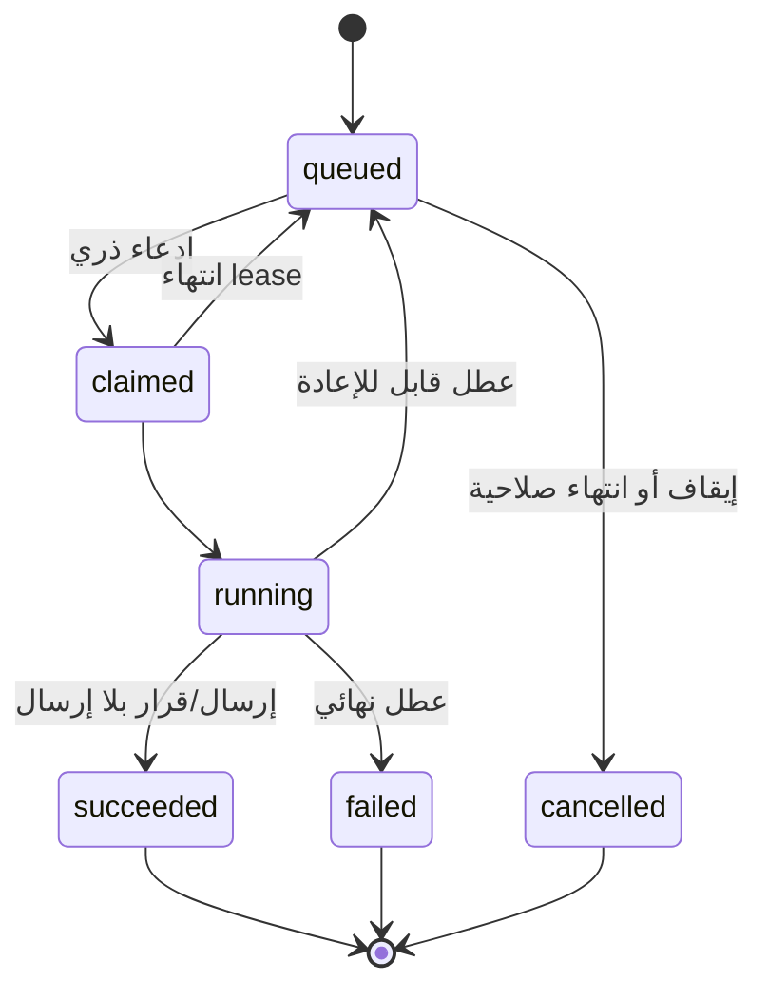

# المرحلة الأولى — نواة تعدد وكلاء الذكاء الاصطناعي

## 1. نتيجة المرحلة

بنهاية هذه المرحلة يمتلك كل حساب في WACRM بنية قادرة على تشغيل أكثر من وكيل AI، مع:

- عدة اتصالات لمزودي النماذج.
- وكيلين نظاميين أوليين: خدمة العملاء والإدارة.
- إصدار منشور وثابت لكل وكيل.
- تعيين معرفة وأدوات وصلاحيات مستقلة.
- رقم/أرقام واتساب إدارية موثوقة.
- توجيه حتمي ينتج وكيلاً واحداً لكل رسالة.
- تشغيل قابل للاستئناف وسجل أحداث واستخدام مرتبط بالوكيل.
- توافق مؤقت مع `ai_configs` والمسار الحالي.

هذه مرحلة بنية تحتية. لا تنشئ كتالوج الخدمات ولا تسمح لوكيل الإدارة بتعديل بيانات تجارية. تجهز الحدود اللازمة فقط.

## 2. قصص المستخدم

1. كمالك حساب، أضيف اتصال OpenAI أو Anthropic، أختبره، ولا أرى المفتاح مجدداً بعد الحفظ.
2. كمالك، أرى وكيل خدمة عملاء ووكيل إدارة، وأحدد لكل منهما الاتصال والنموذج والتعليمات والحدود.
3. كمالك، أسجل رقم واتساب إدارياً وأتحقق منه قبل تفعيله.
4. كمسؤول، أستطيع إيقاف وكيل أو مسار فوراً من دون حذف بياناته.
5. كعضو دعم، أستطيع معرفة أي وكيل رد على الرسالة ولماذا، لكن لا أرى الأسرار.
6. كنظام، لا أرسل ردين إذا تكرر webhook أو حاول عاملان معالجة الرسالة نفسها.

## 3. نطاق المرحلة

### داخل النطاق

- نمذجة المزودين والوكلاء والإصدارات والمعرفة والمنح والمسارات.
- كشف جهة الإدارة قبل تدفقات العميل.
- تشغيل agent runs وحالاتها واسترداد المتعطل.
- دعم توليد نصي متعدد الوكلاء عبر الموصلات الحالية.
- واجهة إدارة محدودة لوكيلين نظاميين واتصالاتهما.
- backfill من الإعداد الفردي الحالي.
- أساس Provider API قابل لإضافة tool calling في المرحلة الثالثة.

### خارج النطاق

- الخدمات والأسعار والتغطيات وأسعار الصرف.
- تنفيذ أوامر إدارية تغير النظام.
- منشئ وكلاء عام أو أداة يعرّفها المستخدم.
- الرسوم المحاسبية والأرصدة والتسويات.
- حذف `ai_configs` أو تغيير معنى `assigned_agent_id`.

## 4. نموذج البيانات

التفاصيل والعقود النهائية في [عقود البيانات والواجهات والأدوات](06_DATA_MODEL_API_AND_TOOL_CONTRACTS.md). الحد الأدنى لهذه المرحلة:

### 4.1 `ai_provider_connections`

يمثل اعتماداً قابلاً لإعادة الاستخدام داخل الحساب.

| الحقل | الغرض |
|---|---|
| `id`, `account_id` | هوية وعزل الحساب |
| `name` | اسم يعرض للمسؤول، مثل «OpenAI الرئيسي» |
| `provider` | enum مضبوط، يبدأ بـ`openai` و`anthropic` |
| `encrypted_api_key` | السر باستخدام آلية التشفير الخادمية الحالية |
| `encrypted_embeddings_api_key` | اختياري عند انفصال اعتماد embeddings |
| `config` | JSONB مسموح بمفاتيح محددة مثل endpoint المعتمد؛ لا أسرار ظاهرة |
| `status` | `unverified/active/invalid/disabled` |
| `last_verified_at`, `last_error_code` | صحة الاتصال من دون نص يكشف السر |
| `created_by`, `updated_by`, timestamps | تدقيق |
| `legacy_ai_config_id` | يمنع تكرار backfill، اختياري وفريد |

قيود:

- الاسم فريد داخل الحساب بعد التطبيع.
- لا تعيد أي API المفتاح. أعد `has_api_key: true` وآخر أربعة أحرف فقط إذا كان ذلك آمناً ومطلوباً.
- تحديث الاسم لا يتطلب مفتاحاً جديداً. تغيير المزود يتطلب اتصالاً جديداً، لا تبديل نوع سجل قائم.
- حذف اتصال مستخدم بإصدار منشور ممنوع؛ يسمح بتعطيله أو تدوير مفتاحه.

### 4.2 `ai_agents`

هوية الوكيل المستقرة.

| الحقل | الغرض |
|---|---|
| `id`, `account_id` | الهوية والعزل |
| `system_key` | `customer_service` أو`admin_operations` للوكلاء النظاميين؛ nullable للمخصصين لاحقاً |
| `slug`, `name`, `description` | تعريف واجهة المستخدم |
| `purpose` | `customer_support/admin_operations/custom` |
| `status` | `draft/active/paused/archived` |
| `published_revision_id` | الإصدار الوحيد المستخدم في الإنتاج |
| `created_by`, `updated_by`, timestamps | تدقيق |

قيود:

- `system_key` فريد داخل الحساب عندما لا يكون null.
- الوكيل المؤرشف لا يختار في أي توجيه جديد.
- لا يمكن تفعيل وكيل بلا إصدار منشور واتصال فعال.

### 4.3 `ai_agent_revisions`

يحفظ تكويناً غير قابل للتغير بعد النشر:

- `agent_id`, `account_id`, `revision_number`.
- `status`: `draft/published/superseded`.
- `provider_connection_id`, `model`.
- `system_prompt`, `language_policy`, `response_style`.
- `temperature`, `max_output_tokens`, `max_tool_rounds` تمهيداً للمرحلة الثالثة.
- `max_ai_replies_per_conversation`, `handoff_human_member_id`.
- `created_by`, `created_at`, `published_by`, `published_at`.
- `settings` JSONB لمفاتيح معروفة ومتحقق منها فقط.

لا تعدّل صفاً منشوراً. أي تغيير ينشئ مسودة جديدة ثم ينشرها داخل معاملة تقوم بتحديث `published_revision_id` ووضع الإصدار السابق `superseded`.

### 4.4 `ai_agent_knowledge_assignments`

يربط وثيقة المعرفة الحالية أو مجموعة منها بإصدار/وكيل:

- في المرحلة الأولى، حافظ على ملكية وثائق المعرفة للحساب.
- أضف assignment يحدد هل الوثيقة مفعلة لهذا الوكيل وترتيبها/وزنها عند الحاجة.
- backfill يسند معرفة الحساب الحالية لوكيل خدمة العملاء.
- وكيل الإدارة لا يرث كل معرفة العميل تلقائياً؛ يختار المسؤول ما يحتاجه.

### 4.5 `ai_agent_tool_grants`

ينشأ الجدول من الآن ولو كانت أدوات المرحلة الأولى قليلة:

- `agent_revision_id`, `tool_key`, `permission`.
- `permission`: `read/propose/execute`، لكن المرحلة الأولى لا تنشر grant من نوع `execute` لوكيل نموذج.
- `constraints` JSONB محقق، مثل أنواع خدمة أو قنوات مسموحة لاحقاً.
- FK إلى سجل/كتالوج أدوات معروف إن خزن في DB، أو تحقق خدمة النشر من سجل الكود.

لا تخزن دالة JavaScript أو SQL أو URL في هذا الجدول.

### 4.6 `trusted_admin_identities`

| الحقل | الغرض |
|---|---|
| `channel` | يبدأ بـ`whatsapp` |
| `normalized_address` | رقم E.164 بعد التطبيع |
| `display_name` | اسم إداري |
| `member_id` | العضو البشري المرتبط، إن وجد |
| `status` | `pending_verification/active/revoked` |
| `verification_method` | OTP أو ربط من جلسة موثوقة |
| `verified_at`, `verified_by`, `revoked_at` | تدقيق |
| `allowed_capabilities` | قائمة مقيدة مثل `services.propose` لاحقاً |

قيد فريد: `(account_id, channel, normalized_address)`. لا تعتمد المقارنة على صيغة الرقم الخام.

المرحلة الأولى تنفذ التسجيل والتحقق والإلغاء، لكن قدرات تعديل الخدمات لن تعمل قبل المرحلة الثالثة.

### 4.7 `ai_agent_routes`

- `account_id`, `name`, `channel`, `priority`, `is_active`.
- `agent_id` و`route_kind`: `explicit_rule/default/admin`.
- `conditions` JSONB وفق مخطط مغلق: صندوق وارد، tag، لغة، وقت، أو معرف قناة؛ لا كود حر.
- `stop_processing` افتراضياً true بعد التطابق.
- `created_by`, timestamps.

تمنع قاعدة/فهرس وجود أكثر من default فعال للقناة والحساب. مسار الإدارة مشتق أساساً من `trusted_admin_identities` ولا يسمح لقاعدة منخفضة الأولوية بتجاوزه.

### 4.8 `conversation_ai_state`

لا تضف معاني جديدة متضاربة إلى أعمدة المحادثة الحالية. أنشئ حالة منفصلة:

- `conversation_id` فريد، `account_id`.
- `assigned_ai_agent_id` اختياري.
- `mode`: `auto/human_only/ai_paused/handoff`.
- `pause_until`, `reason`, `updated_by`, `version`.

إذا كان عضو بشري مستلماً للمحادثة أو `ai_autoreply_disabled` قائماً، يترجم ذلك إلى قرار يمنع الرد، إلا إذا اختار المنتج صراحة نمطاً مساعداً لا يرسل تلقائياً.

### 4.9 `ai_agent_runs` و`ai_agent_run_events`

`ai_agent_runs` يحتوي:

- `account_id`, `conversation_id`, `inbound_message_id` الفريد.
- `ai_agent_id`, `agent_revision_id`, `provider_connection_id` snapshot references.
- `route_id`, `route_reason`.
- `status`: `queued/claimed/running/waiting_tool/succeeded/failed/cancelled/skipped`.
- `attempt_count`, `available_at`, `lease_expires_at`, `claimed_by`.
- `idempotency_key`, `outbound_message_id`.
- رموز الاستخدام والزمن و`error_code` المنقح.

`ai_agent_run_events` append-only، ويسجل الانتقال، نوع الحدث، الممثل، وmetadata منقحة. لا تسمح للعميل بتعديل الأحداث.

## 5. RLS والصلاحيات البشرية

استخدم helpers المشروع الحالية (`requireAccountContext`/سياسات الأدوار) ولا تثق في `account_id` من body.

| العملية | Owner | Admin | Agent بشري | Viewer |
|---|---:|---:|---:|---:|
| عرض الوكلاء وإصداراتهم | نعم | نعم | عرض محدود | عرض محدود |
| إنشاء/تعديل اتصال مزود | نعم | حسب سياسة الحساب | لا | لا |
| رؤية وجود مفتاح/حالة اتصال | نعم | نعم | لا | لا |
| نشر/إيقاف وكيل | نعم | نعم إن مُنح | لا | لا |
| إدارة رقم إداري موثوق | نعم | Admin مخول فقط | لا | لا |
| تعيين وكيل AI لمحادثة | نعم | نعم | نعم ضمن صناديقه | لا |
| مشاهدة run/events | نعم | نعم | محادثاته فقط | قراءة منقحة |

RLS وحدها لا تكفي للعمليات الخادمية بمفتاح مرتفع الصلاحية؛ تحقق طبقة المجال من `account_id` وactor capability أيضاً.

## 6. عقد موصل المزود

أعد هيكلة الموصلات الحالية خلف عقد موحد، من دون كسر التوليد النصي:

```ts
type ProviderCapabilities = {
  text: true;
  tools: boolean;
  structuredOutput: boolean;
  streaming: boolean;
};

interface AiProviderAdapter {
  verifyConnection(input: VerifyConnectionInput): Promise<VerifyResult>;
  getCapabilities(model: string): ProviderCapabilities;
  generate(input: GenerateInput): Promise<GenerateResult>;
}
```

في المرحلة الأولى يمكن أن تكون `tools=false` في مسار التشغيل، لكن `GenerateInput` لا ينبغي أن يربط النظام بصيغة OpenAI أو Anthropic الخاصة. المرحلة الثالثة تضيف tool calls داخل نفس الحد.

كل موصل:

- يحدد مهلة وAbortSignal.
- يصنف الأخطاء إلى `auth/rate_limit/timeout/provider_unavailable/invalid_request`.
- لا يطبع headers أو المفتاح.
- يعيد الاستخدام بصورة موحدة.
- يتحقق من allowlist للنموذج أو من قدرات مجربة، ولا يقبل اسماً غير متوقع بصمت.

## 7. خوارزمية التوجيه

أنشئ خدمة pure قدر الإمكان، مثلاً `routeInboundMessage(context)`, تعيد قراراً مفسراً ولا ترسل شيئاً بنفسها.

### مدخلات القرار

- الحساب والقناة وصندوق الواتساب.
- العنوان المرسل بعد التطبيع.
- المحادثة وحالة AI والاستلام البشري.
- نتيجة التدفق والأتمتة الحالية.
- الوكيل المعين والقواعد والافتراضي.
- حالة الوكيل والإصدار والاتصال وأعلام الميزات.

### ناتج القرار

```ts
type RoutingDecision =
  | { action: "route"; plane: "admin" | "customer"; agentId: string; revisionId: string; reason: string; routeId?: string }
  | { action: "skip"; reason: string };
```

### الدمج مع webhook الحالي

1. تحقق من توقيع/مصدر webhook كما هو قائم.
2. احفظ الرسالة الواردة idempotently.
3. افحص `trusted_admin_identities` باستخدام الحساب والقناة والرقم المطبع.
4. إذا كانت إدارية: لا تشغل flow أو automation خاصاً بالعملاء؛ أنشئ قرار admin.
5. إن لم تكن: شغل flow ثم automations بنفس السلوك القائم، واجمع هل استهلكت الرسالة.
6. طبق شروط human takeover ثم قواعد AI.
7. أنشئ `agent_run` بعملية insert-on-conflict على `inbound_message_id`.
8. أطلق المعالجة السريعة، واترك العامل الدوري ضماناً للاسترداد.
9. استمر في public `message.received` webhook وفق العقد الحالي، مع منع أن ينتج ذلك رداً داخلياً مكرراً.

يجب توثيق معنى «استهلكت الرسالة» في عقود flow/automation بدلاً من استنتاجه من وجود رد فقط.

## 8. دورة التشغيل



- استخدم backoff محدوداً مع jitter.
- لا تعِد أخطاء التحقق الدائمة أو المصادقة بلا نهاية.
- إذا انتهى lease، يسمح لعامل آخر بالادعاء، لكن مفتاح إرسال الرد يبقى نفسه.
- افحص قبل الإرسال أن المحادثة لم تنتقل إلى human-only منذ بدء التشغيل.
- خزّن `agent_revision_id` منذ الإنشاء؛ لا تقرأ أحدث إصدار منتصف التشغيل.

## 9. API المطلوبة

كل route يطبق مصادقة الحساب، تحقق مخطط، CSRF/نمط المشروع، وحدود معدل مناسبة.

### اتصالات المزود

- `GET /api/ai-providers`
- `POST /api/ai-providers`
- `GET /api/ai-providers/:id`
- `PATCH /api/ai-providers/:id`
- `POST /api/ai-providers/:id/verify`
- `POST /api/ai-providers/:id/rotate-key`
- `POST /api/ai-providers/:id/disable`

لا يوجد endpoint يعيد السر أو يحذفه إذا كان مستخدماً. تحديث الاتصال لا يقبل `account_id` من العميل كمصدر سلطة.

### الوكلاء والإصدارات

- `GET /api/ai-agents`
- `GET /api/ai-agents/:id`
- `POST /api/ai-agents/:id/revisions`
- `POST /api/ai-agents/:id/revisions/:revisionId/publish`
- `POST /api/ai-agents/:id/pause`
- `POST /api/ai-agents/:id/resume`
- `PUT /api/ai-agents/:id/knowledge`

إنشاء وكلاء مخصصين غير متاح في UI/API العامة قبل المرحلة الرابعة. مسار داخلي/backfill ينشئ الوكيلين النظاميين.

### التوجيه والإدارة

- `GET/POST /api/agent-routes`
- `PATCH/DELETE /api/agent-routes/:id`
- `GET/POST /api/trusted-admins`
- `POST /api/trusted-admins/:id/send-verification`
- `POST /api/trusted-admins/:id/verify`
- `POST /api/trusted-admins/:id/revoke`
- `PUT /api/conversations/:id/ai-state`
- `GET /api/agent-runs?conversation_id=...`

الإلغاء المنطقي أفضل من DELETE للهوية الموثوقة بسبب الحاجة إلى الأثر التدقيقي.

## 10. واجهة المستخدم

طوّر `/agents` الحالية بدلاً من إنشاء تجربة منفصلة بالكامل:

### تبويب «الوكلاء»

- بطاقتان نظاميتان: خدمة العملاء، عمليات الإدارة.
- حالة الوكيل، الإصدار المنشور، المزود/النموذج، آخر تشغيل، ومفتاح إيقاف.
- لا تعرض زر «إنشاء وكيل» العام قبل المرحلة الرابعة.

### صفحة تفاصيل الوكيل

- معلومات عامة وتعليمات في مسودة.
- اختيار اتصال مزود ونموذج.
- حدود الرد والتحويل للبشر.
- تعيين المعرفة.
- شاشة مقارنة المسودة بالإصدار المنشور.
- نشر يتطلب صلاحية ويظهر أثر التغيير.

### تبويب «اتصالات المزود»

- إضافة اتصال واختباره وتدوير مفتاحه وتعطيله.
- المفتاح حقل secret ولا يعاد بعد الحفظ.
- رسالة خطأ آمنة ومحددة، مثل «فشل التحقق من الاعتماد» لا dump المزود.

### تبويب «أرقام الإدارة»

- إدخال الرقم مع country code وتطبيعه إلى E.164.
- إرسال رمز تحقق، إدخاله، عرض الحالة، وإلغاء الثقة.
- تحذير واضح: رقم موثوق يمكنه لاحقاً اقتراح تغييرات؛ التنفيذ لا يزال يحتاج اعتماداً.

### تبويب «التوجيه والسجل»

- المسار الافتراضي، القواعد وترتيبها، ومعاينة قرار على محادثة.
- سجل تشغيل منقح مرتبط بالمحادثة، لا يعرض reasoning داخلياً أو أسراراً.

أضف المفاتيح إلى كل ملفات locale الموجودة، لا إلى لغة واحدة، ولا تكتب نصوصاً صلبة داخل المكونات.

## 11. backfill والتوافق

اكتب مهمة idempotent لكل حساب:

1. إذا وجد `legacy_ai_config_id` فلا تكرر الاتصال.
2. أنشئ اتصال مزود من البيانات المشفرة الحالية.
3. أنشئ `customer_service` إن لم يوجد.
4. أنشئ revision 1 بالقيم القديمة وانشره.
5. أسند المعرفة الحالية.
6. أنشئ route افتراضياً يعكس `auto_reply_enabled`.
7. أنشئ `admin_operations` كوكيل متوقف/بلا قدرات كتابة، أو فعالاً فقط بعد تحقق رقم الإدارة وفق قرار المنتج.
8. علّم الحساب migrated بعد تحقق كل المراجع، لا في بداية العملية.

خلال dual read:

- الكتابة من شاشة الإعداد القديمة إما تحدث البنية الجديدة أيضاً أو تصبح الشاشة read-only مع رابط واضح؛ لا تسمح بمصدرين متعارضين.
- `getAiConfig` القديم يمكن أن يركب صورة توافقية من الوكيل الافتراضي الجديد.
- إذا فشل الجديد قبل cutover، يستخدم القديم. بعد cutover لا تخفِ الفشل بالرجوع الصامت؛ سجله وأظهره.

## 12. اختبارات المرحلة

### وحدة

- تطبيع رقم واتساب.
- ترتيب القواعد وكسر التعادل بصورة ثابتة.
- تصنيف أخطاء المزود وتنقيحها.
- منع نشر إصدار بلا اتصال/نموذج صالح.
- منع منح أداة غير معروفة.

### تكامل وقاعدة بيانات

- RLS بين حسابين لكل جدول.
- قيد وكيل نظامي واحد لكل `system_key` والحساب.
- قيد تشغيل واحد لكل inbound message.
- نشر إصدار ذري وتثبيت الإصدار في run.
- backfill مرتين ينتج السجلات نفسها.
- اتصال مستخدم لا يحذف، وتعطيله يمنع التشغيل الجديد.

### E2E

- رسالة عميل عادية تمر بالـflow ثم وكيل العميل عند عدم الاستهلاك.
- رسالة من رقم موثوق لا تمر بتدفق العميل وتذهب لوكيل الإدارة.
- رقم مشابه لكن غير موثق يعامل كعميل.
- human takeover يمنع الرد حتى لو توجد قاعدة AI.
- تكرار webhook بالتوازي ينتج run ورداً واحداً.
- توقف المزود ينتهي إلى fallback/handoff آمن.

### أمن

- لا يظهر المفتاح في JSON أو HTML أو log أو telemetry.
- مستخدم Agent/Viewer لا يستطيع تدوير المفتاح أو توثيق رقم إدارة.
- تغيير `account_id` في الطلب لا يصل إلى حساب آخر.
- prompt داخل رسالة لا يستطيع تغيير route أو اختيار أداة؛ التوجيه يسبق النموذج.

## 13. خطوات التنفيذ المقترحة

1. أضف الأنواع والمخططات المشتركة واختبارات التطبيع/التوجيه.
2. أنشئ ترحيل جداول provider/agent/revision/assignments/grants مع RLS.
3. أنشئ جداول trusted identities/routes/conversation state/runs/events.
4. طبق مستودعات المجال وخدمات النشر والتحقق.
5. لف الموصلات الحالية بالعقد الموحد.
6. طبق router وrun dispatcher والعامل المسترد.
7. ادمج نقطة الكشف الإداري في webhook باختبارات regression.
8. طبق backfill وdual read.
9. ابن واجهة الإدارة المحدودة.
10. فعّل shadow routing لحساب اختبار، ثم cutover مضبوطاً بعلم ميزة.

## 14. معيار الخروج

لا تعتبر المرحلة مكتملة حتى:

- يعمل حساب قديم بعد backfill من دون إعادة إدخال مفتاحه.
- يمكن تشغيل وكيلين بتكوينين مختلفين من دون التباس مع أعضاء الفريق.
- تثبت اختبارات التزامن أن الرسالة لا تكرر الرد.
- يُكتشف رقم الإدارة قبل تدفقات العميل ويُرفض غير الموثق.
- كل run مرتبط بالوكيل والإصدار والمزود وسبب التوجيه.
- تعطيل الوكيل أو الاتصال أو العلم يوقف التشغيل الجديد فوراً وبشكل مفهوم.
- لا توجد أي قدرة كتابة تجارية متاحة للنموذج.
- نجحت بوابة الجودة الكاملة في وثيقة التشغيل.
