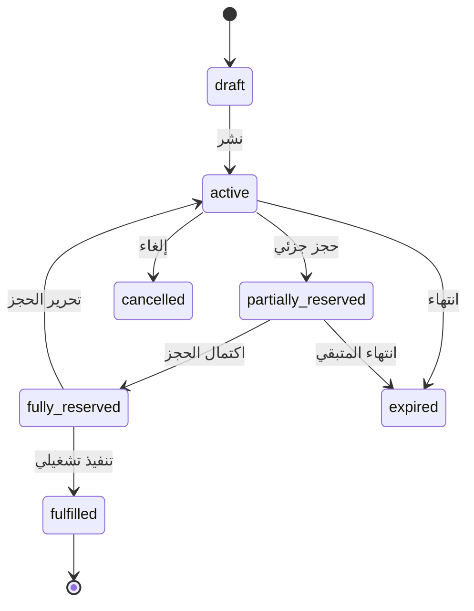

# المرحلة الثانية — الخدمات المرنة والتغطيات وأسعار الصرف

## 1. نتيجة المرحلة

بنهاية هذه المرحلة يستطيع صاحب العمل من لوحة WACRM، يدوياً وبصلاحيات واضحة:

- إنشاء تصنيفات خدمات مرنة وحقول مختلفة لكل تصنيف.
- إنشاء خدمة ووصف عام ووصف داخلي مخصص لإرشاد الذكاء الاصطناعي لاحقاً.
- تعريف قاعدة تسعير حتمية، مثل «6 عن كل 1000».
- إدارة أسعار شراء وبيع العملات بحسب السياق والمنطقة والقناة ونشرها دفعة واحدة.
- تسجيل عروض تغطية يقدمها عملاء/أطراف، وطلبات تغطية يحتاجها آخرون.
- حجز ومطابقة الكميات كلياً أو جزئياً من دون تجاوز الكمية المتاحة.
- مراجعة سجل التغييرات والحالات.

لا يتعامل AI مع هذه البيانات بعد في هذه المرحلة. الهدف أن يصبح مجال العمل صحيحاً ومستقلاً وقابلاً للاختبار قبل إعطاء الوكلاء أدوات قراءة أو اقتراح.

## 2. فهم مجال العمل

النشاط ليس «قائمة أسعار» فقط. في التغطيات توجد جهتان تتغيران لكل عملية:

- طرف يوفّر تغطية/سيولة بشروط وكمية وموقع وطريقة إيداع.
- طرف يطلب تغطية، والنشاط يحقق طلبه من عرض أو عدة عروض مناسبة.

قد يكون الشخص نفسه مورداً في عملية وطالباً في عملية أخرى. لذلك:

- لا تضف `contact.type = supplier` كحقيقة دائمة وحيدة.
- اربط جهة الاتصال بدور `provider` في سجل العرض، و`requester` في سجل الطلب.
- افصل «تعريف خدمة التغطية» عن «عرض التغطية الحي» وعن «طلب العميل» وعن «المطابقة».

## 3. نطاق المرحلة

### داخل النطاق

- التصنيفات، إصدارات مخطط الحقول، الخدمات وإصداراتها.
- التسعير الحتمي وقواعد التقريب.
- دفاتر/نشرات أسعار الصرف وإصدارات النشر.
- عروض وطلبات ومطابقات التغطية وحالاتها.
- واجهات إدارة يدوية وAPI داخلية.
- RLS والتدقيق واختبارات التزامن والدقة.

### خارج النطاق

- أدوات الوكيل والرد من البيانات الحية؛ تأتي في المرحلة الثالثة.
- مزامنة أسعار خارجية تلقائية.
- إنشاء تلقائي لخدمة من رسالة واتساب.
- تحصيل ودفع وأرصدة وقيود ومحاسبة.
- تحويل المطابقة إلى إثبات تسوية مالية.

## 4. مبدأ المرونة الآمنة

لا تضف عموداً جديداً إلى جدول `services` كلما ظهرت خدمة. استخدم:

1. تصنيفاً مستقراً.
2. إصدار مخطط للتصنيف.
3. تعريفات حقول typed ضمن الإصدار.
4. قيماً مرنة في JSONB على إصدار الخدمة.
5. تحققاً خادمياً يطابق JSONB بتعريفات الحقول.

المرونة هنا «حقول معلنة ومتحقق منها»، وليست JSON عشوائياً. يمنع قبول مفتاح غير معرف أو قيمة من نوع خاطئ.

## 5. نموذج التصنيفات والحقول

### 5.1 `service_categories`

- `id`, `account_id`, `slug`, `name`, `description`.
- `status`: `active/inactive/archived`.
- `current_schema_version_id`.
- `created_by`, `updated_by`, timestamps.

`slug` فريد داخل الحساب. الأرشفة لا تحذف الخدمات القديمة.

### 5.2 `service_category_schema_versions`

- `category_id`, `version_number`.
- `status`: `draft/published/superseded`.
- `change_note`, `created_by`, `published_by`, timestamps.

الإصدار المنشور immutable. تعديل حقل أو قيوده ينشئ إصداراً جديداً. لا تنقل الخدمات القديمة تلقائياً إذا كان التغيير غير متوافق؛ اعرض خطة ترحيل/معاينة.

### 5.3 `service_field_definitions`

كل صف يخص إصدار مخطط:

| الحقل | وصفه |
|---|---|
| `field_key` | مفتاح ثابت بصيغة آمنة، مثل `coverage_destination` |
| `label` و`help_text` | العرض للمستخدم |
| `data_type` | نوع من سجل مغلق |
| `required` | هل يلزم عند النشر |
| `visibility` | `public/internal/ai_only` |
| `constraints` | حد أدنى/أقصى، enum، scale، عملات مسموحة وفق النوع |
| `display_order` | ترتيب الواجهة |
| `is_filterable` | هل ينشأ له فهرس/بحث مدروس |

الأنواع الأولية المسموحة:

- `short_text`, `long_text`, `number`, `integer`, `boolean`.
- `money`, `currency`, `percentage`, `per_unit_rate`.
- `enum`, `multi_enum`.
- `region`, `payment_method`.
- `date`, `datetime`.

لا تسمح في هذه المرحلة بصيغة eval أو JavaScript أو regex غير مقيد يكتبه المستخدم. القيود المتقدمة تنفذ من قوالب معروفة.

## 6. نموذج الخدمات والإصدارات

### 6.1 `services`

هوية الخدمة الثابتة:

- `id`, `account_id`, `category_id`.
- `code` داخلي فريد، `slug`، `status`: `draft/active/paused/archived`.
- `current_revision_id`.
- `created_by`, `updated_by`, timestamps.

### 6.2 `service_revisions`

الإصدار المنشور immutable ويشمل:

- `service_id`, `revision_number`, `category_schema_version_id`.
- `name`.
- `public_description`: وصف يجوز إظهاره للعميل.
- `ai_guidance`: شرح داخلي للوكيل عن متى تستخدم الخدمة وما الذي يجب سؤاله وما الذي يحظر كشفه؛ لا يظهر للعميل حرفياً.
- `internal_notes`: للبشر فقط ولا يدخل سياق AI افتراضياً.
- `field_values` JSONB متحقق وفق مخطط التصنيف.
- `pricing_rule_id` اختياري.
- `status`: `draft/published/superseded`.
- `valid_from`, `valid_until` اختياريان.
- ناشر الإصدار وتوقيته وسبب التغيير.

يعرض الرد لاحقاً بيانات public فقط، بينما `ai_guidance` يوجه اختيار الأداة. لا تستخدم `internal_notes` كمعرفة للنموذج إلا بمنح صريح.

## 7. محرك التسعير

### 7.1 `service_pricing_rules`

اجعل كل قاعدة منشورة immutable ومربوطة بإصدار خدمة. الأنواع:

- `fixed`: مبلغ ثابت.
- `percentage`: نسبة من أساس محدد.
- `per_unit`: قيمة لكل وحدة، ومنها «لكل ألف».
- `fixed_plus_percentage`.
- `tiered`: شرائح محددة مسبقاً.
- `fx_buy_sell`: مرجع إلى دفتر سعر صرف واتجاه.
- `manual_quote`: يمنع عرض سعر تلقائي ويطلب موظفاً.

الحقول المشتركة:

- عملة مبلغ الإدخال، وعملة العمولة/الناتج.
- `minimum_fee`, `maximum_fee` اختياريان.
- `rounding_mode` و`rounding_increment`.
- `tax_policy` يترك `none` ما لم يدخل لاحقاً نطاق قانوني واضح؛ لا تخترع ضريبة.
- `formula_config` JSONB حسب نوع القاعدة وبمخطط صارم.

### 7.2 دقة الأرقام

- في PostgreSQL استخدم `numeric(precision, scale)` مناسباً، لا `real/double precision` للأموال.
- في JSON/API انقل المبالغ كسلاسل decimal مثل `"10000.00"`.
- في TypeScript استخدم مكتبة decimal موثوقة أو نفذ الحساب داخل دالة SQL/RPC مجربة؛ لا تستخدم عمليات `number` للأموال.
- كل ناتج يعيد العملة، قاعدة التقريب، نسخة قاعدة التسعير، والمدخلات المستخدمة.

### 7.3 مثال «6 مقابل كل ألف»

قاعدة نموذجية:

```json
{
  "kind": "per_unit",
  "unit_size": "1000",
  "rate_per_unit": "6",
  "rounding_mode": "proportional",
  "fee_currency": "YER"
}
```

عند مبلغ `10000`:

`units = 10000 / 1000 = 10`

`fee = 10 × 6 = 60 YER`

يجب اختيار معنى المبالغ الجزئية صراحة:

| النمط | مبلغ 10,500 عند 6 لكل 1,000 |
|---|---:|
| `proportional` | 63 |
| `ceil_started_unit` | 66 |
| `floor_complete_unit` | 60 |
| `nearest_unit` | 66 عند قاعدة نصف فأعلى |

لا يفترض النظام أحدها بصمت. واجهة الإنشاء تعرض مثالاً محسوباً قبل النشر.

### 7.4 خدمة المثال

يمكن تمثيل «تغطية شبكات صنعاء مقابل إيداع نقدي في الجنوب» كالتالي:

- التصنيف: `coverage`.
- الوصف العام: صياغة يفهمها العميل من دون كشف المورد.
- `ai_guidance`: متى تسأل عن مبلغ التغطية، شبكة/جهة الاستلام، مدينة الإيداع، موعد الحاجة، وطريقة الإيداع.
- حقول: `coverage_region=Sanaa`, `deposit_region=South`, `deposit_method=cash`, وربما `network`.
- تسعير: `per_unit`, معدل 6 لكل 1000، مع قاعدة تقريب يحددها صاحب العمل.

لا تخزن الرقم 6 في الوصف فقط؛ يجب أن يكون في قاعدة تسعير typed ليحسبه النظام حتمياً.

## 8. أسعار الصرف الحية

سعر الصرف يختلف جوهرياً عن عمولة الخدمة؛ يحتاج اتجاهاً ومدة صلاحية ونشراً ذرياً.

### 8.1 `exchange_rate_books`

يمثل سياقاً، مثل «أسعار صنعاء — واتساب — نقدي»:

- `id`, `account_id`, `name`.
- `region_id`/رمز المنطقة، `channel`, `settlement_method`.
- `timezone`، و`stale_after_seconds`.
- `current_published_version_id`.
- `status`.

### 8.2 `exchange_rate_book_versions`

- `book_id`, `version_number`.
- `status`: `draft/published/superseded`.
- `effective_at`, `expires_at` اختياري.
- `source`: `manual/admin_agent/external`، مع المرحلة الحالية `manual`.
- ناشر الإصدار وسبب التغيير.

### 8.3 `exchange_rates`

كل سعر ينتمي إلى إصدار واحد:

- `base_currency`, `quote_currency` وفق ISO/قائمة عملات العمل.
- `buy_rate`, `sell_rate` كـnumeric/string.
- `min_amount`, `max_amount` اختياريان.
- `rate_unit` إذا كانت السوق المحلية تستخدم تمثيلاً خاصاً، ويجب تطبيعه في API.
- `notes_public`, `notes_internal`.

قيد فريد مناسب داخل الإصدار يمنع صفين متضاربين لنفس الزوج والسياق/الشريحة.

### 8.4 النشر الذري والانتهاء

يحرر المسؤول مسودة كاملة ثم ينشرها داخل معاملة واحدة تحدث `current_published_version_id`. بهذه الطريقة لا يرى عميل نصف العملات بالسعر الجديد ونصفها بالقديم.

تعد النشرة stale إذا تجاوزت `stale_after_seconds` منذ `effective_at/published_at` أو انتهت `expires_at`. الواجهة تحذر، وواجهة القراءة لا تصف السعر بأنه «حالي» عند stale. لا يرجع النظام إلى قيمة معرفة قديمة.

لا تستنتج سعر الاتجاه العكسي تلقائياً إلا إذا كانت سياسة الدفتر تنص عليه واختبر التقريب والشراء/البيع. الأفضل تخزين كل اتجاه يعرضه النشاط بوضوح.

## 9. عروض وطلبات ومطابقات التغطية

### 9.1 `coverage_offers`

عرض حي من طرف يوفر التغطية:

- `account_id`, `service_id`, `provider_contact_id`.
- `reference_code` غير كاشف يعرض داخلياً.
- `total_amount`, `reserved_amount`, `fulfilled_amount`, `currency`.
- منطقة/شبكة التغطية، منطقة وطريقة الإيداع، و`attributes` متحقق وفق حقول الخدمة.
- تكلفة المورد/شروطه التشغيلية إذا لزم، وهي `internal`.
- `available_from`, `expires_at`.
- الحالة ونسخة متفائلة `version`.
- المصدر والعضو المنشئ.

المتاح حتمياً:

`available_amount = total_amount - reserved_amount - fulfilled_amount`

يفضل حسابه في query/view أو تحديثه بمعاملة محمية، لا قبول قيمة available من العميل.

### 9.2 `coverage_requests`

طلب طرف يحتاج التغطية:

- `requester_contact_id`, `service_id`.
- `requested_amount`, `reserved_amount`, `fulfilled_amount`, `currency`.
- الوجهة/الشبكة، منطقة وطريقة الإيداع، الوقت المطلوب، والحقول الخاصة.
- snapshot للعرض/العمولة المقدم للعميل إذا صدر quote.
- `expires_at`, `priority`, `notes` المفرزة بحسب visibility.
- الحالة و`version`.

### 9.3 `coverage_matches`

يربط عرضاً واحداً بطلب واحد بكمية قد تكون جزئية:

- `offer_id`, `request_id`, `matched_amount`, `currency`.
- snapshot لشروط العرض وتكلفة المورد وقاعدة السعر ورسوم العميل وقت الحجز.
- `status`, `reserved_until`.
- من أنشأ/أكد/ألغى والسبب.
- `idempotency_key` فريد لكل عملية إنشاء من الواجهة/API.

طلب واحد قد يطابق عدة عروض، وعرض واحد قد يخدم عدة طلبات. لا تفترض علاقة واحد لواحد.

### 9.4 حالات العرض والطلب



قد تختلف أسماء حالة العرض والطلب داخلياً، لكن الانتقالات يجب أن تكون مسجلة ومتحققاً منها. «fulfilled» هنا إنجاز تشغيلي للخدمة، وليس قيد دفع أو تسوية محاسبية.

### 9.5 حالات المطابقة

- `proposed`
- `reserved`
- `confirmed`
- `fulfilled`
- `released`
- `cancelled`
- `expired`

لا تنتقل من `released/cancelled/expired` إلى `confirmed`. بدلاً من ذلك أنشئ مطابقة جديدة بمفتاح جديد.

## 10. التزامن والحجز

أخطر خطأ في هذه المرحلة هو بيع/حجز نفس الكمية مرتين. عملية الحجز تنفذ في دالة مجال/معاملة واحدة:

1. تحقق الحساب والعملة وتوافق خصائص العرض والطلب.
2. اقفل صف العرض والطلب بترتيب ثابت (`SELECT ... FOR UPDATE`) أو استخدم تحديثاً شرطياً ذرياً.
3. أعد حساب المتاح والمطلوب من القيم داخل المعاملة.
4. ارفض إذا لم تكف الكمية أو تغير `version`.
5. أنشئ المطابقة بمفتاح idempotency.
6. حدث `reserved_amount` والحالات والإصدارات.
7. سجل الحدث.
8. commit ثم أرسل أي إشعار؛ لا ترسل داخل المعاملة قبل نجاحها.

اختبر عاملين يحجزان آخر كمية في اللحظة نفسها؛ يجب أن ينجح واحد فقط، أو ينجحان بكميتين لا يتجاوز مجموعهما المتاح.

## 11. الخصوصية والرؤية

عرّف مستويات البيانات:

| المستوى | مثال | من يراه |
|---|---|---|
| `public` | اسم الخدمة، المتطلبات، السعر المعلن | العميل والموظف وAI العميل |
| `internal` | هوية المورد، تكلفة المورد، ملاحظات التفاوض | الموظف المخول ووكيل إدارة بمنح مناسب لاحقاً |
| `ai_only` | تعليمات اختيار الخدمة وصياغة الأسئلة | الوكيل المخول والمسؤول، لا تعرض حرفياً للعميل |
| `secret` | مفاتيح المزود أو رموز التحقق | الخادم فقط؛ لا ينتمي عملياً إلى مجال الخدمة |

أداة توفر التغطية المستقبلية ترجع للعميل تجميعاً مثل «متوفر حتى 50,000 بالشروط كذا»، لا قائمة عروض أو أسماء موردين أو هامش النشاط.

## 12. API المرحلة

استخدم pagination وفلاتر typed وETag/`version` للتعديل المتفائل.

### التصنيفات والخدمات

- `GET/POST /api/service-categories`
- `GET/PATCH /api/service-categories/:id`
- `POST /api/service-categories/:id/schema-versions`
- `POST /api/service-categories/:id/schema-versions/:versionId/publish`
- `GET/POST /api/services`
- `GET/PATCH /api/services/:id`
- `POST /api/services/:id/revisions`
- `POST /api/services/:id/revisions/:revisionId/publish`
- `POST /api/services/:id/pause`
- `POST /api/services/:id/quote-preview`

### الصرف

- `GET/POST /api/exchange-rate-books`
- `POST /api/exchange-rate-books/:id/versions`
- `PUT /api/exchange-rate-books/:id/versions/:versionId/rates`
- `POST /api/exchange-rate-books/:id/versions/:versionId/validate`
- `POST /api/exchange-rate-books/:id/versions/:versionId/publish`
- `GET /api/exchange-rates/current?...context`

### التغطيات

- `GET/POST /api/coverage/offers`
- `GET/PATCH /api/coverage/offers/:id`
- `GET/POST /api/coverage/requests`
- `GET/PATCH /api/coverage/requests/:id`
- `POST /api/coverage/matches/preview`
- `POST /api/coverage/matches`
- `POST /api/coverage/matches/:id/confirm`
- `POST /api/coverage/matches/:id/release`
- `POST /api/coverage/matches/:id/fulfill`

لا توفر endpoint عاماً يغير `reserved_amount` أو الحالة مباشرة؛ استخدم أوامر المجال المسماة.

## 13. واجهة المستخدم

أضف قسماً رئيسياً «الخدمات» يتضمن:

### 13.1 التصنيفات

- قائمة وبحث وحالة.
- منشئ حقول بالسحب/الترتيب واختيار النوع والظهور والقيود.
- معاينة نموذج الخدمة.
- مقارنة schema draft بالمنشور وتحذير التغييرات الكاسرة.

### 13.2 الخدمات

- الاسم، التصنيف، الوصف العام، إرشادات AI الداخلية، الحالة.
- نموذج ديناميكي يولد من schema المنشور.
- محرر تسعير من قوالب، لا مربع معادلة برمجية.
- أمثلة محسوبة إلزامية قبل نشر قاعدة تسعير.
- سجل إصدارات واستعادة عبر إنشاء إصدار جديد، لا تعديل التاريخ.

### 13.3 أسعار الصرف

- اختيار دفتر/سياق.
- جدول شراء/بيع لكل زوج.
- وقت آخر تحديث ومؤشر واضح للحالي/قريب الانتهاء/stale.
- حفظ كمسودة، تحقق، ثم نشر الدفعة كلها.
- عدم نشر إذا تكرر زوج أو كانت قيمة buy/sell غير موجبة أو ناقصة وفق السياسة.

### 13.4 التغطيات

- لوحتان واضحتان: «العروض المتاحة» و«طلبات العملاء».
- فلاتر العملة والمنطقة والشبكة والطريقة والانتهاء.
- شاشة مطابقة تقترح يدوياً عروضاً متوافقة وتبين الكميات من دون كشفها للطرف الآخر.
- دعم المطابقة الجزئية وتاريخ الحجز وانتهاءه.
- مؤشرات الكمية الكلية/المحجوزة/المنفذة/المتاحة.

### 13.5 سجل النشاط

- من أنشأ وعدل ونشر وحجز وألغى.
- الفرق بين الإصدارات.
- لا تعرض internal notes لمن لا يملك صلاحية.

## 14. الصلاحيات

أنشئ capabilities أدق من الاعتماد على الدور وحده:

- `services.read`, `services.manage`, `services.publish`.
- `rates.read`, `rates.manage`, `rates.publish`.
- `coverage.read`, `coverage.manage`, `coverage.match`, `coverage.fulfill`.
- `service_internal_fields.read`.

يعين owner هذه القدرات للأدوار/الأعضاء وفق نظام المشروع. إن لم يوجد RBAC دقيق بعد، استخدم مصفوفة خادمية ثابتة مؤقتة owner/admin للكتابة، لكن صمم API لتقبل capability checker لاحقاً.

أضف public API scopes فقط عند الحاجة الفعلية وبشكل منفصل للقراءة والكتابة؛ لا توسع `messages:send` ليشمل الخدمات.

## 15. الفهارس والبحث

- فهارس `(account_id, status)` وslugs الفريدة.
- فهارس الوقت والحالة للعروض والطلبات النشطة.
- فهارس أزواج العملات وسياق دفتر السعر المنشور.
- GIN على JSONB فقط للحقول التي أثبتت حاجة بحث؛ لا تفهرس كل metadata عشوائياً.
- إذا كانت حقول ديناميكية معينة كثيرة الاستخدام، أنشئ projection/index مدروساً من تعريف `is_filterable` عبر آلية آمنة، لا SQL من المستخدم.

## 16. اختبارات المرحلة

### التحقق والتسعير

- رفض مفتاح/نوع غير مطابق لمخطط التصنيف.
- نشر schema جديد لا يغير تفسير خدمة قديمة.
- كل نوع تسعير، حدود min/max، وجميع أنماط التقريب.
- 10,000 عند 6/1,000 يساوي 60 بدقة.
- أرقام كبيرة وكسور وعملات بعدد منازل مختلف.
- تساوي حساب الخادم ومعاينة الواجهة؛ الخادم هو المرجع.

### الصرف

- buy وsell واتجاه الزوج الصحيح.
- نشر دفعة ذرية وعدم ظهور مسودة في القراءة الحالية.
- رفض سعر سالب/صفر وتكرار زوج.
- انتقال current version مرة واحدة تحت التزامن.
- تصنيف stale والانتهاء وفق timezone وتوقيت الخادم.

### التغطية

- مورد/طالب كدور لكل سجل، وإمكان أن يكون contact نفسه في دورين مختلفين.
- مطابقة كلية وجزئية ومتعددة العروض.
- منع اختلاف العملة/السياق غير المسموح.
- حجزان متزامنان لا يتجاوزان المتاح.
- إعادة نفس idempotency key لا تكرر المطابقة.
- انتهاء/تحرير الحجز يعيد الكمية مرة واحدة.
- عدم تسرب هوية المورد أو تكلفته في DTO العام.

### RLS وأمن

- حسابان يملكان slugs متشابهة ولا يريان بيانات بعضهما.
- viewer لا يرى حقول internal.
- agent غير المخول لا ينشر سعراً ولا ينفذ مطابقة.
- JSON خبيث أو كبير أو عميق يرفض بحدود واضحة.

## 17. خطوات التنفيذ المقترحة

1. ثبت vocabularies: العملات، المناطق، طرق الدفع، حالات المجال، وأنواع الحقول والتسعير.
2. نفذ مخطط التصنيف والإصدارات والتحقق الخادمي.
3. نفذ الخدمات والإصدارات وقوالب التسعير ومحرك decimal.
4. ابن واجهة التصنيفات والخدمات والمعاينة.
5. نفذ دفاتر وإصدارات أسعار الصرف والنشر الذري.
6. ابن واجهة الأسعار وحالة stale.
7. نفذ العروض والطلبات والمطابقات مع دوال حجز ذرية.
8. ابن لوحة التغطيات وسجل النشاط.
9. أضف RLS/قدرات/اختبارات تسرب DTO.
10. املأ بيانات اختبار واقعية وراجع العمليات مع صاحب العمل قبل فتح الإنتاج.

## 18. معيار الخروج

- يمكن إنشاء تصنيف جديد وحقوله من دون ترحيل قاعدة بيانات.
- الخدمة لها وصف عام وإرشاد AI داخلي منفصلان وإصدار منشور ثابت.
- التسعير يعطي ناتجاً حتمياً مفسراً ويطبق التقريب المختار.
- أسعار الصرف تنشر ذرياً وتمنع وصف السعر المنتهي بأنه حالي.
- العرض والطلب والمطابقة تدعم الدور المتغير والكمية الجزئية.
- اختبار التزامن يثبت عدم الحجز الزائد.
- واجهات العرض العامة لا تكشف المورد أو تكلفته.
- يستطيع البشر إدارة الدورة كاملة من اللوحة بلا AI.
- لا يوجد جدول رصيد أو قيد أو تسوية محاسبية ضمن الترحيلات.
