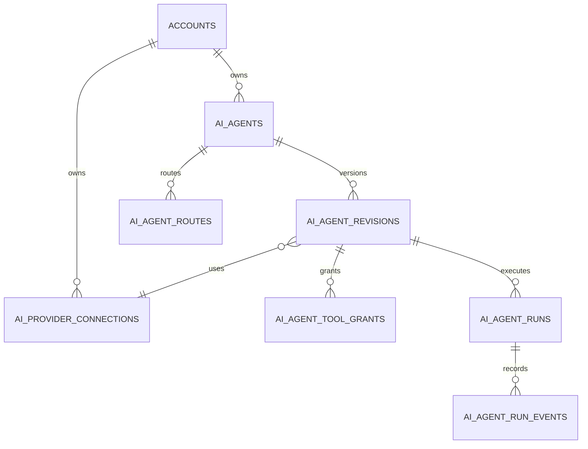
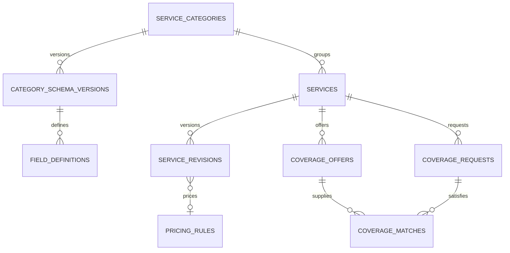
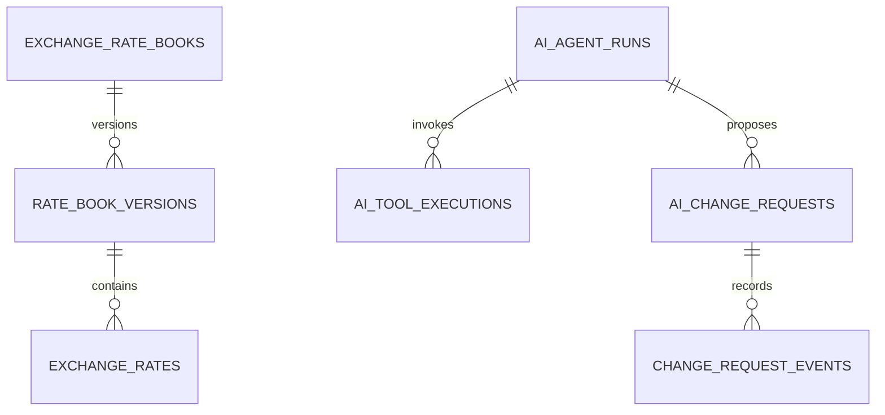

# المرجع المشترك — نموذج البيانات وواجهات API وعقود الأدوات

## 1. وظيفة هذه الوثيقة

هذه الوثيقة مرجع مشترك للمراحل الأربع. إذا كررت وثيقة مرحلة مفهوماً هنا، تطبق القاعدة الأكثر تقييداً. الأسماء النهائية يمكن تكييفها مع naming conventions في المستودع، لكن لا تغير العلاقات وحدود الثقة والحالات من دون سجل قرار.

## 2. قواعد تسمية وأنواع مشتركة

- المعرفات UUID وفق نمط المشروع.
- كل جدول مملوك لحساب يحتوي `account_id NOT NULL`.
- كل وقت `timestamptz` ويخزن UTC؛ تحول المنطقة عند العرض فقط.
- المال والسعر `numeric` في DB وسلسلة decimal في JSON/TypeScript.
- أرقام الهاتف تطبع إلى E.164 في حقل مستقل؛ احتفظ بالصيغة الخام للعرض فقط إذا لزم وبصلاحية.
- الحقول التي يحررها أكثر من طرف تحتوي `version bigint NOT NULL DEFAULT 1` للتعديل المتفائل.
- الحالات enums/قيود check مع دوال انتقال؛ لا يقبل route تغيير status عاماً.
- السجلات التاريخية والمنشورة لا تحذف hard delete في المسار العادي.
- استخدم `created_by_member_id` و`updated_by_member_id` عندما actor بشري، وactor type/id موحداً في الأحداث لوكيل/نظام.

لمنع مراجع عابرة للحساب، أنشئ `UNIQUE(account_id, id)` على الجداول المهمة واستخدم FK مركبة `(account_id, foreign_id)` حيث يكون ذلك عملياً، بالإضافة إلى RLS والتحقق الخادمي.

## 3. خريطة العلاقات — الوكلاء



علاقة المعرفة تربط revision أو agent وفق القرار النهائي، لكن يجب أن يكون run قابلاً لإثبات قائمة المعرفة/إصدار التكوين المستخدم.

## 4. خريطة العلاقات — الخدمات والتغطية





## 5. قاموس الجداول

### 5.1 نواة AI

| الجدول | المفتاح/الملكية | أهم القيود |
|---|---|---|
| `ai_provider_connections` | `id`, `account_id` | اسم فريد للحساب؛ السر مشفر؛ لا حذف عند الاستخدام |
| `ai_agents` | `id`, `account_id` | `system_key` فريد غير null؛ `published_revision_id` من الوكيل نفسه |
| `ai_agent_revisions` | `id`, `account_id`, `agent_id` | `(agent_id, revision_number)` فريد؛ published immutable |
| `ai_agent_knowledge_assignments` | revision/knowledge ids | الطرفان من الحساب نفسه؛ assignment فريد |
| `ai_agent_tool_grants` | revision/tool key | مفتاح/نسخة أداة معروفة؛ permission مسموح للأداة |
| `ai_agent_routes` | `id`, `account_id`, `agent_id` | default فعال واحد لكل حساب/قناة؛ conditions محققة |
| `trusted_admin_identities` | `id`, `account_id` | قناة+عنوان مطبع فريد؛ active بعد تحقق فقط |
| `conversation_ai_state` | `conversation_id`, `account_id` | واحد لكل محادثة؛ AI agent من الحساب نفسه |
| `ai_agent_runs` | `id`, `account_id` | inbound message فريد؛ revision snapshot ثابت |
| `ai_agent_run_events` | run id | append-only؛ ترتيب حدث monotonic لكل run |
| `ai_tool_executions` | run id/call id | `(run_id, provider_call_id)` أو بصمة فريدة؛ نتيجة منقحة |

يفضل تمديد `ai_usage_log` الحالي بأعمدة nullable: `ai_agent_id`, `agent_revision_id`, `provider_connection_id`, `agent_run_id`, ثم backfill حيث أمكن. لا تنشئ سجل تكلفة ثانياً متضارباً.

### 5.2 الخدمات

| الجدول | المفتاح/الملكية | أهم القيود |
|---|---|---|
| `service_categories` | account/category | slug فريد؛ current schema من التصنيف نفسه |
| `service_category_schema_versions` | category/version | رقم فريد؛ published immutable |
| `service_field_definitions` | schema version/key | key فريد بالإصدار؛ نوع وconstraints محققان |
| `services` | account/service | code وslug فريدان؛ category من الحساب نفسه |
| `service_revisions` | service/revision | published immutable؛ values تطابق schema version |
| `service_pricing_rules` | account/rule | kind/config متوافقان؛ المبالغ موجبة حيث يلزم |
| `service_activity_events` | target/event | append-only وmetadata منقحة |

يمكن دمج سجل النشاط في audit system قائم إن كان يدعم actor والفرق وعزل الحساب؛ لا تنشئ نظامي تدقيق يعرضان حقائق متعارضة.

### 5.3 الصرف

| الجدول | المفتاح/الملكية | أهم القيود |
|---|---|---|
| `exchange_rate_books` | account/book | سياق فريد وفق سياسة الحساب؛ current version من الدفتر نفسه |
| `exchange_rate_book_versions` | book/version | منشور immutable؛ effective/expiry صالحان |
| `exchange_rates` | version/pair/context slice | buy/sell موجبان؛ زوج غير متكرر؛ base ≠ quote |

لا تحدث exchange rate منشوراً in place. أنشئ إصداراً، تحقق من كل صفوفه، ثم بدّل الإصدار الحالي داخل معاملة.

### 5.4 التغطيات

| الجدول | المفتاح/الملكية | أهم القيود |
|---|---|---|
| `coverage_offers` | account/offer | total/reserved/fulfilled غير سالبة؛ مجموع المحجوز والمنفذ لا يتجاوز الإجمالي |
| `coverage_requests` | account/request | requested/reserved/fulfilled غير سالبة؛ لا تجاوز المطلوب |
| `coverage_matches` | account/match | العرض والطلب والخدمة/العملة متوافقان؛ idempotency فريد |
| `coverage_events` | target/event | append-only؛ يثبت الانتقال والكمية |

يفضل ألا يعتمد قيد الاتساق الكمي على check فقط إذا كانت الكمية المشتقة موزعة على matches؛ تحمي خدمة المعاملة الصفوف وتوفر مهمة reconciliation.

### 5.5 التغييرات والاعتماد

| الجدول | المفتاح/الملكية | أهم القيود |
|---|---|---|
| `ai_change_requests` | account/change | public code فريد داخل الحساب؛ payload immutable بعد pending |
| `ai_change_request_events` | change/event | append-only؛ لا رمز خام |
| `admin_control_sessions` | account/identity/conversation | انتهاء قصير؛ active proposal صريح |

`normalized_payload`, snapshots وdiff قد تحتوي حقولاً internal؛ تطبق عليها DTOs وصلاحيات، ولا تعرض لمجرد أن المستخدم يمكنه رؤية عنوان الاقتراح.

## 6. الحالات والانتقالات

لا تستخدم endpoint من نوع `PATCH {status: ...}` للكيانات الحساسة. استخدم أوامر بأسماء أفعال.

| الكيان | الحالات الرئيسية | أوامر الانتقال |
|---|---|---|
| AI agent | draft, active, paused, archived | publish revision, pause, resume, archive |
| Agent run | queued, claimed, running, waiting_tool, succeeded, failed, cancelled, skipped | claim, start, record tool, complete, fail, cancel |
| Service | draft, active, paused, archived | publish revision, pause, resume, archive |
| Rate version | draft, published, superseded | validate, publish |
| Coverage offer/request | draft, active, partially_reserved, fully_reserved, fulfilled, expired, cancelled | publish, reserve, release, fulfill, expire, cancel |
| Coverage match | proposed, reserved, confirmed, fulfilled, released, cancelled, expired | reserve, confirm, fulfill, release, cancel, expire |
| Change request | draft, needs_information, pending_approval, approved, executing, applied, rejected, expired, conflicted, failed | validate, request approval, approve, reject, execute, retry |

دالة الانتقال تتحقق من الحالة القديمة والإصدار والصلاحية داخل transaction وتكتب event في المعاملة نفسها.

## 7. RLS وعزل الحساب

لكل جدول مملوك للحساب:

1. فعّل RLS.
2. سياسة SELECT تقارن `account_id` بسياق العضوية الحالية.
3. INSERT يحتاج account مطابقاً وcapability خادمية/بشرية مناسبة.
4. UPDATE/DELETE محدودان؛ التاريخ والأحداث لا تعدل من العميل.
5. اختبر بحسابين ومستخدم عضو في حساب واحد وآخر عضو في حسابين.

لا تستخدم معرفاً من path وحده ثم تستعلم بـ`id = ?`. استخدم `(account_id = authenticatedAccountId AND id = ?)` حتى في الخادم.

أي دالة `SECURITY DEFINER`:

- تثبت `search_path` آمناً.
- تأخذ account/actor من سياق موثوق أو تتحقق منه.
- لا تقبل أسماء جداول/أعمدة.
- تضيق صلاحية التنفيذ.
- لها اختبارات cross-tenant مباشرة.

## 8. عقد API الداخلي

### 8.1 نجاح مفرد

```json
{
  "data": {
    "id": "uuid",
    "version": 3
  },
  "meta": {
    "request_id": "req_..."
  }
}
```

### 8.2 قائمة

```json
{
  "data": [],
  "meta": {
    "request_id": "req_...",
    "next_cursor": null,
    "has_more": false
  }
}
```

استخدم cursor pagination للقوائم المتغيرة. حد أعلى ثابت لـ`limit`. الفرز allowlist، لا اسم عمود خام.

### 8.3 خطأ

```json
{
  "error": {
    "code": "VERSION_CONFLICT",
    "message": "تم تحديث السجل منذ فتحه.",
    "field_errors": [],
    "retryable": false
  },
  "meta": {
    "request_id": "req_..."
  }
}
```

أكواد مقترحة:

- `UNAUTHENTICATED`, `FORBIDDEN`, `NOT_FOUND`.
- `VALIDATION_FAILED`, `INVALID_STATE_TRANSITION`.
- `VERSION_CONFLICT`, `IDEMPOTENCY_CONFLICT`.
- `PROVIDER_AUTH_FAILED`, `PROVIDER_RATE_LIMITED`, `PROVIDER_UNAVAILABLE`.
- `TOOL_NOT_GRANTED`, `TOOL_INPUT_INVALID`, `TOOL_TIMEOUT`.
- `APPROVAL_REQUIRED`, `APPROVAL_INVALID`, `APPROVAL_EXPIRED`, `CHANGE_CONFLICTED`.
- `RATE_STALE`, `RATE_NOT_FOUND`, `COVERAGE_INSUFFICIENT`.

لا تضع provider response الخام أو stack trace في `message` الموجه للمستخدم.

### 8.4 التعديل المتفائل

PATCH/commands الحساسة ترسل `version` أو`If-Match`. عند عدم التطابق أعد HTTP 409 و`VERSION_CONFLICT` مع النسخة الحالية المسموح بعرضها. لا تعيد المحاولة تلقائياً لتغيير إداري لأن ذلك قد يكتب فوق قرار آخر.

### 8.5 Idempotency

عمليات POST ذات الأثر تقبل `Idempotency-Key`:

- المفتاح scoped إلى account + actor + endpoint.
- خزّن hash للطلب والنتيجة/الحالة لفترة معلومة.
- تكرار المفتاح والpayload نفسه يعيد النتيجة المنطقية.
- تكراره مع payload مختلف يعيد 409 `IDEMPOTENCY_CONFLICT`.
- webhook يستخدم معرف مزود الرسالة، لا header يختاره العميل.

## 9. DTOs والرؤية

لا ترسل صف DB مباشرة. أنشئ DTOs منفصلة:

- `PublicServiceDto`: public description/requirements فقط.
- `InternalServiceDto`: يضيف ai guidance أو notes حسب capability.
- `PublicCoverageAvailabilityDto`: تجميع بلا عرض أو مورد.
- `OperationsCoverageDto`: معرفات وتفاصيل داخلية للمخول.
- `AgentSummaryDto`: لا prompt أو أسرار.
- `ProviderConnectionDto`: الحالة والاسم و`has_secret` فقط.
- `ChangeRequestSummaryDto` و`ChangeRequestSensitiveDto` حسب الصلاحية.

أضف اختبارات snapshot/explicit keys تمنع ظهور حقل جديد داخلي تلقائياً عند توسيع الجدول.

## 10. عقد سياق الأداة

النموذج يوفر arguments فقط. runtime يبني السياق غير القابل للتزوير:

```ts
type ToolExecutionContext = {
  requestId: string;
  accountId: string;
  plane: "customer" | "admin";
  channel: "whatsapp" | "playground";
  conversationId: string;
  inboundMessageId: string;
  runId: string;
  agentId: string;
  revisionId: string;
  trustedAdminIdentityId?: string;
  actorCapabilities: ReadonlySet<string>;
  simulation: boolean;
  now: Date;
};

type RegisteredTool<I, O> = {
  key: string;
  version: number;
  inputSchema: Schema<I>;
  outputSchema: Schema<O>;
  effect: "read" | "propose" | "execute-internal";
  risk: "read" | "low" | "medium" | "high";
  requiredCapabilities: string[];
  execute(ctx: ToolExecutionContext, input: I): Promise<O>;
};
```

لا يحتوي input schema على `account_id`, `run_id`, أو actor؛ تؤخذ من السياق. وإذا أرسلها النموذج كحقول إضافية يرفض strict schema.

## 11. أمثلة عقود الأدوات

### 11.1 حساب عمولة

طلب النموذج:

```json
{
  "service_id": "svc_uuid",
  "amount": "10000",
  "currency": "YER",
  "attributes": {
    "coverage_region": "sanaa",
    "deposit_region": "aden",
    "deposit_method": "cash"
  }
}
```

النتيجة:

```json
{
  "status": "quoted",
  "service_revision_id": "rev_uuid",
  "pricing_rule_id": "rule_uuid",
  "input_amount": "10000.00",
  "input_currency": "YER",
  "fee_amount": "60.00",
  "fee_currency": "YER",
  "rounding_mode": "proportional",
  "valid_until": "2026-09-06T12:30:00Z",
  "rendered_facts": "عمولة تغطية 10,000 ريال هي 60 ريال وفق السعر الحالي."
}
```

النموذج لا يعيد حساب `fee_amount`. إن احتاج المجموع، تعيده الأداة أيضاً.

### 11.2 قراءة صرف

```json
{
  "base_currency": "SAR",
  "quote_currency": "YER",
  "intent": "customer_sells_base",
  "region": "sanaa",
  "channel": "whatsapp",
  "settlement_method": "cash"
}
```

```json
{
  "status": "current",
  "book_version_id": "rate_version_uuid",
  "side": "buy",
  "rate": "418.00",
  "published_at": "2026-09-06T12:00:00Z",
  "valid_until": "2026-09-06T12:30:00Z",
  "meaning": "النشاط يشتري SAR من العميل مقابل YER"
}
```

عند stale:

```json
{
  "status": "unavailable_stale",
  "last_published_at": "2026-09-06T10:00:00Z",
  "customer_safe_message": "السعر الحالي يحتاج تحديثاً من الإدارة."
}
```

لا تعيد `rate` في الاستجابة الافتراضية stale حتى لا يستخدمه النموذج خطأ.

### 11.3 توفر تغطية عام

```json
{
  "status": "partially_available",
  "requested_amount": "100000.00",
  "available_amount": "70000.00",
  "currency": "YER",
  "availability_expires_at": "2026-09-06T12:10:00Z",
  "supplier_details": null
}
```

### 11.4 اقتراح تعديل خدمة

مدخل الأداة لا يتضمن `approved=true`:

```json
{
  "service_id": "svc_uuid",
  "expected_revision": 4,
  "changes": {
    "public_description": "...",
    "ai_guidance": "..."
  },
  "reason": "توضيح شروط الإيداع"
}
```

النتيجة:

```json
{
  "status": "pending_approval",
  "change_request_id": "change_uuid",
  "public_code": "CHG-7F3K9",
  "expires_at": "2026-09-06T12:15:00Z",
  "approval_instruction": "اعتماد CHG-7F3K9 4821"
}
```

لا يعاد الرمز الخام في logs أو APIs اللاحقة. ظهوره هنا مخصص للرسالة المباشرة إلى الجهة الموثوقة، ويمكن توليده/إرساله في طبقة منفصلة بحيث لا يدخل سياق النموذج إذا أمكن.

## 12. تنفيذ الأدوات وسجلها

لكل call:

1. طابق key/version بالسجل.
2. احسب effective grant.
3. تحقق strict من input والحجم.
4. اشتق account/actor من السياق.
5. طبق timeout وidempotency.
6. نفذ handler.
7. تحقق output schema.
8. طبق redaction حسب plane.
9. اكتب `ai_tool_executions` والحالة والمدة.
10. أرجع نتيجة bounded للنموذج.

حالات التنفيذ: `requested/validated/running/succeeded/rejected/failed/timed_out/simulated`.

لا تخزن chain-of-thought. يمكن تخزين `decision_reason_code` وملخص تشغيلي منظم.

## 13. التحقق من الحقول الديناميكية

أنشئ compiler داخلياً يحول `service_field_definitions` إلى مخطط تحقق محدود. قواعده:

- keys الإضافية مرفوضة.
- required حسب schema version المستخدم.
- money يتطلب `{amount: decimal-string, currency: code}` أو تمثيلاً موحداً واحداً.
- enum يقبل values المعرفة فقط.
- النص له حد طول وتطبيع، ولا يعامل HTML موثوقاً.
- المنطقة/طريقة الدفع references من vocabularies الحساب.
- visibility لا تأتي من قيمة الخدمة؛ تأتي من تعريف الحقل.

عند نشر schema جديد، شغل compatibility check:

- إضافة حقل اختياري: متوافق غالباً.
- جعل اختياري مطلوباً: كاسر للخدمات القائمة حتى هجرتها.
- تغيير type/key أو حذف قيمة enum مستخدمة: كاسر.
- تغيير label/help فقط: غير كاسر.

## 14. عقود الأحداث

أحداث داخلية موحدة:

- `ai.run.queued|started|succeeded|failed|skipped`
- `ai.tool.succeeded|rejected|failed`
- `ai.change.pending_approval|approved|applied|rejected|expired|conflicted`
- `service.revision.published|status_changed`
- `exchange_rate.version.published|became_stale`
- `coverage.offer.created|reserved|released|fulfilled`
- `coverage.request.created|reserved|fulfilled`
- `coverage.match.created|confirmed|released|fulfilled`

غلاف الحدث:

```json
{
  "event_id": "evt_uuid",
  "type": "exchange_rate.version.published",
  "version": 1,
  "occurred_at": "2026-09-06T12:00:00Z",
  "account_id": "account_uuid",
  "actor": { "type": "member", "id": "member_uuid" },
  "subject": { "type": "rate_book_version", "id": "version_uuid" },
  "correlation_id": "change_or_request_uuid",
  "data": {}
}
```

الأحداث العامة عبر `/api/v1` أو webhooks تستخدم DTO منقحاً منفصلاً. لا ترسل `account_id` أو internal costs إن لم يحتج المستهلك، ووقع webhook وطبّق retries/idempotency وفق نظام المشروع.

## 15. Public API scopes المقترحة

لا تفعّلها كلها تلقائياً. عند إضافة endpoints عامة استخدم scopes دقيقة:

- `services:read`, `services:write`, `services:publish`.
- `rates:read`, `rates:write`, `rates:publish`.
- `coverage:read`, `coverage:write`, `coverage:match`.
- `ai_agents:read`, `ai_agents:manage`.
- `change_requests:read`, `change_requests:approve` — الأخير عالي الحساسية وقد يمنع من API keys العامة في الإصدار الأول.

النطاقات الحالية مثل `messages:send` و`contacts:write` لا تمنح أي نطاق جديد ضمنياً.

## 16. التزامن والإعادة — جدول القرارات

| العملية | الحماية المطلوبة |
|---|---|
| رسالة webhook | معرف رسالة فريد + upsert آمن |
| إنشاء agent run | unique inbound message + claim lease |
| إرسال جواب | idempotency مشتق من run/step |
| نشر revision وكيل/خدمة | version check + transaction |
| نشر دفتر صرف | قفل الدفتر + current version swap ذري |
| حجز تغطية | row locks بترتيب ثابت + recheck amounts |
| اعتماد تغيير | message id فريد + token hash + status compare-and-set |
| تنفيذ تغيير | claim approved once + expected version + transaction |

أي retry خارجي يجب أن يستطيع تمييز «لم يبدأ»، «قيد التنفيذ»، و«نجح لكن فقد الرد».

## 17. حدود الأحجام

حددها مركزياً وقابلة للضبط ضمن سقف خادمي:

- طول prompt والتعليمات والوصف وAI guidance.
- عدد الحقول لكل schema وعمق JSON.
- عدد rates في إصدار واحد.
- عدد tool calls والنتائج وحجم كل نتيجة.
- عدد الاقتراحات pending لكل هوية/حساب.
- مدى pagination.
- مهلة run وtool وprovider.

رفض الحجم يكون قبل إرسال المحتوى إلى المزود أو تنفيذ استعلام مكلف.

## 18. معايير اكتمال العقد

- تولد أنواع TypeScript ومخططات التحقق من مصدر واحد حيث أمكن.
- لا route handler يحتوي منطق تسعير أو حجز أو اعتماد؛ يستدعي خدمات المجال.
- توجد contract tests لكل provider adapter وكل registered tool.
- توجد RLS tests وDTO leak tests لكل مجموعة بيانات.
- كل عملية ذات أثر لها version/idempotency وانتقال حالة واضح.
- كل decimal يبقى string عبر حدود JSON ولا يتحول عشوائياً إلى `number`.
- لا API أو أداة تقبل account/actor/permission من النموذج أو body كمصدر سلطة.
