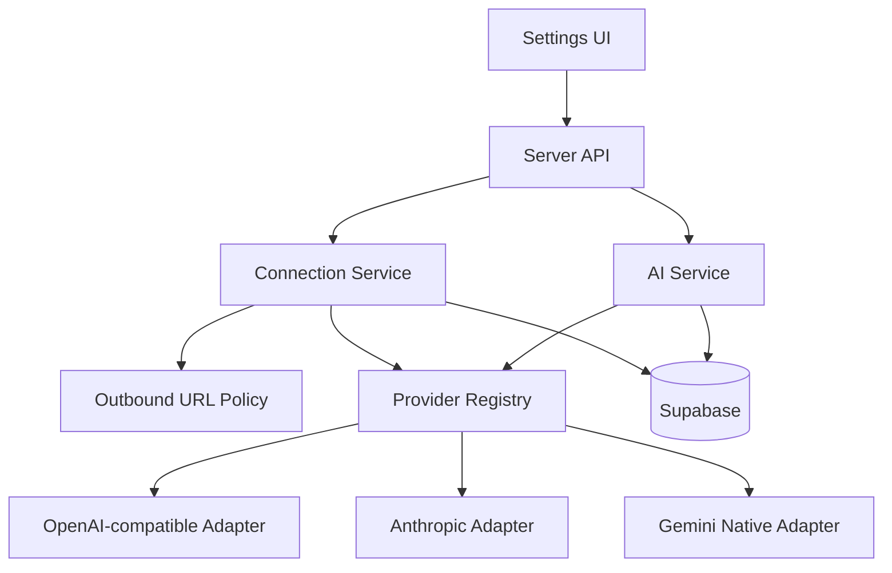
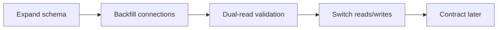

# المواصفات الرئيسية لتعدد اتصالات ومزوّدي الذكاء الاصطناعي في WACRM

**معرّف الوثيقة:** WACRM-AI-MP-001  
**الإصدار:** 1.0  
**التاريخ:** 2026-09-03  
**الحالة:** مواصفات تنفيذ معتمدة مبدئياً  
**اللغة:** العربية، مع إبقاء العقود البرمجية والمصطلحات التقنية بالإنجليزية عند الحاجة

---

## 1. الملخص التنفيذي

الهدف هو تحويل تكامل الذكاء الاصطناعي في WACRM من اختيار ثابت بين OpenAI وAnthropic إلى منظومة اتصالات مرنة وآمنة تسمح بما يلي:

- استخدام OpenAI وAnthropic دون كسر السلوك الحالي.
- إضافة Gemini من خلال مهايئ Native واضح، مع إمكانية الاستفادة من واجهته المتوافقة مع OpenAI عند الضرورة فقط.
- إضافة DeepSeek وأي خدمة تتبع عقد OpenAI-compatible من دون بناء مهايئ خاص لكل علامة تجارية.
- دعم الخدمات التي تتبع عقد Anthropic-compatible عند الحاجة.
- دعم بوابات محلية أو وسيطة مثل 9Router ضمن سياسة نشر صريحة وآمنة، لا عبر فتح عناوين داخلية لجميع المستخدمين.
- جلب قائمة النماذج ديناميكياً من المزوّد عند الإمكان، مع بقاء الإدخال اليدوي متاحاً دائماً.
- فصل اتصال المحادثة عن اتصال Embeddings حتى لا يُجبر المستخدم على استعمال المزوّد نفسه لكليهما.
- الحفاظ على أمان مفاتيح BYOK، وعزل الحسابات، ومنع SSRF، وتوحيد الأخطاء، وإضافة اختبارات وتشغيل قابل للرصد.

التصميم المقترح لا يربط النظام بأسماء مزوّدين متزايدة داخل `switch`، بل يفصل بين ثلاثة مفاهيم:

1. **Connection:** إعداد محفوظ لحساب معيّن، يحوي اسم الاتصال والبروتوكول و`base URL` والسر المشفر.
2. **Protocol adapter:** تنفيذ عقد تقني مثل `openai-compatible` أو `anthropic-compatible` أو `gemini-native`.
3. **Provider preset:** إعداد تجربة المستخدم لمزوّد معروف مثل OpenAI أو DeepSeek، يحدد القيم الافتراضية والسياسات من دون تكرار المهايئ.

هذه الوثيقة هي المرجع الأعلى للفكرة. التفاصيل الموسعة موجودة في ملفات الحزمة، والبرومبتات المرحلية تمنع تنفيذ المشروع دفعة واحدة بطريقة يصعب تدقيقها أو الرجوع عنها.

---

## 2. المشكلة الحالية

بحسب لقطة مرجعية من الفرع العام لـ WACRM بتاريخ هذه الوثيقة، يوجد دعم BYOK لـ OpenAI وAnthropic، لكن التوسعة تواجه القيود التالية:

- النوع `AiProvider` محصور في `'openai' | 'anthropic'`.
- اختيار المزوّد يتم داخل `generateReply` بواسطة `switch`.
- عناوين API ثابتة داخل المهايئات.
- اسم النموذج حقل نصي حر، ولا توجد آلية اكتشاف نماذج موحدة.
- Embeddings مرتبطة بمفتاح OpenAI منفصل، ونموذج ثابت، وبُعد ثابت `1536`.
- جدول `ai_configs` يجمع سلوك المساعد والاختيار والمفاتيح في سجل واحد لكل حساب.
- اختبار الإعداد يعتمد على طلب توليد حقيقي، ولا يفصل بين صلاحية الاتصال وصلاحية نموذج بعينه.
- قبول `base URL` مخصص من المستخدم سيضيف سطح SSRF جديداً لم يكن موجوداً عند استخدام عناوين ثابتة.

هذه اللقطة ليست بديلاً عن فحص فرع العمل الحقيقي. يجب على المنفّذ إعادة الاستكشاف قبل كتابة أي كود؛ فقد تتغير الملفات والمخططات والـ APIs أو توجد تغييرات محلية أو PR متداخل.

---

## 3. أهداف المنتج

### 3.1 أهداف إلزامية

| المعرّف | الهدف |
|---|---|
| OBJ-01 | المحافظة على إعدادات OpenAI وAnthropic الحالية وسلوكها أثناء الترحيل |
| OBJ-02 | تمكين مزوّدات OpenAI-compatible من خلال مهايئ مشترك و`base URL` مضبوط |
| OBJ-03 | دعم Gemini Native بعقد منفصل وقابل للاختبار |
| OBJ-04 | اكتشاف النماذج ديناميكياً عندما يعلن المزوّد ذلك، مع إدخال يدوي دائم |
| OBJ-05 | فصل إعدادات Chat وEmbeddings واختيار كل منهما بشكل مستقل |
| OBJ-06 | عدم كشف مفاتيح API أو تفاصيل حساسة في العميل أو السجلات أو رسائل الخطأ |
| OBJ-07 | منع SSRF وDNS rebinding وإساءة استخدام المسارات وإعادة التوجيه |
| OBJ-08 | توفير ترحيل تدريجي قابل للرجوع من دون فقد إعدادات حالية |
| OBJ-09 | توفير عقود واختبارات ووثائق تجعل إضافة بروتوكول لاحق عملية محدودة وواضحة |
| OBJ-10 | توفير تجربة إعداد توضح حالة الاتصال، عمر قائمة النماذج، وفشل كل خطوة بدقة |

### 3.2 أهداف جودة

- لا تُضاف تبعية تشغيلية جديدة بلا حاجة موثقة.
- لا توجد اتصالات خارجية من المتصفح إلى مزوّد الذكاء الاصطناعي.
- لا توجد أسماء نماذج إلزامية hard-coded كقائمة سماح عامة.
- لا تؤدي إضافة preset جديد إلى تعديل منطق التوليد إن كان يستخدم بروتوكولاً موجوداً.
- لا تؤدي مشكلة اكتشاف النماذج إلى فقد اختيار المستخدم أو تعطيل الإدخال اليدوي.
- تكون كل مرحلة قابلة للاختبار والعرض والرجوع بصورة مستقلة.

### 3.3 خارج النطاق في هذا الإصدار

- بناء وكيل أدوات عام أو function calling أو agent orchestration.
- إعادة تصميم نظام الردود الآلية أو Sentinel الخاص بالتحويل إلى موظف.
- إضافة streaming لمجرد أنه مدعوم لدى مزوّد ما؛ الواجهة الحالية غير متدفقة، ويمكن إضافته لاحقاً بقرار مستقل.
- إدارة فوترة المزوّدات أو شراء أرصدة أو تخزين مفاتيح مركزية بالنيابة عن العملاء.
- دعم كل اختلاف غير قياسي لخدمة تدّعي توافق OpenAI أو Anthropic.
- تغيير أبعاد pgvector بلا خطة إعادة فهرسة مستقلة ومختبرة.
- النشر إلى الإنتاج أو تشغيل migration إنتاجي تلقائياً.

---

## 4. مصطلحات ملزمة

| المصطلح | التعريف |
|---|---|
| Connection | إعداد حساب محفوظ للوصول إلى API، يشمل البروتوكول وAPI root والسر المشفر والسياسة |
| Adapter | كود يحوّل عقد WACRM الداخلي إلى بروتوكول مزوّد محدد ويطبّع النتيجة |
| Preset | تعريف غير سري لمزوّد معروف: الاسم، البروتوكول، API root الافتراضي، وإمكانات الاكتشاف |
| Custom connection | اتصال يسمح بعنوان مخصص ضمن سياسة النشر، وليس عنواناً حراً غير مقيد |
| Model catalog | قائمة مؤقتة وإرشادية للنماذج التي أعادها المزوّد، وليست ضماناً لقدرتها أو توفرها |
| Capability | قدرة معلنة أو مكتشفة مثل chat أو embeddings، وقيمتها `supported` أو `unsupported` أو `unknown` |
| Verification | فحص مصادقة/وصول أو فحص نموذج مختار، وتُحفظ نتائجهما منفصلة |
| Semantic index revision | هوية النموذج والبُعد والإعدادات التي أُنشئت بها متجهات قاعدة المعرفة |

---

## 5. مبادئ التصميم

### 5.1 البروتوكول ليس العلامة التجارية

DeepSeek وOpenRouter و9Router وأي خدمة قياسية أخرى لا تحتاج ملفات توليد مكررة إن كانت تتبع عقد OpenAI. يجب أن يحدد preset تجربة المستخدم، بينما يحدد adapter البروتوكول.

### 5.2 الاكتشاف قدرة اختيارية

ليست كل خدمة متوافقة تطبق `GET /models` أو تعيد بيانات كافية لتحديد الغرض. لذلك:

- تكون `listModels` اختيارية في العقد.
- الفشل فيها لا يجعل الاتصال غير صالح تلقائياً.
- الإدخال اليدوي للنموذج متاح دائماً.
- قائمة النماذج ليست allowlist للتوليد.

### 5.3 الفشل الآمن مع المحافظة على عمل المستخدم

عند فشل تحديث الكتالوج، يحتفظ النظام بآخر نسخة ناجحة ويعرض أنها قديمة. لا يمسح النموذج المحفوظ، ولا يستبدله بأول عنصر في القائمة الجديدة، ولا يحذف المفتاح.

### 5.4 السر يبقى على الخادم

العميل يستقبل `has_key` وحالة التحقق فقط. المفتاح المشفر أو المفكوك لا يظهر في JSON أو HTML أو Local Storage أو URL أو logs.

### 5.5 التوافق الخلفي قبل النظافة النظرية

تُنفذ قاعدة البيانات بنمط expand → migrate → switch reads/writes → contract لاحق. لا تُحذف أعمدة قديمة في الإصدار نفسه الذي يبدأ القراءة من البنية الجديدة.

### 5.6 العقود صغيرة بقدر الحاجة الحالية

المطلوب الآن توليد غير متدفق وEmbeddings واكتشاف نماذج اختياري. لا يفرض العقد streaming أو tools أو multimodal قبل وجود مستهلك حقيقي لها.

---

## 6. خط الأساس المرجعي للمستودع

تمت مراجعة المستودع العام `ArnasDon/wacrm` كمرجع فقط عند الالتزام `98b5bd26e8feacacfd4b74ff58411acb8154d212`، وكانت أهم الملاحظات:

- Next.js 16 وReact 19 وTypeScript وSupabase وVitest.
- مزوّدا Chat حاليان تحت `src/lib/ai/providers/`.
- التوجيه في `src/lib/ai/generate.ts`.
- Embeddings في `src/lib/ai/embeddings.ts`، باستخدام `text-embedding-3-small` و`1536` بُعداً.
- جداول ووظائف pgvector في migrations الخاصة بالذكاء الاصطناعي، ومنها migration 030.
- API إعدادات الذكاء الاصطناعي تحت `src/app/api/ai/config/route.ts`.
- واجهة الإعدادات تحت `src/components/settings/ai-config.tsx`.
- مفاتيح BYOK مشفرة باستخدام مسار التشفير الحالي.
- المشروع يحتوي تعليمات محلية تطلب قراءة وثائق Next.js الموجودة في `node_modules` قبل تعديل سلوك الإطار.

### قاعدة ملزمة للمنفّذ

لا يُنسخ هذا الخط الأساس إلى الكود كافتراض. يجب تنفيذ المرحلة صفر على الفرع الفعلي وتوثيق:

- الالتزام الحالي والفرع وحالة `git status`.
- أي ملفات معدّلة من المستخدم وعدم الكتابة فوقها.
- أحدث migration ورقم migration الجديد الصحيح.
- العقود ومسارات الاستدعاء الحالية الفعلية.
- أي PR أو فرع محلي يضيف مزوّدات أو يعيد بناء AI.
- أوامر التحقق الموجودة في `package.json`.

---

## 7. المتطلبات الوظيفية

### 7.1 إدارة الاتصالات

| المعرّف | المتطلب | الأولوية |
|---|---|---|
| FR-CON-01 | يستطيع Admin إنشاء اتصال باسم واضح واختيار preset | Must |
| FR-CON-02 | يشتق النظام protocol وAPI root وسياسة المصادقة من preset | Must |
| FR-CON-03 | يمكن تعديل API root فقط لاتصال Custom وضمن سياسة الخادم | Must |
| FR-CON-04 | يمكن استبدال المفتاح أو مسحه من خلال فعل صريح، ولا يعاد عرضه | Must |
| FR-CON-05 | لا يستطيع المستخدم تحويل preset ثابت إلى عنوان داخلي عبر payload معدل | Must |
| FR-CON-06 | يمكن للحساب امتلاك أكثر من اتصال محفوظ واختيار واحد للمحادثة وآخر للـ Embeddings | Should |
| FR-CON-07 | حذف اتصال مستخدم في إعداد نشط يتطلب فك الارتباط أو تأكيداً ومعاملة ذرية | Must |
| FR-CON-08 | أعضاء الحساب يقرؤون metadata آمنة فقط؛ Admin فأعلى يعدّلون الأسرار | Must |

### 7.2 اكتشاف النماذج

| المعرّف | المتطلب | الأولوية |
|---|---|---|
| FR-MOD-01 | زر صريح «تحقق واجلب النماذج» ينفذ الاستدعاء من الخادم | Must |
| FR-MOD-02 | يدعم OpenAI-compatible `GET models` عند توفره | Must |
| FR-MOD-03 | يدعم Anthropic pagination ويجمع الصفحات ضمن حد آمن | Must |
| FR-MOD-04 | يدعم Gemini Native ونزع بادئة `models/` عند حفظ اسم التوليد إن تطلب العقد | Must |
| FR-MOD-05 | يطبّع النتائج إلى عقد داخلي واحد ويزيل التكرار ويرتبها بثبات | Must |
| FR-MOD-06 | يحتفظ بآخر كتالوج ناجح وبوقت جلبه، ويعرض stale عند فشل التحديث | Must |
| FR-MOD-07 | يسمح دائماً بإدخال اسم نموذج يدوياً حتى إن نجح الاكتشاف | Must |
| FR-MOD-08 | لا يخفي نموذجاً مجهول القدرة اعتماداً على الاسم فقط؛ يمكن تصنيفه `unknown` | Must |
| FR-MOD-09 | يحد حجم الصفحات والصفوف والـ response bytes والمهلة | Must |
| FR-MOD-10 | لا يجلب تلقائياً مع كل render أو كل ضغطة مفتاح | Must |

### 7.3 التحقق والحفظ

- **فحص الاتصال/الكتالوج:** يثبت أن العنوان والمصادقة وendpoint الاكتشاف يعملون؛ لا يثبت صلاحية Chat لنموذج معين.
- **فحص النموذج المختار:** طلب صغير صريح إلى endpoint التوليد؛ قد يستهلك حصة أو مالاً، لذلك لا يتكرر عند حفظ إعدادات سلوكية لم تتغير.
- تغيير المفتاح أو API root أو protocol يلغي نتيجة التحقق السابقة ويجعل الكتالوج stale.
- تغيير model يلغي `generation_verified_at` فقط.
- لا تُحفظ نتيجة success إن تغيرت بصمة الاتصال بين بداية الطلب ونهايته.
- عند عدم وجود endpoint اكتشاف، يمكن اختبار نموذج يدوي ثم الحفظ.
- الحفظ لا يعتبر نجاحاً جزئياً: إما تُحفظ الروابط والإعدادات المتوافقة معاً، أو تُرجع رسالة آمنة بلا حالة هجينة.

### 7.4 التوليد

- يحتفظ المستهلك الحالي بعقد Provider-neutral.
- يختار Registry المهايئ بناء على protocol المخزن، لا على نص العلامة التجارية.
- يجب أن يدعم العقد الحالي: system prompt، رسائل `user/assistant`، اسم النموذج، timeout، وتطبيع usage.
- يحافظ Anthropic adapter على دمج الأدوار المتتابعة إن كان API يتطلب التناوب.
- يحافظ مسار التوليد على parsing الحالي لعلامة handoff.
- يمنع إرسال طلب إذا كان الاتصال غير فعال، أو المفتاح غير قابل للفك، أو model فارغاً.
- retries لتوليد الرد معطلة افتراضياً لتجنب تكرار التكلفة أو الرد، إلا إذا وُجدت آلية idempotency موثوقة وقرار مستقل.

### 7.5 Embeddings وقاعدة المعرفة

هذه المنطقة لها قيد سلامة بيانات لا يجوز تجاوزه: المخطط المرجعي الحالي يستخدم `vector(1536)` وفهرساً مبنياً لهذا البُعد.

لذلك، في هذا الإصدار:

1. يختار المستخدم اتصال Embeddings مستقلاً عن Chat.
2. لا يظهر نموذج Embeddings كصالح لمجرد وجود اسمه في `/models`.
3. عند التحقق، يُرسل إدخال صغير ثم يُقاس طول المتجه فعلياً.
4. لا يُقبل النموذج لمسار قاعدة المعرفة الحالي إلا إذا أعاد بالضبط `1536` بعد تطبيق خيار أبعاد رسمي مدعوم لدى المزوّد.
5. لا تُقصّر المتجهات ولا تُملأ بأصفار محلياً.
6. يُحفظ `embedding_model` و`embedding_dimensions` و`embedding_revision` مع إعداد الحساب.
7. تغيير أي من هذه القيم يجعل الفهرس الحالي غير متوافق ويتطلب re-index صريحاً.
8. أثناء re-index لا تُخلط متجهات مراجعتين في البحث نفسه.
9. إذا فشل semantic retrieval، يبقى fallback النصي الحالي متاحاً وفق السلوك القائم.

دعم أبعاد متعددة في قاعدة البيانات مشروع تالٍ. يتطلب فهارس منفصلة أو تخطيطاً متوافقاً مع قيود pgvector؛ لا يُحل بتخزين متجهات مختلفة الطول في الفهرس نفسه.

---

## 8. المتطلبات غير الوظيفية

### 8.1 الأمن

- تشفير الأسرار at rest باستخدام الآلية الحالية المراجعة أو نسخة محسنة ذات versioning.
- TLS عام إلزامي للاتصالات المخصصة في النشر المستضاف.
- عناوين preset ثابتة على الخادم وغير قابلة للتجاوز من payload العميل.
- سياسة outbound مركزية تشمل DNS، IP ranges، ports، redirects، timeout، وحجم الرد.
- RLS وعزل كامل بـ `account_id`.
- لا تُسجل prompts أو محادثات أو مفاتيح أو Authorization headers.
- رسائل خطأ للمستخدم لا تتضمن provider body الخام.
- تدقيق أفعال إنشاء/تعديل/اختبار/حذف الاتصال من دون قيمة السر.

### 8.2 الأداء والاعتمادية

- اكتشاف النماذج عملية عند الطلب مع cache وTTL، وليس ضمن مسار توليد الرد.
- timeout منفصل لكل من connect/read/overall إن سمحت المكتبة المستخدمة.
- حد أقصى للصفحات والنماذج وحجم JSON.
- concurrency limit لكل حساب/اتصال.
- استخدام آخر كتالوج ناجح عند تعذر التحديث.
- فشل مزوّد واحد لا يؤثر على بقية الاتصالات.

### 8.3 القابلية للصيانة

- لا يكون للـ UI علم بتفاصيل headers أو paths الخاصة بكل مزوّد.
- لا تكرر المهايئات تطبيع الشبكة والأخطاء.
- كل preset declarative قدر الإمكان.
- العقود العامة موثقة ومغطاة باختبارات contract.
- أي استثناء غير قياسي لخدمة معينة يُعزل في preset hook أو adapter extension موثق.

---

## 9. العمارة المستهدفة



### 9.1 الطبقات

1. **UI:** يرسل intent فقط: preset، اسم اتصال، سر جديد اختياري، نموذج مختار.
2. **Route/service layer:** المصادقة، الدور، validation، rate limits، والمعاملات.
3. **Connection service:** تحميل metadata، فك السر في الذاكرة، حساب fingerprint، إدارة الكتالوج والتحقق.
4. **Outbound policy:** التحقق من الوجهة قبل كل اتصال وكل redirect.
5. **Provider registry:** يحل protocol إلى adapter ويحل preset إلى configuration.
6. **Adapters:** تحويل الطلب/الرد فقط، من دون وصول مباشر إلى قاعدة البيانات أو session.
7. **Persistence:** connections وconfig وaudit/cache وفق RLS.

### 9.2 العقود المقترحة

الأسماء التالية توجيهية وتتكيف مع naming المشروع:

```ts
export type ProviderProtocol =
  | 'openai_compatible'
  | 'anthropic_compatible'
  | 'gemini_native'

export type CapabilityState = 'supported' | 'unsupported' | 'unknown'

export interface ProviderCapabilities {
  chat: CapabilityState
  embeddings: CapabilityState
  modelDiscovery: CapabilityState
}

export interface RuntimeConnection {
  id: string
  accountId: string
  presetId: string
  protocol: ProviderProtocol
  apiRoot: URL
  apiKey: string
}

export interface ModelInfo {
  id: string
  displayName: string
  capabilities: ProviderCapabilities
  inputTokenLimit?: number
  outputTokenLimit?: number
  ownedBy?: string
  rawProviderId?: string
}

export interface ModelCatalog {
  models: ModelInfo[]
  fetchedAt: string
  source: 'provider' | 'cache'
  completeness: 'complete' | 'bounded'
}

export interface GenerateRequest {
  connection: RuntimeConnection
  model: string
  systemPrompt: string
  messages: ChatMessage[]
  timeoutMs: number
}

export interface EmbedRequest {
  connection: RuntimeConnection
  model: string
  inputs: string[]
  dimensions?: number
  timeoutMs: number
}

export interface ProviderAdapter {
  readonly protocol: ProviderProtocol
  generate(request: GenerateRequest): Promise<ProviderResult>
  listModels?: (connection: RuntimeConnection) => Promise<ModelCatalog>
  embed?: (request: EmbedRequest) => Promise<number[][]>
}
```

#### قواعد العقد

- لا يمر `apiKey` في props أو client DTOs.
- لا يقرأ adapter متغيرات session أو قاعدة البيانات.
- `URL` يبنى مرة بعد التحقق، ولا يجري concatenation عشوائي للسلاسل.
- `ModelInfo.capabilities` ثلاثية الحالة؛ `unknown` ليست `unsupported`.
- الحقل `rawProviderId` للتشخيص الداخلي الآمن فقط، ولا يلزم تخزين الاستجابة الخام.
- أي optional method يعني قدرة غير متاحة إن غابت؛ لا ترمِ `not implemented` في المسار العادي.

### 9.3 Registry وPresets

مثال توجيهي:

```ts
export interface ProviderPreset {
  id: string
  label: string
  protocol: ProviderProtocol
  apiRoot: string
  apiRootMode: 'fixed' | 'custom'
  authMode: 'bearer' | 'x-api-key' | 'query-key'
  availability: 'public' | 'deployment_opt_in'
}
```

قواعد:

- `authMode` لا يرسله العميل؛ يأتي من preset/protocol.
- OpenAI وDeepSeek وOpenRouter قد تكون presets مختلفة فوق adapter واحد.
- 9Router أو عنوان LAN يصنف `deployment_opt_in` ويحتاج allowlist يملكها مشغّل النظام.
- Custom OpenAI-compatible لا يعني السماح بكل host. التخصيص يخضع لسياسة نشر.
- إضافة preset لا تتطلب migration إذا كانت القائمة في الكود، إلا إن تقرر جعلها بيانات إدارية.

### 9.4 بناء URLs

يُعرّف `apiRoot` بأنه جذر API شامل النسخة التي يتطلبها المزوّد، مثل مسار ينتهي بـ `/v1/` أو `/v1beta/`. ثم يبني adapter المسارات النسبية بطريقة موحدة:

```ts
const endpoint = new URL('chat/completions', ensureTrailingSlash(apiRoot))
```

لا يُفترض أن كل base URL يحتاج إضافة `/v1`. فبعض الخدمات تعطي root يتضمنه، وبعضها يضع مساراً مختلفاً، وإضافته آلياً قد تنتج `/v1/v1` أو تمسح path مهم عند استخدام `new URL` بصورة خاطئة.

---

## 10. نموذج البيانات المقترح

### 10.1 جدول `ai_provider_connections`

الأسماء النهائية يحددها فحص المشروع، لكن الحد الأدنى المنطقي:

| العمود | الغرض |
|---|---|
| `id uuid pk` | معرّف الاتصال |
| `account_id uuid not null` | العزل والملكية |
| `name text not null` | اسم يراه المستخدم |
| `preset_id text not null` | OpenAI/DeepSeek/Custom… |
| `protocol text not null` | قيمة مقيدة إلى البروتوكولات المدعومة |
| `api_root text not null` | القيمة المطبعة بعد validation |
| `encrypted_api_key text not null` | السر المشفر فقط |
| `key_fingerprint text null` | بصمة غير قابلة للعكس للمقارنة والتدقيق، إن لزم |
| `status text not null` | `unverified/verified/error/disabled` |
| `catalog jsonb null` | كتالوج مطبع محدود الحجم، لا response خام |
| `catalog_fetched_at timestamptz null` | حداثة القائمة |
| `catalog_error_code text null` | رمز آمن لآخر خطأ |
| `verified_at timestamptz null` | نجاح فحص الاتصال |
| `generation_verified_at timestamptz null` | نجاح نموذج Chat المحدد إن رُبط هنا، أو يحفظ في config |
| `created_by uuid` | التدقيق |
| `created_at/updated_at` | التتبع |

قيود مقترحة:

- unique للاسم داخل الحساب إن كان UX يعتمد أسماء مميزة.
- `protocol` و`status` لهما CHECK constraints.
- حد لطول name وapi_root والكتالوج عند طبقة التطبيق.
- لا تحفظ headers مخصصة حرة في الإصدار الأول؛ هي قناة سهلة لتسريب أسرار أو تجاوز سياسات.
- إن احتاج النظام headers إضافية، تكون قائمة ثابتة حسب preset ومضافة على الخادم.

### 10.2 تعديل `ai_configs`

يبقى الجدول مسؤولاً عن سلوك المساعد، ويضاف إليه تدريجياً:

- `chat_connection_id`.
- `chat_model` أو إبقاء `model` مؤقتاً أثناء الترحيل.
- `embedding_connection_id`.
- `embedding_model`.
- `embedding_dimensions`.
- `embedding_revision`.
- حالة re-index إن كان النظام يديرها من هنا أو من جدول jobs مستقل.

لا تُحذف `provider/api_key/embeddings_api_key` القديمة في مرحلة التوسعة. تُكتب أداة backfill idempotent تحول كل إعداد قديم إلى اتصال/اتصالين، ثم تتحقق من التكافؤ قبل تحويل القراءة.

### 10.3 كتالوج في عمود أم جدول؟

الافتراضي الموصى به لهذه النسخة هو JSONB محدود داخل الاتصال لأن القائمة cache قابلة للاستبدال ولا تحتاج query علائقية معقدة. يُنقل إلى جدول منفصل فقط إذا ظهرت حاجة حقيقية إلى البحث العالمي أو قوائم ضخمة أو تاريخ إصدارات.

### 10.4 RLS

- كل صف مرتبط بـ `account_id`.
- أعضاء الحساب يمكنهم قراءة view أو RPC آمن لا يتضمن ciphertext.
- Admin فأعلى ينشئ ويعدّل ويختبر ويحذف.
- service role يستخدم فقط في مسارات خادم محددة.
- أي `SECURITY DEFINER` يحدد `search_path` صراحة وتُسحب صلاحية التنفيذ من `PUBLIC` ثم تمنح للأدوار اللازمة فقط.
- اختبارات SQL تثبت أن عضواً من حساب A لا يرى metadata أو status لحساب B.

---

## 11. عقود HTTP المقترحة

يمكن تكييفها لمسارات المشروع، لكن يجب فصل المسؤوليات:

| الطريقة والمسار | الدور | الغرض |
|---|---|---|
| `GET /api/ai/connections` | member | metadata آمنة لكل الاتصالات |
| `POST /api/ai/connections` | admin | إنشاء اتصال، مع سر جديد |
| `PATCH /api/ai/connections/:id` | admin | تعديل الاسم/السر/العنوان المسموح |
| `DELETE /api/ai/connections/:id` | admin | حذف بعد فحص المراجع |
| `POST /api/ai/connections/:id/discover-models` | admin | تحقق اتصال وجلب catalog |
| `POST /api/ai/connections/:id/test-model` | admin | اختبار صريح لنموذج محدد |
| `GET /api/ai/config` | member | إعداد سلوكي آمن وروابط الاتصال |
| `PATCH /api/ai/config` | admin | حفظ chat/embedding selection والسلوك |

### 11.1 DTO آمن نموذجي

```json
{
  "id": "uuid",
  "name": "DeepSeek production",
  "preset_id": "deepseek",
  "protocol": "openai_compatible",
  "api_root": "https://api.example.invalid/v1/",
  "has_key": true,
  "status": "verified",
  "catalog_fetched_at": "2026-09-03T10:00:00Z",
  "catalog_stale": false
}
```

ممنوع أن يتضمن DTO: ciphertext، plaintext، Authorization header، provider response raw، resolved IPs الداخلية، stack trace، أو key fingerprint إن كان يمكن إساءة استخدامه.

### 11.2 Contract خطأ آمن

```json
{
  "error": {
    "code": "AI_MODEL_FORBIDDEN",
    "message": "The selected model is not available for this connection.",
    "retryable": false,
    "request_id": "req_..."
  }
}
```

رموز مقترحة:

- `AI_INVALID_CREDENTIALS`
- `AI_PERMISSION_DENIED`
- `AI_RATE_LIMITED`
- `AI_MODEL_NOT_FOUND`
- `AI_MODEL_FORBIDDEN`
- `AI_UNSUPPORTED_CAPABILITY`
- `AI_CONNECTION_BLOCKED`
- `AI_CONNECTION_TIMEOUT`
- `AI_PROVIDER_UNAVAILABLE`
- `AI_PROVIDER_MALFORMED_RESPONSE`
- `AI_EMBEDDING_DIMENSION_MISMATCH`
- `AI_CONFIG_CONFLICT`
- `AI_INTERNAL_ERROR`

يحفظ الخادم سبباً تقنياً منقحاً مع `request_id`، ويعرض للعميل رسالة مترجمة وآمنة. لا يُمرر body المزوّد الخام حتى لو كان status هو 400.

---

## 12. اكتشاف النماذج وتطبيعها

### 12.1 OpenAI-compatible

- يستدعي `GET models` نسبياً إلى API root.
- يتوقع شكلاً قريباً من `{ data: [{ id, owned_by, created }] }`.
- يتعامل مع غياب metadata كحالة طبيعية.
- لا يستنتج Chat/Embeddings على نحو قطعي من الاسم.
- يمكن استخدام heuristics لترتيب الخيارات أو وضع شارات فقط، وتُختبر كوحدة مستقلة، ولا تمنع الإدخال اليدوي.

### 12.2 Anthropic

- يدعم pagination الرسمية مع حد صفحات/نماذج.
- يرسل headers الرسمية من الخادم.
- يستخدم capabilities الرسمية إن كانت موجودة في response، مع fallback إلى `unknown` عند الغياب.
- لا يفترض أن كل خدمة Anthropic-compatible تطبق أحدث حقول Anthropic.

### 12.3 Gemini Native

- يستخدم endpoint النماذج Native.
- يعتمد `supportedGenerationMethods` لتحديد `generateContent` و`embedContent` حيث تتوفر.
- يحافظ على `rawProviderId` مثل `models/...` ويطبع معرّف الاستخدام وفق endpoint.
- يحترم pagination و`nextPageToken`.
- لا يساوي بين وجود النموذج وإتاحة النموذج للمفتاح أو المنطقة؛ الاختبار الفعلي هو الفيصل.

### 12.4 cache

- TTL افتراضي مقترح: 15 دقيقة إلى ساعة، يثبت بالقرار التشغيلي.
- زر refresh يمكن أن يتجاوز TTL ضمن rate limit.
- مفتاح cache: `connection_id + connection_fingerprint + adapter_catalog_version`.
- تغيير السر أو root أو protocol يلغي الكتالوج.
- تحفظ النسخة القديمة عند خطأ مؤقت وتعرض `stale=true` مع آخر وقت نجاح.
- لا تحفظ أكثر من حد معقول، مثل 500 نموذج، قبل قرار واضح لدعم قوائم أكبر.
- لا تحفظ provider payload الكامل؛ فقط الحقول المطبعة اللازمة.

### 12.5 ترتيب وعرض النماذج

ترتيب ثابت مقترح:

1. النموذج المحفوظ حالياً، حتى إن لم يعد في الكتالوج، مع شارة `Saved / not in latest catalog`.
2. النماذج التي تعلن القدرة المطلوبة.
3. النماذج ذات القدرة `unknown`.
4. النماذج غير المدعومة لا تظهر افتراضياً للغرض الحالي، مع إمكانية عرضها للتشخيص.

لا يُستبدل النموذج تلقائياً بعد refresh، ولا يؤدي اختفاء النموذج من الكتالوج إلى حذف الإعداد.

---

## 13. سياسة الاتصالات الخارجية ومنع SSRF

فتح `base URL` مخصص يعني أن خادم WACRM أصبح قادراً على الاتصال بعنوان يختاره المستخدم. هذا يجب أن يعالج كحد أمني مستقل.

### 13.1 السياسة الافتراضية

- presets العامة تستخدم HTTPS وعناوين ثابتة يملكها الكود.
- custom public endpoints: HTTPS فقط، ports مسموحة، host مسموح حسب إعداد deployment.
- localhost وprivate/link-local/metadata/multicast/unspecified/CGNAT محجوبة.
- IPv4-mapped IPv6 والعناوين العشرية/السداسية والحيل المشابهة تُطبع ثم تُفحص.
- يمنع username/password في URL، والـ fragment، والمسارات الأطول من الحد.
- لا تتبع redirects تلقائياً؛ كل `Location` يعاد تحليله وحل DNS له وفحصه.
- يوضع حد لعدد redirects، ويفضل صفر في API presets.
- يجري DNS resolution قبل الاتصال، وتوجد حماية من إعادة الربط؛ في البيئات الحساسة يستخدم egress proxy/firewall كطبقة نهائية.
- لا يثق النظام بـ proxy environment variables غير المراجعة.

### 13.2 حالة 9Router والخدمات المحلية

9Router غالباً يعمل على `localhost` أو شبكة خاصة، لذلك لا يمكن دعم هذا السيناريو بأمان في SaaS متعدد المستأجرين عبر استثناء عام.

التصميم الصحيح:

- الوضع الافتراضي: محجوب.
- self-hosted deployment: يفعّل المشغّل متغيراً/قائمة سماح على مستوى الخادم لوجهات محددة، مثل host وport معروفين.
- لا يستطيع Admin حساب منفرد تجاوز سياسة المشغّل.
- تظهر الواجهة تحذيراً أن الاتصال خاص بالنشر وقد لا يعمل خارج الشبكة.
- تُوثق المخاطر، ويُفضّل شبكة/egress gateway مخصصة بدلاً من السماح العام لعناوين RFC1918.

### 13.3 حدود الموارد

- timeout إجمالي مضبوط.
- حد bytes للرد قبل JSON parse.
- Content-Type المتوقع مع معالجة مزوّدات لا تضبطه بدقة، من دون قبول ملفات ضخمة.
- حد models/pages.
- rate limit لكل user/account/connection/action.
- concurrency limit لمنع fan-out.
- لا retries على 401/403/404 ومعظم 4xx.
- retries محدودة مع jitter فقط لطلبات idempotent مثل list models، ومع احترام `Retry-After`.

---

## 14. تجربة المستخدم

### 14.1 شاشة الاتصالات

كل بطاقة اتصال تعرض:

- الاسم وpreset.
- حالة السر كـ `Configured / Not configured` فقط.
- API root؛ للـ preset الثابت يكون read-only.
- حالة الاتصال وآخر تحقق.
- آخر تحديث للكتالوج وحالة fresh/stale/error.
- أفعال: Edit، Verify & load models، Test model، Disable، Delete.

### 14.2 نموذج الإنشاء/التعديل

الترتيب المقترح:

1. Provider preset.
2. Connection name.
3. API root عند Custom فقط.
4. API key (فارغ عند التعديل مع توضيح أن تركه فارغاً يبقي الحالي).
5. زر Verify & load models.
6. نتيجة آمنة واضحة.

لا تُرسل قيمة placeholder مثل `••••••••` إلى الخادم على أنها مفتاح.

### 14.3 إعداد Chat

- اختيار connection.
- قائمة بحث للنماذج إن توفرت.
- خيار `Enter model ID manually` دائم.
- زر Test selected model مع تنبيه أنه قد يستهلك حصة صغيرة.
- إعدادات system prompt وauto-reply وhandoff تبقى مستقلة عن الاتصال.

### 14.4 إعداد Embeddings

- اختيار connection يدعم/قد يدعم Embeddings.
- اختيار/إدخال model.
- عرض البُعد المطلوب `1536` في الإصدار الحالي.
- اختبار يعرض `Compatible: 1536 dimensions` أو خطأ واضح.
- عند تغيير الإعداد، تعرض خطة re-index وحالة التقدم قبل تحويل البحث الدلالي.

### 14.5 الترجمة والوصول

- لا تضاف نصوص hard-coded داخل JSX.
- تحدّث جميع locales القائمة في المشروع، لا الإنجليزية فقط.
- حالات loading/error/success تستخدم نصاً وقارئ شاشة، ولا تعتمد اللون وحده.
- keyboard navigation للقوائم والحوارات.
- رسائل الخطأ تشرح الإجراء التالي من دون كشف تفاصيل حساسة.

---

## 15. الترحيل والتوافق الخلفي

### 15.1 نهج expand/migrate/contract



#### Expand

- إضافة الجداول والأعمدة والقيود وRLS بلا حذف القديم.
- نشر كود يستطيع قراءة القديم والجديد.

#### Backfill

- لكل `ai_configs` قديم، إنشاء connection مطابق لـ provider الحالي.
- فك السر داخل مسار خادم آمن ثم إعادة استخدام ciphertext إن كان التنسيق يسمح، أو فك/إعادة تشفير بدون logging.
- إنشاء اتصال Embeddings مستقل فقط عند وجود مفتاحه.
- العملية idempotent، ويمكن إعادة تشغيلها.
- تسجيل counts فقط، لا الأسرار.

#### Dual-read/validation

- مقارنة نتيجة التحميل من المسارين في الاختبارات وبيئة staging.
- عند غياب البنية الجديدة، fallback مؤقت للقديم.
- writes الجديدة يمكن أن تكون dual-write لفترة قصيرة إذا لزم rollback، لكن يجب تحديد مالك وفترة إزالة واضحة.

#### Switch

- feature flag على مستوى النشر أو الحساب.
- مراقبة أخطاء decrypt/config/provider.
- عدم حذف الأعمدة القديمة.

#### Contract لاحق

- بعد إصدار مستقر وفترة رجوع متفق عليها فقط.
- migration منفصل لحذف ciphertext/أعمدة قديمة.
- backup وتحقق مسبق وموافقة تشغيلية.

### 15.2 قاعدة منع فقد البيانات

لا يجوز لأي migration أن يحذف إعداداً حالياً أو يستبدل model أو يعيد كتابة المفتاح بقيمة placeholder. كل صف قديم إما يتحول بنجاح، أو يبقى قابلاً للقراءة عبر fallback مع تقرير قابل للمعالجة.

---

## 16. استراتيجية الاختبار

### 16.1 اختبارات الوحدة

- Registry resolution ورفض protocol مجهول.
- URL joining لكل شكل root ومنع `/v1/v1`.
- normalization لكل مزوّد.
- pagination، deduplication، stable sort، والحدود.
- error mapping وredaction.
- capability tri-state وعدم حجب `unknown`.
- قياس embedding dimensions ورفض mismatch.
- fingerprint invalidation.
- backoff و`Retry-After` للطلبات المسموح بإعادتها.

### 16.2 Contract tests بمزوّد وهمي

خادم HTTP محلي داخل الاختبار يحاكي:

- نجاح OpenAI-compatible.
- غياب `/models` مع نجاح chat.
- response ناقص أو كبير أو بطيء.
- 401، 403، 404، 429، 500.
- pagination Anthropic/Gemini.
- redirect إلى localhost أو metadata IP.
- DNS/address policy بواجهات قابلة للحقن والاختبار من دون اتصال حقيقي.
- model اختفى من القائمة لكنه ما زال محفوظاً.
- embeddings بأبعاد صحيحة وخاطئة.

### 16.3 اختبارات التكامل

- API authorization حسب الدور والحساب.
- عدم وجود الحقول السرية في GET وsnapshots.
- معاملات إنشاء/تعديل وحذف connection.
- migration وbackfill على نسخة بيانات fixture قديمة.
- اختيار Chat وEmbeddings من اتصالين مختلفين.
- fallback lexical عند غياب/فشل semantic path.
- عدم إعادة اختبار provider عند تعديل system prompt فقط، ما لم تتغير بيانات الاتصال/النموذج.

### 16.4 اختبارات UI

- preset ثابت مقابل custom.
- key masked وعدم استرجاعه.
- loading وstale وmanual entry.
- بقاء model المحفوظ بعد refresh فاشل أو اختفائه من catalog.
- منع الحفظ عند تعارض embedding dimension.
- accessibility الأساسية والترجمات.

### 16.5 فحوص الانحدار

- OpenAI الحالي يولد draft كما قبل.
- Anthropic الحالي يولد draft كما قبل.
- auto-reply وhandoff وusage logging لا تتغير.
- معدلات الحد الحالية لا تضعف.
- قاعدة المعرفة lexical والsemantic الحاليان يستمران للحسابات القديمة.

تفاصيل التتبع موجودة في `delivery/TEST_AND_ACCEPTANCE_MATRIX.md`.

---

## 17. المراقبة والتشغيل

### 17.1 بيانات مسموحة في telemetry

- request/correlation ID.
- account identifier مموه أو داخلي حسب سياسة المشروع.
- connection ID وpreset/protocol.
- model ID بعد تطبيق سياسة الخصوصية، من دون إدخال المستخدم.
- العملية: discover/test/generate/embed.
- status/error code/latency/retry count.
- usage tokens إذا أعادها المزوّد.
- catalog count وfresh/stale.

### 17.2 بيانات ممنوعة

- API keys أو ciphertext أو headers.
- prompts والرسائل ومحتوى قاعدة المعرفة.
- response body الخام.
- URL يحتوي query secret.
- stack traces في استجابة العميل.

### 17.3 مؤشرات إطلاق

- نسبة نجاح التوليد حسب protocol/preset.
- p50/p95 latency.
- معدل 401/429/timeout/provider malformed.
- نجاح model discovery وعمر cache.
- أخطاء dimension mismatch.
- عدد الحسابات التي بقيت على fallback القديم أثناء الترحيل.

### 17.4 Runbook مختصر

- ارتفاع 401: لا تعطل النظام؛ وجّه الحساب لإعادة إدخال المفتاح، وتحقق من عدم تغير auth contract.
- ارتفاع 429: لا تكرر التوليد عشوائياً؛ اعرض retryable ورسالة مناسبة وراجع limits.
- فشل catalog فقط: استخدم cache القديم واترك manual entry.
- فشل adapter لمزوّد واحد: عطّل preset عبر flag إن توفر، من دون تعطيل OpenAI/Anthropic.
- خطأ migration: أوقف feature flag، ارجع للقراءة القديمة، ولا تحذف البنية الجديدة قبل تحليل البيانات.
- mismatch للمتجهات: أوقف تفعيل semantic revision الجديدة واستمر على الفهرس السابق/lexical.

---

## 18. خطة التنفيذ المرحلية

| المرحلة | الهدف | المخرج الرئيسي | بوابة الانتقال |
|---|---|---|---|
| 00 | استطلاع الفرع الفعلي | تقرير current-state وخطة ملفات | لا غموض أو تغييرات متداخلة |
| 01 | تأسيس العقود والسجل | adapters/registry دون تغيير سلوك | اختبارات OpenAI/Anthropic الحالية تمر |
| 02 | الاتصالات والأمن | schema + service + outbound policy | RLS وSSRF وmigration tests تمر |
| 03 | OpenAI-compatible | presets واكتشاف وتوليد عام | OpenAI + DeepSeek-like + no-models contracts تمر |
| 04 | Anthropic وGemini | adapters/discovery native | pagination/error/capability tests تمر |
| 05 | Embeddings وUX | فصل الاتصالات وdimension gate وUI | regression وUI/a11y/i18n تمر |
| 06 | التقسية والإطلاق | backfill/flags/observability/docs | build كامل وخطة رجوع مجربة |

لا تنفذ مرحلتين في migration واحد واسع. لكل مرحلة برومبت مستقل وتقرير وفق القالب.

---

## 19. المخاطر والقرارات الحرجة

| الخطر | الأثر | التخفيف |
|---|---|---|
| ادعاء توافق OpenAI مع اختلافات فعلية | فشل مزوّدات مخصصة | عقد subset واضح، contract tests، manual model، أخطاء مفهومة |
| SSRF من base URL | وصول للبنية الداخلية أو metadata | fixed presets، allowlist، DNS/IP/redirect policy، egress control |
| كشف المفتاح في log أو DTO | اختراق حساب المزوّد | server-only، redaction، tests، audit آمن |
| خلط أبعاد embeddings | نتائج خاطئة أو فشل pgvector | gate 1536، revision، re-index، لا truncation/padding |
| اختفاء model من catalog | تعطيل إعداد عامل | catalog إرشادي، حفظ الاختيار، stale/manual |
| طلبات اختبار مكلفة | تكلفة وإزعاج rate limit | فصل discovery عن generation test وعدم التكرار عند تغيير سلوكي |
| migration شامل | فقد إعدادات أو توقف | expand/migrate/contract وfeature flag وrollback |
| توسع نطاق المشروع | تأخر ومخاطر انحدار | استبعاد streaming/tools وإضافة كل قدرة بقرار مستقل |
| PR متداخل في upstream | تعارض أو تكرار | فحص branch/PR قبل التعديل وعدم cherry-pick أعمى |

---

## 20. معايير القبول النهائية

يُعتبر المشروع مكتمل الإصدار عندما تتحقق كلها:

- [ ] الحسابات الحالية تعمل دون إعادة إدخال مفاتيحها بعد الترحيل الناجح.
- [ ] OpenAI وAnthropic يجتازان اختبارات الانحدار.
- [ ] preset لـ DeepSeek أو mock متوافق يعمل عبر OpenAI-compatible adapter نفسه.
- [ ] Gemini Native يعمل عبر adapter مستقل ومغطى باختبارات العقد.
- [ ] خدمة لا تدعم `/models` يمكن استخدامها باسم model يدوي.
- [ ] refresh فاشل لا يمسح catalog القديم أو model المختار.
- [ ] Chat وEmbeddings قابلان للاختيار من اتصالين مختلفين.
- [ ] vector غير 1536 مرفوض قبل الكتابة إلى قاعدة المعرفة الحالية.
- [ ] تغيير embedding revision لا يخلط فهرسين ويطلب re-index.
- [ ] لا تظهر الأسرار في responses أو logs أو DOM أو snapshots.
- [ ] SSRF tests تغطي private IPv4/IPv6 وredirects وDNS policy.
- [ ] أدوار member/admin والعزل بين الحسابات مثبتة آلياً.
- [ ] errors مطبعة وآمنة ومترجمة ولها request ID.
- [ ] rate limits وtimeouts/size limits مفعلة.
- [ ] كل locale قائم في المشروع محدث.
- [ ] `format:check` و`lint` و`typecheck` و`test` و`build` تمر، أو توجد قيود بيئية موثقة بدقة لا تُخفى.
- [ ] migration/backfill/rollback جُربت على بيانات fixture تشبه القديم.
- [ ] وثائق المشغل والمطور والمستخدم وADRs وتقارير المراحل محدثة.
- [ ] لا يوجد commit أو push أو deploy أو migration إنتاجي تم بلا تفويض صريح.

---

## 21. Definition of Done لكل مرحلة

لا تكفي عبارة «الكود يعمل». المرحلة منتهية فقط عند:

1. تنفيذ النطاق المحدد فقط.
2. إضافة/تحديث الاختبارات المناسبة.
3. تشغيل أوامر التحقق الفعلية في المشروع.
4. مراجعة عدم كشف الأسرار.
5. تحديث الوثائق والـ ADR عند الانحراف.
6. كتابة تقرير المرحلة: الملفات، migrations، الاختبارات، المخاطر، rollback، والمتبقي.
7. عدم وجود TODO أمني مبهم أو fallback صامت.
8. توضيح أي فشل اختبار قديم أو بيئي مع دليل، من دون وصفه كنجاح.

---

## 22. البرومبت التنفيذي الرئيسي لوكيل البرمجة

انسخ النص التالي إلى وكيل البرمجة بعد إتاحة هذه الحزمة داخل المستودع. الأفضل بعده استخدام برومبت كل مرحلة منفردة.

```text
أنت المسؤول عن تنفيذ مشروع تعدد مزوّدي واتصالات الذكاء الاصطناعي في WACRM. تعامل مع docs/ai-multi-provider/WACRM_MULTI_PROVIDER_MASTER.md بوصفها المواصفات الرئيسية، واقرأ README وخطة الطريق والعقود والأمن والاختبارات والقرارات قبل لمس الكود.

قواعد العمل الإلزامية:

1) ابدأ حصراً بالمرحلة 00 (Reconnaissance). اقرأ تعليمات المستودع المحلية كاملة، ومنها AGENTS.md/CLAUDE.md وأي تعليمات متداخلة. افحص git status والفرع والالتزام، ولا تكتب فوق تغييرات المستخدم. اقرأ وثائق Next.js المحلية التي تلزمك بها تعليمات المشروع قبل تعديل كود Next.js.

2) لا تفترض أن لقطة المستودع المذكورة في الوثائق تطابق الفرع الحالي. ابنِ خريطة فعلية لمسارات AI وconfig وdatabase وRLS وUI وi18n والاختبارات. افحص وجود تغييرات أو PRs متداخلة في تعدد المزوّدات، ولا تدمج أو تنسخ شيئاً بصورة عمياء.

3) لا تبدأ التنفيذ قبل تسليم تقرير استكشاف يوضح: الوضع الحالي، الفجوات، الملفات المقترحة، رقم migration التالي، المخاطر، وخطة تحقق. إن وجدت تغييرات محلية متداخلة أو قراراً قد يسبب فقد بيانات، توقف واطلب قراراً.

4) نفّذ مرحلة واحدة فقط في كل مرة، مستخدماً prompt المرحلة المقابل. حافظ على حجم diff قابل للمراجعة. لا تخلط refactor واسعاً أو features غير مطلوبة مثل streaming/tools/agents.

5) افصل ProviderProtocol عن ProviderPreset وعن account Connection. DeepSeek/OpenRouter/9Router والخدمات القياسية تستخدم OpenAI-compatible adapter بدلاً من نسخ adapter لكل اسم. Gemini يستخدم Native adapter في النطاق الحالي. اكتشاف النماذج قدرة اختيارية، والإدخال اليدوي يبقى دائماً.

6) لا تجعل العميل يتصل بالمزوّد مباشرة، ولا ترجع أو تسجل المفتاح أو ciphertext أو Authorization header أو provider response الخام أو prompts. استخدم التشفير الحالي بصورة متوافقة، وطبّق redaction واختبارات تمنع التسرب.

7) أي base URL مخصص يمر عبر سياسة outbound موحدة تمنع SSRF وDNS rebinding وprivate/loopback/link-local/metadata/IPv4-mapped IPv6 والredirect غير المفحوص. presets الثابتة لا يقبل عنوانها override من payload. دعم 9Router المحلي لا يفتح localhost للجميع؛ يحتاج deployment-level opt-in/allowlist صريحاً.

8) افصل فحص الاتصال/جلب النماذج عن اختبار model بالتوليد. الكتالوج advisory/cache فقط: لا تمسح model المحفوظ عند فشل أو اختفاء، لا تعتبر unknown unsupported، واترك manual entry. ضع timeouts وlimits للصفحات والصفوف والبايتات وrate/concurrency.

9) لا توسع Embeddings بلا معالجة قيد vector(1536) الموجود. في الإصدار الحالي تحقق فعلياً أن الناتج 1536، واحفظ model/dimensions/revision، ولا تقص أو تملأ المتجهات. أي تغيير يحتاج re-index واضحاً ولا يخلط revisions. حافظ على lexical fallback.

10) نفّذ الترحيل بنمط expand/migrate/switch/contract. لا تحذف الأعمدة القديمة في إصدار التحويل. اجعل backfill idempotent ومغطى باختبارات، واستخدم feature flag وخطة rollback. لا تشغل migration إنتاجياً ولا deploy ولا push ولا commit من دون تفويض صريح.

11) طبّع الأخطاء إلى codes آمنة مع request ID وretryable، وسجل تفاصيل منقحة فقط. لا تعِد generation تلقائياً بما قد يكرر التكلفة. اسمح بإعادة محدودة فقط لطلبات idempotent وباحترام Retry-After.

12) بعد كل مرحلة شغّل الأوامر المتاحة فعلياً، والمتوقع مبدئياً: format:check، lint، typecheck، test، build. لا تدّع نجاح أمر لم تشغله. حدّث كل locales القائمة ولا تضف نصوص UI ثابتة.

13) اكتب تقرير المرحلة وفق templates/PHASE_REPORT_TEMPLATE.md، ويشمل الملخص، القرارات، الملفات، schema، security review، الاختبارات ونتائج الأوامر، المخاطر، rollback، والأسئلة المفتوحة. إذا انحرفت مادياً عن المواصفات، أنشئ ADR قبل الكود أو معه يشرح البدائل والسبب.

الآن نفّذ المرحلة 00 فقط وفق prompts/PHASE_00_RECONNAISSANCE.md، وأعد التقرير المطلوب. لا تعدل كود المنتج في هذه المرحلة.
```

---

## 23. إرشادات إضافة مزوّد مستقبلاً

### إذا كان متوافقاً فعلاً مع بروتوكول موجود

1. أضف preset.
2. وثّق API root والمصادقة والسياسة.
3. أضف fixtures/contract tests الخاصة باختلافاته.
4. لا تنشئ adapter جديداً إلا إذا خرج عن subset المدعوم.

### إذا كان بروتوكولاً جديداً

1. اكتب ADR.
2. عرّف adapter صغيراً يطبق القدرات الفعلية فقط.
3. أضف normalization/error mapping/contract tests.
4. لا تغيّر مستهلكي AI ما دام العقد الداخلي كافياً.

### قائمة مراجعة

- هل المصادقة server-controlled؟
- هل list models موجودة فعلاً وما pagination؟
- هل model IDs تحتاج تطبيعاً؟
- هل usage mapping واضح؟
- هل system prompt منفصل أم رسالة؟
- هل الأدوار المتتابعة مسموحة؟
- هل embeddings موجودة، وما البُعد؟
- هل endpoint ثابت أم custom؟
- ما حدود الحجم والمهلة وإعادة المحاولة؟
- ما بيانات الخطأ التي يجب حجبها؟

---

## 24. المراجع الفنية الأساسية

يجب إعادة التحقق من المراجع عند التنفيذ لأن APIs تتغير:

- WACRM: <https://github.com/ArnasDon/wacrm>
- OpenAI Models API: <https://developers.openai.com/api/reference/resources/models/methods/list/>
- Anthropic List Models: <https://platform.claude.com/docs/en/api/models/list>
- Gemini Models API: <https://ai.google.dev/api/models>
- Gemini OpenAI compatibility: <https://ai.google.dev/gemini-api/docs/openai>
- Gemini partner integration guidance: <https://ai.google.dev/gemini-api/docs/partner-integration>
- DeepSeek API quick start: <https://api-docs.deepseek.com/>
- DeepSeek List Models: <https://api-docs.deepseek.com/api/list-models/>
- 9Router repository: <https://github.com/decolua/9router>
- 9Router architecture: <https://github.com/decolua/9router/blob/master/docs/ARCHITECTURE.md>

---

## 25. ملاحظة ختامية للمالك والمراجع

أهم قرارين في هذه المبادرة ليسا «إضافة Gemini» أو «إضافة dropdown للنماذج»، بل:

1. جعل الاتصال كياناً مستقلاً والمزوّد بروتوكولاً قابلاً للتبديل، كي لا يتكرر الدين التقني مع كل خدمة جديدة.
2. اعتبار عنوان API المخصص وحدود Embeddings مسائل أمن وسلامة بيانات من الدرجة الأولى.

إذا حافظ التنفيذ على هذين القرارين، يمكن إضافة مزوّدات جديدة بتغييرات صغيرة ومدروسة. وإذا تم تجاوزهما، سيبدو الإصدار الأول أسرع لكنه سيعيد المشكلة نفسها بصورة أكبر وأكثر خطورة.
