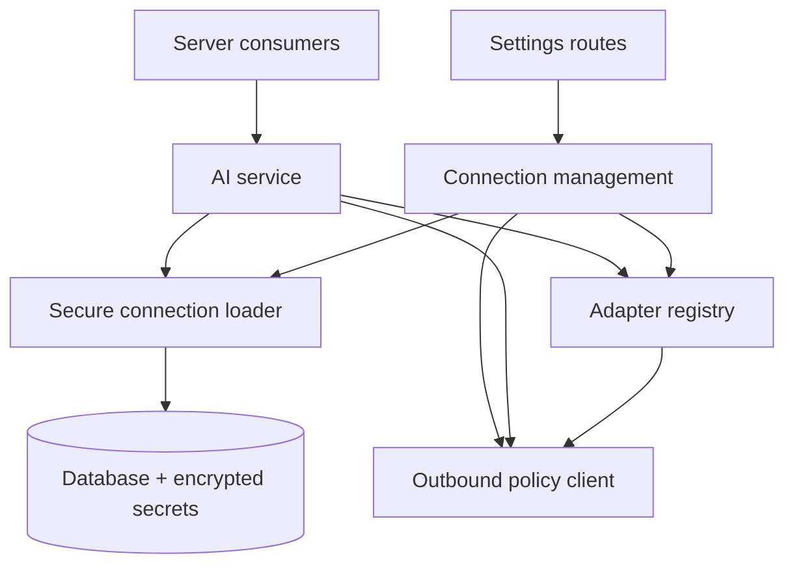
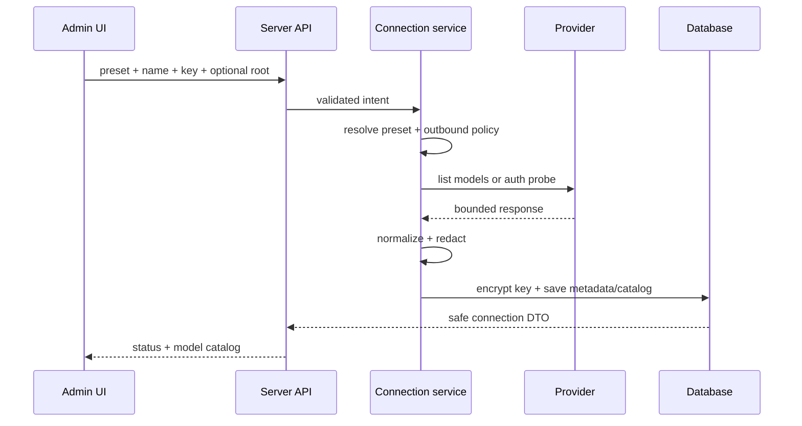
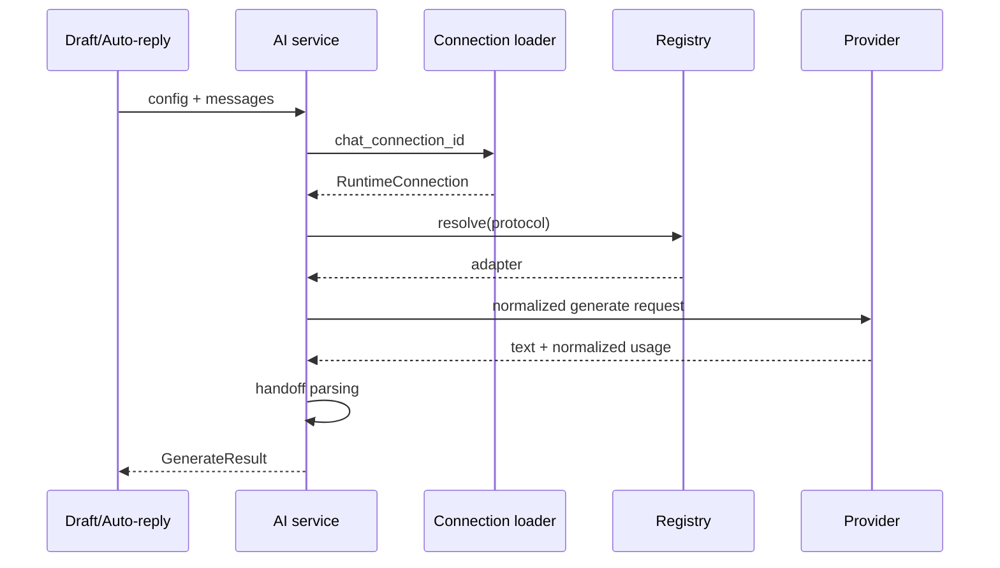
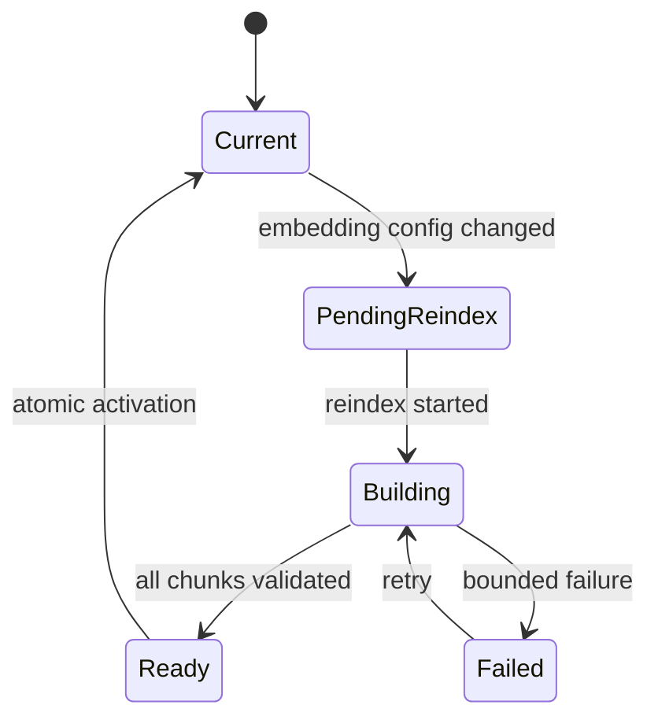

# العمارة المستهدفة

**الحالة:** Normative  
**يرتبط بـ:** `WACRM_MULTI_PROVIDER_MASTER.md`  
**الغرض:** تحديد حدود الوحدات ومسؤولياتها وتدفق البيانات، من دون فرض أسماء ملفات على فرع قد يختلف عن اللقطة المرجعية.

## 1. السياق

يستهلك WACRM الذكاء الاصطناعي في أكثر من مسار: إنشاء مسودة، الرد الآلي، اختبار الإعداد، وتضمين نصوص قاعدة المعرفة والبحث الدلالي. التصميم المستهدف يُبقي هذه المستهلكات مستقلة عن تفاصيل أي مزوّد.

المستهلك يطلب قدرة مثل `generate` أو `embed`. خدمة الذكاء الاصطناعي تحمّل اتصال الحساب الآمن، ثم يحل Registry المهايئ المناسب. المهايئ يعرف بروتوكول HTTP فقط، ولا يعرف Supabase أو session أو أدوار المستخدم.

## 2. حدود المكونات



### 2.1 Server consumers

أمثلة: draft route، auto-reply engine، knowledge ingestion، knowledge retrieval، config test. مسؤوليتها بناء intent وسياق المجال، لا headers أو URLs.

### 2.2 AI service

مسؤول عن:

- التحقق من وجود config صالح.
- تحميل الاتصال المناسب للقدرة المطلوبة.
- تمرير الطلب إلى adapter.
- تطبيق handoff parsing وسجل usage كما في السلوك الحالي.
- اختيار fallback المشروع، مثل lexical retrieval عند تعذر semantic retrieval.

ليس مسؤولاً عن:

- قبول base URL من العميل.
- بناء قائمة presets.
- تشفير/فك سر عند كل طبقة عشوائياً.

### 2.3 Connection management service

مسؤول عن lifecycle الاتصال:

- create/update/disable/delete.
- normalize وvalidate API root.
- encrypt/decrypt في نطاق خادم محدود.
- حساب fingerprint لا يكشف السر.
- discover models وتخزين catalog المطبّع.
- test selected model.
- invalidation عند تغير root/key/protocol.
- فحص المراجع قبل الحذف.

### 2.4 Secure connection loader

واجهة واحدة تعيد `RuntimeConnection` للخادم فقط. يجب ألا يخرج الكائن عن الذاكرة اللازمة للطلب، وألا يُمرر إلى logger أو client serializer. يعيد خطأً آمناً عند فشل فك التشفير، ولا يطبع ciphertext.

### 2.5 Outbound policy client

غلاف مركزي فوق HTTP client/fetch. لا يجوز للمهايئات استدعاء URL مخصص مباشرة من دون المرور به. يتولى:

- canonicalization.
- scheme/host/port validation.
- DNS resolution وIP classification.
- redirect policy.
- time/size limits.
- headers sanitation.
- request ID وقياسات آمنة.

يمكن السماح لعناوين preset الثابتة بمسار fast path، لكن تظل timeouts وsize limits وredaction مطبقة.

### 2.6 Adapter registry

سجل immutable يُنشأ على الخادم ويربط `ProviderProtocol` بمهايئ واحد. لا يقرأ قيمته من اسم class مرسل من العميل، ولا يستخدم dynamic import لمسار يختاره المستخدم.

```ts
const adapters = new Map<ProviderProtocol, ProviderAdapter>([
  ['openai_compatible', openAiCompatibleAdapter],
  ['anthropic_compatible', anthropicAdapter],
  ['gemini_native', geminiAdapter],
])
```

### 2.7 Preset registry

قائمة declarative لأسماء الخدمات المعروفة. مثال مفاهيمي لا يُنسخ قبل التحقق من URLs الرسمية:

| preset | protocol | API root | mode |
|---|---|---|---|
| OpenAI | openai_compatible | fixed | public |
| DeepSeek | openai_compatible | fixed | public |
| OpenRouter | openai_compatible | fixed | public |
| Custom OpenAI-compatible | openai_compatible | custom | deployment policy |
| Anthropic | anthropic_compatible | fixed | public |
| Custom Anthropic-compatible | anthropic_compatible | custom | deployment policy |
| Gemini | gemini_native | fixed | public |
| 9Router/private gateway | openai_compatible | custom | deployment opt-in |

يجب مراجعة العنوان الرسمي وقت التنفيذ. لا تحفظ preset key أو header value سرياً في القائمة.

## 3. فصل Connection عن Config

### Connection

يمثل «كيف أصل إلى API». قابل لإعادة الاستخدام بواسطة Chat أو Embeddings، ومملوك لحساب.

### AI config

يمثل «كيف يتصرف المساعد»: system prompt، active، auto-reply، handoff، النموذج المختار، وروابط الاتصالات.

الفصل يمنع تكرار السر عند استخدام الاتصال نفسه، ويسمح باتصال Chat من Anthropic واتصال Embeddings من OpenAI/Gemini، ويجعل تبديل المزوّد لا يغير سلوك المساعد.

## 4. نموذج القدرات

القيمة الثنائية غير كافية؛ كثير من `/models` لا يعلن الغرض. استخدم:

```ts
type CapabilityState = 'supported' | 'unsupported' | 'unknown'
```

قواعد قرار UI/Service:

| الحالة | العرض | السماح بالاختيار |
|---|---|---|
| supported | يظهر أولاً وبشارة واضحة | نعم |
| unknown | يظهر بعد المدعوم مع تنبيه | نعم، مع اختبار فعلي |
| unsupported | مخفي افتراضياً للقدرة | لا، إلا وضع تشخيص إداري |

لا تحول name heuristic إلى `unsupported`. يمكن لـ heuristic اقتراح فئة أو ترتيب فقط.

## 5. تدفق إنشاء اتصال والتحقق



### قواعد ذرية

- إذا فشل التحقق قبل الإنشاء، لا يُنشأ اتصال بنصف بيانات إلا إذا اختار UX صراحة «Save unverified» ضمن سياسة المنتج.
- التوصية: السماح بحفظ `unverified` للـ custom APIs التي لا تدعم list models، ثم اشتراط test model قبل تفعيلها.
- عند تعديل اتصال قائم وفشل المفتاح الجديد، يبقى المفتاح القديم صالحاً ولا يُستبدل.
- تحديث السر والـ fingerprint وinvalidation والكتالوج يتم في معاملة منطقية واحدة.

## 6. تدفق اكتشاف النماذج

1. يتحقق route من admin role وrate limit.
2. يحمل connection ويحسب fingerprint الحالي.
3. يفحص policy قبل DNS/HTTP.
4. ينادي `adapter.listModels` إن وجدت.
5. يجمع الصفحات ضمن الحدود.
6. يطبع العناصر، ويزيل التكرار حسب ID canonical.
7. يحد الحقول والحجم ويرتب بثبات.
8. يتحقق أن fingerprint لم يتغير أثناء الطلب.
9. يحفظ الكتالوج و`fetched_at` ويزيل خطأه السابق.
10. يعيد DTO آمناً.

عند الفشل:

- يسجل code آمن وrequest ID.
- لا يمسح آخر catalog ناجح.
- يعيد `stale=true` إن وجد cache.
- يبين أن manual entry متاح.

## 7. تدفق التوليد



قواعد:

- لا يدخل model catalog في المسار الساخن؛ النموذج المحفوظ يُستخدم مباشرة.
- لا يجري refresh catalog ضمن generation.
- timeout قابل للضبط من الخادم ضمن حدود، لا من العميل.
- لا retry تلقائياً للتوليد افتراضياً.
- الأخطاء تحافظ على code متسق للمستهلك الحالي.

## 8. تدفق Embeddings وإصدارات الفهرس

### 8.1 إنشاء revision

هوية revision المقترحة مشتقة من:

```text
protocol + preset/connection identity + model + dimensions + provider options version
```

لا تتضمن السر. تحفظ كمعرّف صريح أو hash غير حساس.

### 8.2 تغيير الإعداد



- يستمر البحث على revision السابقة حتى جاهزية الجديدة، أو يستخدم lexical fallback إن لم توجد سابقة.
- لا تتحول القراءة إلى revision جديدة قبل اكتمال chunks المطلوبة والتحقق من الأبعاد.
- cleanup للقديمة خطوة مستقلة بعد فترة رجوع.

إن كان نطاق الإصدار لا يسمح ببناء نظام revisions كامل، يجب اختيار بديل محافظ: تعطيل semantic مؤقتاً، إعادة فهرسة كاملة، ثم التفعيل. لا يجوز مزج المتجهات.

## 9. استراتيجية أخطاء الطبقات

### AdapterError

يحمل معلومات داخلية منقحة: operation، provider status، retry-after، cause category. لا يخرج مباشرة إلى العميل.

### AiError/ApplicationError

يحمل code العام، status مناسب، retryable، request ID، ومفتاح ترجمة. يحظر تضمين body الخام في message.

### UI

يعرض رسالة عملية مثل «تعذر الوصول إلى الخدمة. تحقق من العنوان أو حاول لاحقاً» مع request ID عند الحاجة للدعم.

## 10. نقاط الامتداد المسموحة

- preset جديد لبروتوكول موجود.
- adapter جديد لبروتوكول جديد.
- normalizer خاص بالـ catalog ضمن adapter.
- auth strategy جديدة مسجلة على الخادم، بقرار أمني.
- provider options typed ومحدودة؛ لا `Record<string, any>` يمر مباشرة إلى body.

## 11. Anti-patterns ممنوعة

- توسيع `switch (providerName)` مع كل مزوّد.
- تخزين provider label باعتباره protocol.
- السماح للعميل بإرسال headers أو method أو full endpoint.
- استخدام `fetch(body.baseUrl + '/v1/...')` مباشرة.
- جلب النماذج في React effect مع المفتاح.
- اعتبار فشل `/models` دليلاً على فشل Chat.
- حذف model المحفوظ إذا لم يظهر في القائمة.
- اكتشاف القدرة بالاسم كحكم نهائي.
- تمرير response error للمزوّد إلى المستخدم كما هو.
- retry للتوليد من دون idempotency.
- تخزين vectors مختلفة الأبعاد في الفهرس الحالي.

## 12. معايير قبول العمارة

- مستهلكا draft وauto-reply لا يستوردان adapters مباشرة.
- لا توجد معرفة بـ DeepSeek أو Gemini في منطق domain العام، عدا preset/registry/config.
- adapter tests لا تحتاج Supabase.
- connection service tests لا تحتاج مزوّداً حقيقياً.
- outbound policy لها اختبارات مستقلة وقابلة لحقن resolver/transport.
- إزالة preset لا تكسر اتصالاً محفوظاً بصمت؛ هناك migration/deprecation path.
- يمكن شرح إضافة مزوّد OpenAI-compatible جديد بأنها preset + tests فقط.
