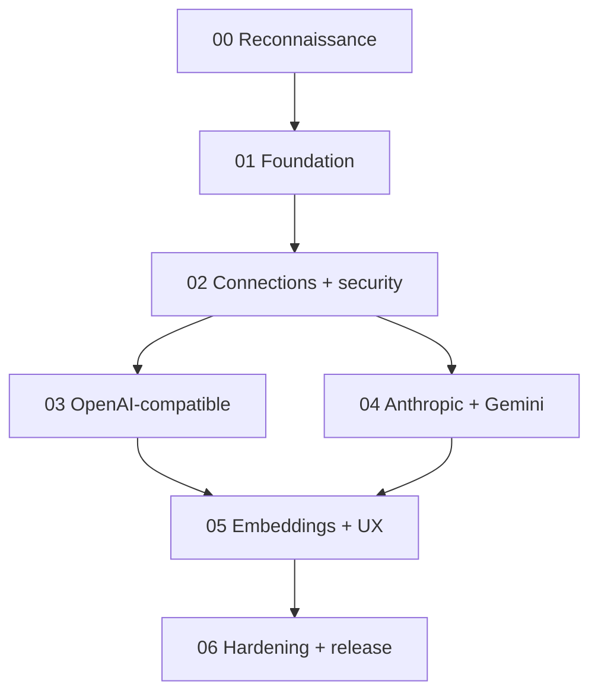

# خطة التنفيذ المرحلية

**الحالة:** Normative  
**الهدف:** إبقاء التغيير قابلاً للمراجعة والرجوع، مع فصل refactor عن توسعة السلوك وترحيل البيانات.

## 1. قواعد عامة

- فرع واحد مخصص للمبادرة، وdiff صغير لكل مرحلة/PR حسب سياسة الفريق.
- لا كتابة فوق تغييرات محلية أو unrelated cleanup.
- لا تغيير dependencies إلا بعد إثبات الحاجة وADR عند الأثر المعماري.
- كل migration جديد يحمل الرقم التالي الفعلي؛ لا تعدّل migrations مطبقة.
- لا real provider calls في CI الافتراضي.
- لا deploy أو push أو commit أو production migration بلا تفويض صريح.
- كل مرحلة تنتهي بتقرير القالب ونتائج أوامر فعلية.

## 2. خريطة الاعتماد

يمكن تنفيذ بعض أعمال المرحلة 03 و04 بالتوازي بشرياً بعد استقرار العقود، لكن لا تدمجها قبل اجتياز اختبارات Registry/Connection/Outbound المشتركة.

## 3. المرحلة 00: الاستكشاف وتجميد خط الأساس

### الهدف

بناء صورة دقيقة للفرع المحلي قبل أي تغيير.

### الأعمال

- قراءة `AGENTS.md`, `CLAUDE.md`, README، ومساهمات/تعليمات متداخلة.
- فحص branch/commit/status وعدم تعديل ملفات المستخدم.
- قراءة package scripts والإصدارات.
- رسم call graph لـ config → generate → provider، وknowledge ingest/retrieval → embeddings.
- فحص migrations/RLS/RPCs والـ dimensions.
- فحص UI/i18n ومعدل الحدود/error contracts/encryption.
- البحث عن عمل متداخل أو PR محلي/remote ذي صلة إن كانت الشبكة والتفويض يسمحان.
- تدوين الانحرافات عن هذه الحزمة.

### المخرجات

- تقرير `phase-00-current-state.md`.
- قائمة ملفات متوقعة per phase.
- مخاطر/أسئلة/قرارات مطلوبة.
- لا تعديل كود منتج.

### البوابة

- لا تغييرات محلية متداخلة غير مفهومة.
- رقم migration وخطة backfill معروفان.
- قيد embeddings الفعلي مؤكد.
- تعليمات Next.js الفعلية مقروءة.

## 4. المرحلة 01: الأساس من دون تغيير السلوك

### الهدف

إزالة `switch` الخاص بالمزوّد لصالح عقود وRegistry مع بقاء OpenAI وAnthropic فقط وظيفياً.

### الأعمال

- تعريف `ProviderProtocol`, adapter interfaces، normalized errors/capabilities.
- نقل OpenAI وAnthropic الحاليين إلى Registry بأقل diff.
- استخراج network/error helpers المشتركة من دون custom URL بعد.
- الحفاظ على public `generateReply` contract أو adapter shim للتوافق.
- إضافة tests للـ registry والعقد والانحدار والusage/handoff.

### غير مسموح

- migration.
- تغيير UI.
- إضافة Gemini/DeepSeek.
- base URL من المستخدم.
- تغيير سلوك embeddings.

### البوابة

- OpenAI/Anthropic fixtures تعطي النتائج نفسها.
- call sites الحالية لا تعرف adapter.
- جميع فحوص المشروع تمر.

### rollback

إرجاع refactor المعزول؛ لا بيانات تغيرت.

## 5. المرحلة 02: الاتصالات والأمن والبيانات additive

### الهدف

إنشاء Connection entity وخدمة آمنة وسياسة outbound، من دون تحويل كل المستهلكين بعد.

### الأعمال

- migration additive للجداول/الأعمدة/RLS/constraints.
- safe DTO وserver-only loader.
- encrypt/decrypt reuse/versioning.
- preset registry والسياسات fixed/custom/opt-in.
- outbound URL policy وtransport wrapper.
- CRUD routes وauthorization/rate limits.
- backfill tooling/SQL idempotent لكن لا contract deletion.
- feature flag وfallback loader.

### البوابة

- cross-account/RLS tests.
- secret leakage tests.
- SSRF matrix.
- backfill twice بلا duplicates.
- old config remains readable.

### rollback

flag off واستخدام الأعمدة القديمة؛ schema الجديد يبقى غير مستخدم. لا drop طارئ.

## 6. المرحلة 03: OpenAI-compatible وModel discovery

### الهدف

تعميم OpenAI الحالي وإضافة presets ذات صلة، مع catalog اختياري.

### الأعمال

- API root آمن في runtime connection.
- paths مبنية نسبياً بلا double version.
- list models normalizer وحدود/cache/stale behavior.
- presets: OpenAI وDeepSeek، وأي preset آخر مؤكد في قرار النطاق.
- Custom OpenAI-compatible حسب deployment policy.
- 9Router preset/guide opt-in فقط إن قرر المنتج إظهاره.
- test connection وtest model منفصلان.
- contract fixtures لمزوّد standard وآخر ذي اختلافات وendpoint بلا models.

### البوابة

- OpenAI regression كامل.
- خدمة models=404 + chat=success تعمل يدوياً.
- fixed preset override مرفوض.
- cache invalidation/stale-on-error تمر.
- لا real key مطلوب.

### rollback

تعطيل presets الجديدة؛ OpenAI القديم عبر adapter نفسه يبقى.

## 7. المرحلة 04: Anthropic-compatible وGemini Native

### الهدف

استكمال البروتوكولات الأساسية مع pagination وقدرات أصلية.

### الأعمال

- Anthropic adapter ضمن Registry مع سلوكه الحالي محفوظاً.
- Anthropic list models الرسمي وpagination bounded.
- قرار واضح هل يعرض Custom Anthropic-compatible الآن أم يؤجل.
- Gemini Native generate/list models، وتأسيس embed capability من دون تحويل الفهرس بعد.
- تطبيع Gemini IDs وsupported methods/token limits.
- error/usage mapping.

### البوابة

- Anthropic regression، بما فيه consecutive roles.
- pagination boundaries.
- Gemini native fixtures لـ generate/models/errors.
- لا مزج بين OpenAI compatibility وNative contracts.

### rollback

تعطيل Gemini preset؛ Anthropic الحالي يبقى في Registry.

## 8. المرحلة 05: Embeddings وUX الكامل

### الهدف

فصل Chat/Embeddings، تطبيق dimension gate/re-index، وتقديم واجهة آمنة ومفهومة.

### الأعمال الخلفية

- generic embed contract للمهايئات التي تدعمه.
- حفظ embedding model/dimensions/revision.
- test صغير يقيس البُعد.
- رفض أي vector غير متوافق قبل DB/RPC.
- backfill إعداد OpenAI embeddings الحالي.
- تصميم re-index state/job أو البديل المحافظ الموثق.
- lexical fallback محفوظ.

### أعمال الواجهة

- إدارة connections.
- preset/root/key masking.
- verify/load models.
- searchable list + manual input.
- fresh/stale/error/saved-missing states.
- Chat وEmbeddings selectors منفصلان.
- re-index warning/progress.
- كل locales وaccessibility.

### البوابة

- 1536 pass، وأبعاد أخرى fail بلا write.
- اتصالان مختلفان لـ Chat/Embeddings.
- UI لا يرسل placeholder أو يمسح model.
- current OpenAI embeddings accounts continue.
- semantic revision activation atomic أو fallback conservative مثبت.

### rollback

العودة إلى embedding config القديم تحت flag، أو lexical fallback؛ لا حذف vectors القديمة قبل نافذة الاستقرار.

## 9. المرحلة 06: التقسية والإطلاق

### الهدف

دمج المسارات، إغلاق الثغرات، تجهيز التشغيل والإصدار التدريجي.

### الأعمال

- E2E محدود لرحلات الإعداد.
- full regression وproduction build.
- redaction/security review.
- performance/limits for catalogs and batches.
- observability dashboards/queries حسب أدوات المشروع.
- migration rehearsal، counts، rollback rehearsal.
- docs: architecture, add-provider, admin guide, deployment env, runbook, release notes.
- canary flag وخطة rollout.
- مراجعة TODOs والـ dual-read expiry owner/date.

### البوابة

- كل معيار قبول في الوثيقة الرئيسية له دليل.
- لا high-severity finding مفتوح.
- rollback مجرب.
- owner واضح للحذف اللاحق للأعمدة القديمة.
- موافقة بشرية قبل production.

## 10. Contract phase اللاحقة

ليست جزءاً تلقائياً من المراحل الست. بعد نافذة استقرار:

- تحقق أن لا fallback reads.
- backup وموافقة.
- حذف الأسرار/الأعمدة القديمة في migration مستقل.
- إزالة dual-write وfeature flag المتقادم.
- تحديث الوثائق وdata retention.

## 11. نقاط توقف إلزامية

يتوقف الوكيل ويطلب قراراً إذا:

- `git status` يحتوي تعديلات تتداخل مع الملفات المقصودة ولا يعرف مصدرها.
- فرع المشروع نفذ تصميماً مختلفاً جوهرياً أو PR قريباً من الدمج.
- migration قد يحذف أو يعيد تشفير أسرار بلا rollback.
- يلزم مفتاح حقيقي أو استهلاك مدفوع لإكمال الاختبار.
- يلزم السماح private network في بيئة غير معروفة.
- لا يمكن حماية DNS rebinding لكن المنتج يطلب custom arbitrary URLs في SaaS.
- قرار multi-dimension embeddings مطلوب الآن.
- tests الأساسية تفشل قبل التغيير ولا يمكن عزل السبب.
- يتطلب التنفيذ deploy/push/production access غير مفوض.

## 12. تقرير المرحلة

بعد كل مرحلة، أنشئ تقريراً من `templates/PHASE_REPORT_TEMPLATE.md`. يجب أن يذكر الأوامر ونتائجها لا عبارة عامة، ويضع روابط/مسارات الملفات ويشرح rollback فعلياً.

