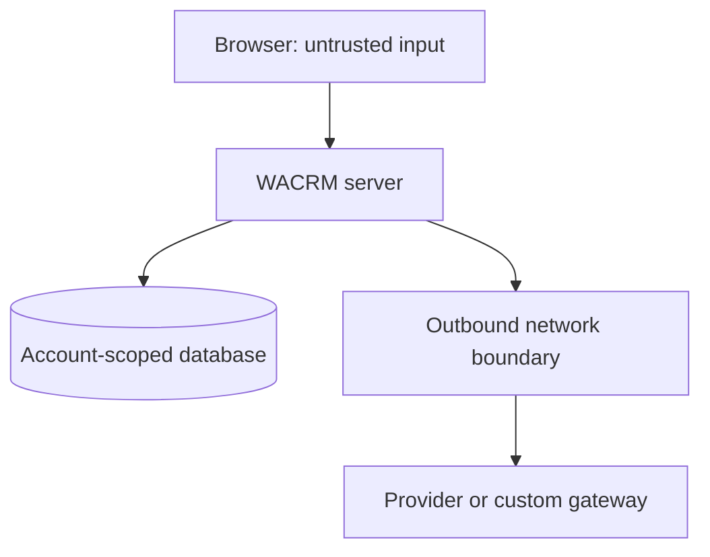
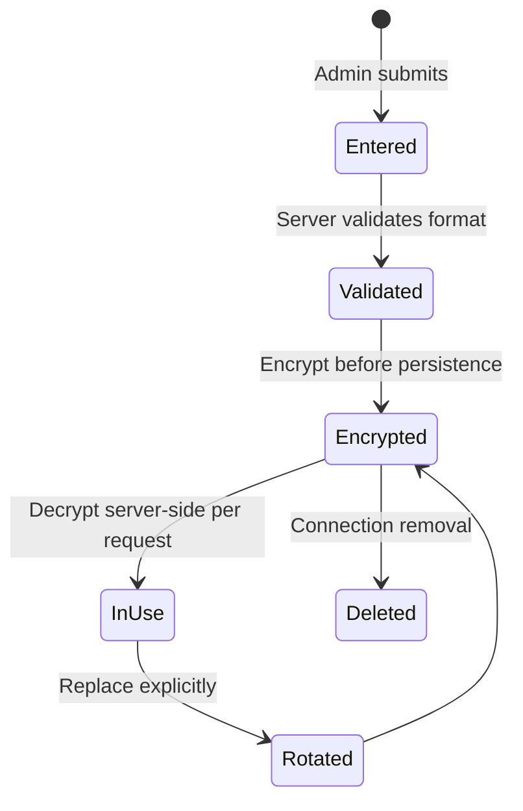

# الأمن والاعتمادية والتشغيل

**الحالة:** Normative  
**النطاق:** مفاتيح BYOK، الاتصالات الصادرة، API routes، قاعدة البيانات، السجلات، ضبط التكلفة، وإدارة الحوادث.

## 1. نموذج التهديد

### الأصول المطلوب حمايتها

- مفاتيح API التي يملكها العميل.
- محتوى المحادثات وsystem prompts وقاعدة المعرفة.
- حدود حساب WACRM وبيانات حسابات أخرى.
- الشبكة الداخلية وmetadata services وواجهات الإدارة في بيئة الاستضافة.
- حصة/رصيد API للمستخدم.
- سلامة فهرس embeddings ونتائج الاسترجاع.

### جهات محتملة

- عضو عادي يحاول استدعاء endpoint إداري.
- Admin لحساب يحاول الوصول إلى حساب آخر أو الشبكة الداخلية.
- مزوّد/بوابة مخصصة خبيثة تعيد redirects أو response ضخم أو JSON مشوهاً.
- مهاجم يملك مفتاحاً مسروقاً ويحاول معرفة صلاحياته من خلال WACRM.
- خطأ برمجي يسجل السر أو يمرر provider error الخام.
- إساءة استخدام شرعية ظاهرياً تسبب تكلفة أو rate exhaustion.

### حدود الثقة



- كل ما يأتي من المتصفح غير موثوق، حتى لو أخفاه UI.
- ciphertext في قاعدة البيانات حساس، وليس «آمناً للنشر» لمجرد أنه مشفر.
- response المزوّد غير موثوق ويخضع للحجم والتحليل والتنقيح.

## 2. التحكم في الوصول

| العملية | الحد الأدنى المقترح |
|---|---|
| قراءة حالة config واتصال آمن | member داخل الحساب |
| إنشاء/تعديل/استبدال سر/اختبار/حذف | admin داخل الحساب |
| تفعيل private endpoint على مستوى النشر | مشغّل deployment فقط |
| تشغيل backfill/migration | إجراء تشغيلي مخول |
| قراءة logs الداخلية | دور تشغيل مقيد |

قواعد:

- جميع المسارات تستخرج `accountId` من session/server context، لا من body.
- `connectionId` يبحث عنه مع `account_id` في query نفسه.
- عدم العثور على اتصال من حساب آخر يعامل كـ 404 لتقليل كشف الوجود.
- لا يعتمد الأمان على UI disabled state.
- mutation routes لها CSRF/Origin protection وفق نمط Next.js والمشروع.
- rate limit لا يستبدل authorization.

## 3. إدارة الأسرار

### 3.1 دورة السر



### 3.2 متطلبات ملزمة

- الحقل input يستخدم HTTPS للنشر ولا يخزن في browser storage.
- لا يعاد المفتاح بعد الإنشاء؛ GET يعيد `has_key` فقط.
- ترك الحقل فارغاً في edit يعني «احتفظ بالحالي»، وليس «خزّن فارغاً».
- المسح والاستبدال فعلان صريحان.
- استخدم primitive التشفير الحالي AES-256-GCM إن كان صالحاً، مع versioned envelope وخطة تدوير master key.
- لا تستخدم key fingerprint مشتقاً مباشرة بلا HMAC إذا كان يمكن إجراء تخمين؛ إن كانت الحاجة مجرد invalidation، استخدم HMAC بمفتاح خادم أو random version.
- plaintext يعيش أقصر فترة لازمة ولا يُضمّن في exception context.
- redaction يشمل القيم بعد URL encoding وJSON serialization حيث يمكن.

### 3.3 اختبار منع التسرب

- افحص API snapshots لغياب `api_key`, `encrypted_api_key`, `authorization`.
- اختبر logger spy عند أخطاء fetch/decrypt/provider.
- افحص rendered HTML/React props.
- لا تطبع request body في middleware debugging.
- لا تضع السر في query string إلا إذا فرض Gemini strategy ذلك؛ عندها يبني الخادم URL ولا يسجله، ويفضل header إن كانت الواجهة الرسمية تدعمه.

## 4. سياسة SSRF والاتصال الصادر

### 4.1 خوارزمية قرار الوجهة

1. حل preset على الخادم.
2. إن كان preset ثابتاً، قارن root بالقيمة server-side ولا تقبل override.
3. Parse بواسطة `URL`; ارفض parsing غير الحتمي.
4. ارفض username/password/fragment.
5. افرض `https:` للوجهات العامة؛ `http:` لا يسمح إلا deployment allowlist محددة في self-hosted.
6. افرض port allowlist؛ الافتراضي 443، والاستثناءات server-configured.
7. طبّع host إلى ASCII/IDNA وخفض case وأزل trailing dot حيث يلزم.
8. ارفض hostname patterns المحظورة، لكن لا تعتمد عليها وحدها.
9. Resolve كل A وAAAA.
10. ارفض إذا أعاد أي عنوان نطاقاً محظوراً، وليس فقط أول عنوان.
11. ثبّت destination قدر الإمكان في طبقة النقل أو استخدم egress proxy؛ الفحص ثم fetch عادي قد يبقى معرضاً لـ DNS rebinding/TOCTOU.
12. استخدم `redirect: manual`. إذا سُمح redirect، كرر الخوارزمية لكل hop وحدد العدد.
13. طبق timeout وresponse-size limit أثناء streaming، قبل `json()` الكامل.
14. أغلق/ألغ الطلب عند تجاوز الحد.

### 4.2 نطاقات يجب حجبها افتراضياً

- IPv4 loopback وprivate وlink-local وcarrier-grade NAT وmulticast وunspecified وdocumentation/reserved حسب مكتبة IP موثوقة.
- IPv6 loopback وunique-local وlink-local وmulticast وunspecified وreserved.
- IPv4-mapped IPv6 التي تشير إلى نطاق محظور.
- cloud metadata endpoints المعروفة، مع الاعتماد أولاً على تصنيف IP لا أسماء فقط.
- localhost وأشكاله والتدوينات الرقمية الغريبة بعد canonicalization.

لا تكتب parser IP منزلياً إذا توفر primitive موثوق في runtime/تبعية موجودة. أي تبعية جديدة تحتاج مراجعة وصيانة.

### 4.3 DNS rebinding

حل DNS ثم استدعاء `fetch(hostname)` قد يعيد الحل إلى عنوان مختلف. الخيارات مرتبة:

1. egress proxy/firewall يطبق allowlist/CIDR ويمنع metadata على مستوى الشبكة.
2. transport/dispatcher يربط الاتصال بعنوان resolved ومراجع مع الحفاظ على TLS SNI/Host والتحقق من الشهادة.
3. allowlist hosts ثابتة للمزوّدات العامة، مع منع custom في SaaS حتى توفر حماية أقوى.

لا تصف validation سطحي بأنه «محصّن تماماً» من SSRF. وثق طبقة النشر المطلوبة.

### 4.4 9Router والبوابات الخاصة

إعدادات مقترحة على مستوى deployment، بأسماء يحددها المشروع:

```text
AI_CUSTOM_ENDPOINTS_ENABLED=false
AI_PRIVATE_ENDPOINTS_ENABLED=false
AI_ENDPOINT_ALLOWLIST=api.example.com:443
```

لا تجعل هذه القيم قابلة للتغيير من حساب مستأجر. عند تفعيل private endpoints:

- استخدم exact host/IP وport، لا wildcard واسعاً.
- اعزل WACRM عن شبكات الإدارة والmetadata بجدار ناري.
- بين للمستخدم أن الاتصال deployment-scoped.
- لا تشحن قيمة localhost مفعلة افتراضياً.

## 5. مصادقة المزوّد

- OpenAI-compatible غالباً Bearer؛ لا تسمح للمستخدم بتغيير اسم header في الإصدار الأول.
- Anthropic يستخدم headers الرسمية التي يضيفها adapter، ومنها version من قيمة server-defined مختبرة.
- Gemini auth يتبع الواجهة الرسمية المستخدمة؛ السر يبقى على الخادم.
- لا تخلط provider 401 مع session 401.
- لا تسجل header عند retries أو exceptions.

## 6. Validation المدخلات والمخرجات

### المدخلات

- connection name: trim، طول أقصى، منع control characters.
- model ID: trim، طول أقصى، منع CR/LF؛ لا تفرض regex ضيقاً يكسر IDs صحيحة.
- API root: طول أقصى وURL policy.
- system prompt: حافظ على الحدود الحالية أو وثق تغييرها؛ لا يدخل في probe logs.
- pagination token من المزوّد لا يعرض للعميل ولا يستخدم خارج نفس host/path contract.

### المخرجات

- JSON فقط ضمن الحجم المتوقع.
- عدد أقصى للـ models والصفحات.
- model field lengths محدودة قبل التخزين/العرض.
- إزالة حقول غير لازمة من payload.
- حماية UI من النصوص غير الموثوقة بالاعتماد على React escaping وعدم استخدام HTML خام.

## 7. ضبط التكلفة وإساءة الاستخدام

- rate limit لكل user وaccount وconnection، لا IP فقط.
- حدود منفصلة لـ discover وtest وgenerate/embed.
- test model لا يعمل تلقائياً عند فتح الشاشة.
- save لسلوك غير متعلق بالاعتماد لا يعيد probe.
- debounce وحده ليس حماية خادم.
- concurrency gate يمنع عشرات discovery calls المتزامنة لنفس الاتصال.
- cache يشارك النتيجة داخل الحساب والاتصال.
- backoff للـ 429 في discovery فقط ضمن سقف؛ generation يعود للمستهلك بلا retry تلقائي.
- budget/circuit breaker اختياري للمستقبل، لكن observability يجب أن تسمح بإضافته.

## 8. سياسة الأخطاء والسجلات

### سجل آمن نموذجي

```json
{
  "event": "ai.provider.request.failed",
  "request_id": "req_...",
  "account_id_hash": "...",
  "connection_id": "...",
  "protocol": "openai_compatible",
  "operation": "list_models",
  "status": 429,
  "code": "AI_RATE_LIMITED",
  "latency_ms": 820,
  "retryable": true
}
```

ممنوع إضافة `headers`, `body`, `prompt`, `response_text`, `api_key`, `full_url_with_query`.

### provider error bodies

- يمكن تحليل حقول code/type المعروفة ضمن size limit.
- تمر عبر redactor.
- لا تُخزن كاملة افتراضياً.
- message العام يختار من mapping داخلي.
- request ID يسمح بربط الدعم بالسجل.

## 9. RLS وقاعدة البيانات

قائمة مراجعة لكل policy/RPC:

- account membership مستخدمة بنفس النمط الموثوق في المشروع.
- member لا يقرأ ciphertext حتى لو استطاع قراءة metadata.
- admin mutation يتحقق مرتين: route وdatabase policy حيث يمكن.
- service role client لا يمر إلى browser.
- `SECURITY DEFINER` مع `set search_path` وqualification للأسماء.
- revoke execute from public ثم grant أقل صلاحية.
- FK لا يسمح بربط config لاتصال حساب آخر.
- حذف account يمسح secrets وفق السياسة الحالية.
- backup access وretention للأسرار موثقان.

## 10. الاعتمادية

### timeouts

عرّف budget لكل عملية، مثلاً:

- discovery: مدة إجمالية أطول قليلاً بسبب pagination، مع حد لكل صفحة.
- test: قصيرة وبطلب صغير.
- generation: الإعداد الحالي أو قيمة server-controlled.
- embeddings batch: حسب الحجم ضمن السقف.

الأرقام النهائية تُضبط بعد قياس؛ لا يقبل timeout من العميل.

### retries

| العملية | الافتراضي |
|---|---|
| list models GET | 1–2 bounded retries على 408/429/5xx/network المؤقت |
| connection auth probe | retry محدود فقط إن كان idempotent |
| chat generation | لا retry تلقائي |
| embeddings ingest | retry على مستوى job/chunk بإدempotency واضحة، لا حلقة داخلية غير محدودة |
| DB transaction | حسب نمط المشروع وتعارضات معروفة فقط |

### circuit breaking

ليس إلزامياً للإصدار الأول، لكن لا تُخفِ الحالة. يمكن تخفيض الضغط على مزوّد فاشل عبر cache وrate limits، ثم إضافة circuit breaker بقرار لاحق.

## 11. تشغيل وترحيل آمن

### قبل النشر

- backup واختبار restore وفق سياسة المشروع.
- تشغيل migration على نسخة staging ببيانات قديمة ممثلة.
- counts قبل/بعد: configs، connections، configs بلا connection، decrypt failures.
- لا تطبع IDs/أسرار أكثر من اللازم في تقرير التشغيل.
- feature flag افتراضياً off.
- التحقق من متغيرات encryption وoutbound policy.

### canary

- تفعيل لحساب داخلي أو نسبة صغيرة.
- مقارنة نجاح OpenAI/Anthropic والـ latency.
- مراقبة config load/decrypt/backfill failures.
- اختبار rollback إلى read القديم.

### التوسع

- دفعات تدريجية.
- عدم تشغيل backfill ثقيل ضمن request عادي.
- مراقبة Supabase locks وAPI limits.
- إبقاء الأعمدة القديمة خلال نافذة الرجوع.

## 12. Runbooks

### 12.1 اشتباه تسرب مفتاح

1. لا تطبع المفتاح للتحقق.
2. حدّد connection/request IDs من metadata.
3. عطّل الاتصال أو preset المتأثر.
4. اطلب تدوير مفتاح المزوّد من مالكه.
5. راجع logs/traces/caches/backups لمواضع التسرب وفق الصلاحيات.
6. أصلح المسار وأضف regression test.
7. وثق الحادث وفق سياسة المشروع.

### 12.2 ارتفاع SSRF blocks

1. راجع codes والوجهات بعد تنقيحها.
2. لا توسع allowlist فوراً بناء على طلب مستأجر واحد.
3. تحقق هل preset الرسمي تغيّر.
4. إن كانت بوابة خاصة شرعية، عالجها بإعداد deployment وضوابط شبكة.
5. اختبر redirect/DNS قبل التفعيل.

### 12.3 فشل model discovery

1. تحقق من endpoint الرسمي/version/pagination.
2. أبق cache stale وmanual entry.
3. لا تعطل generation العامل.
4. افصل 401 عن 404 unsupported وعن 429 مؤقت.
5. حدّث preset/adapter مع contract fixture.

### 12.4 فشل Embeddings أو mismatch

1. لا تكتب vector المخالف.
2. لا تحول revision النشطة.
3. استمر على القديمة أو lexical fallback.
4. تحقق من dimensions parameter الرسمي والنموذج.
5. أعد job المتأثر بعد الإصلاح، لا كامل البيانات بلا حاجة.

### 12.5 فشل migration/backfill

1. أوقف feature flag والتحويل، لا تنفذ حذفاً عكسياً متسرعاً.
2. حافظ على القراءة القديمة.
3. استخرج counts ورموز الخطأ المنقحة.
4. أصلح backfill idempotent وأعد تشغيل الصفوف الفاشلة.
5. لا تنتقل إلى contract phase.

## 13. قائمة مراجعة أمنية قبل الإصدار

- [ ] Threat model محدث بعد الكود النهائي.
- [ ] ثابت أن المتصفح لا يتصل بالمزوّد.
- [ ] لا secrets في responses/logs/errors/DOM/tests fixtures الحقيقية.
- [ ] fixed presets لا تقبل override.
- [ ] custom endpoints off أو مقيدة حسب deployment.
- [ ] IPv4/IPv6/redirect/DNS rebinding strategy موثقة ومختبرة.
- [ ] RLS cross-account tests تمر.
- [ ] admin role tests تمر.
- [ ] rate/concurrency/time/size limits موجودة.
- [ ] provider errors منقحة.
- [ ] generation retries معطلة افتراضياً.
- [ ] embedding dimensions validated قبل DB write.
- [ ] rollback وfeature flag مجربان.
- [ ] dependencies الجديدة، إن وجدت، مراجعة ومثبتة بإصدارات متوافقة.

